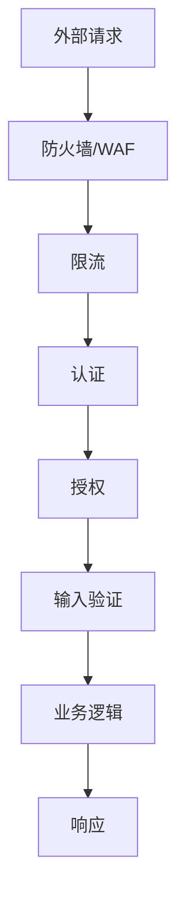

# 6.3 守好程序的大门——API 安全防护实践

## 认知重构

API 是你应用与外界交互的窗口。每一个暴露的接口，都是潜在的攻击入口。API 安全不是"加个验证"那么简单，而是需要从认证、授权、输入验证、限流、日志等多个维度构建防护体系。



## 本节内容

| 小节 | 核心问题 | 你将学会 |
|------|----------|----------|
| 6.3.1 认证方法 | 如何验证请求者身份？ | JWT/Session/API Key 的选择 |
| 6.3.2 CORS 机制 | 为什么会有跨域问题？ | 预检请求与安全配置 |
| 6.3.3 XSS 防护 | 如何防止脚本注入？ | 输出编码与 CSP |
| 6.3.4 CSRF 防护 | 如何防止伪造请求？ | Token 验证与 SameSite |
| 6.3.5 API 限流 | 如何防止接口被滥用？ | 速率限制与异常检测 |

## API 安全层级

### 第一层：传输安全

```typescript
// 强制 HTTPS
if (process.env.NODE_ENV === 'production') {
  if (request.headers.get('x-forwarded-proto') !== 'https') {
    return Response.redirect(`https://${request.headers.get('host')}${request.url}`)
  }
}
```

### 第二层：认证与授权

```typescript
// middleware.ts
import { getToken } from 'next-auth/jwt'

export async function middleware(request: NextRequest) {
  const token = await getToken({ req: request })
  
  if (!token) {
    return Response.json({ error: '未授权' }, { status: 401 })
  }
  
  // 检查权限
  if (request.nextUrl.pathname.startsWith('/api/admin')) {
    if (token.role !== 'admin') {
      return Response.json({ error: '禁止访问' }, { status: 403 })
    }
  }
}
```

### 第三层：输入验证

```typescript
import { z } from 'zod'

const CreatePostSchema = z.object({
  title: z.string().min(1).max(100),
  content: z.string().min(1).max(10000),
  tags: z.array(z.string()).max(10).optional(),
})

export async function POST(request: Request) {
  const body = await request.json()
  
  const result = CreatePostSchema.safeParse(body)
  if (!result.success) {
    return Response.json(
      { error: '参数错误', details: result.error.issues },
      { status: 400 }
    )
  }
  
  // 使用验证后的数据
  const { title, content, tags } = result.data
}
```

### 第四层：限流防护

```typescript
import { Ratelimit } from '@upstash/ratelimit'
import { Redis } from '@upstash/redis'

const ratelimit = new Ratelimit({
  redis: Redis.fromEnv(),
  limiter: Ratelimit.slidingWindow(10, '10 s'), // 10秒10次
})

export async function middleware(request: NextRequest) {
  const ip = request.ip ?? '127.0.0.1'
  const { success } = await ratelimit.limit(ip)
  
  if (!success) {
    return Response.json(
      { error: '请求过于频繁' },
      { status: 429 }
    )
  }
}
```

## 安全响应头

```typescript
// next.config.js
const securityHeaders = [
  {
    key: 'X-DNS-Prefetch-Control',
    value: 'on'
  },
  {
    key: 'X-Frame-Options',
    value: 'SAMEORIGIN'
  },
  {
    key: 'X-Content-Type-Options',
    value: 'nosniff'
  },
  {
    key: 'Referrer-Policy',
    value: 'origin-when-cross-origin'
  },
]

module.exports = {
  async headers() {
    return [
      {
        source: '/:path*',
        headers: securityHeaders,
      },
    ]
  },
}
```

## AI 协作提示

向 AI 描述 API 安全需求时：

- "实现请求限流，每个 IP 每分钟最多 60 次请求"
- "对用户输入使用 zod 进行严格验证"
- "添加 CORS 配置，只允许指定域名访问"
- "在响应头中添加安全相关的 HTTP 头"

::: warning API 安全审查清单
1. [ ] 所有接口都有认证检查
2. [ ] 敏感操作有授权验证
3. [ ] 用户输入经过验证和转义
4. [ ] 实现了请求限流
5. [ ] 配置了安全响应头
6. [ ] 错误信息不泄露敏感信息
:::
