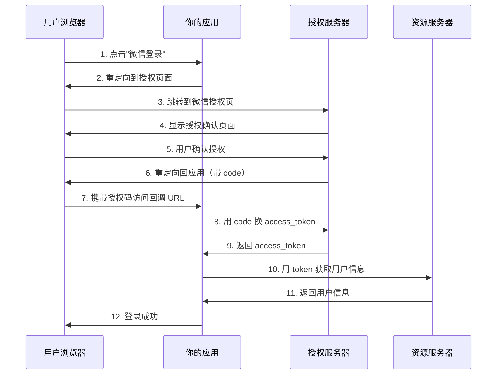

# 6.5.1 OAuth 2.0 流程：授权码模式详解

## 一句话破题

OAuth 2.0 解决的问题是：**让用户授权第三方应用访问自己的数据，但不暴露密码**。授权码模式是最安全的标准流程。

## 核心价值

理解 OAuth 2.0 能让你：
- 明白所有第三方登录的底层原理
- 无论接入哪个平台都能快速上手
- 排查登录失败时知道问题出在哪

## 授权码模式流程



## 快速上手

### 步骤一：构建授权 URL

```typescript
// app/api/auth/wechat/route.ts
export async function GET() {
  const params = new URLSearchParams({
    appid: process.env.WECHAT_APP_ID!,
    redirect_uri: encodeURIComponent('https://your-site.com/api/auth/wechat/callback'),
    response_type: 'code',
    scope: 'snsapi_login',
    state: generateSecureState(),  // 防 CSRF
  })
  
  const authUrl = `https://open.weixin.qq.com/connect/qrconnect?${params}#wechat_redirect`
  return Response.redirect(authUrl)
}
```

### 步骤二：处理回调

```typescript
// app/api/auth/wechat/callback/route.ts
export async function GET(request: Request) {
  const { searchParams } = new URL(request.url)
  const code = searchParams.get('code')
  const state = searchParams.get('state')
  
  // 验证 state 防止 CSRF
  if (!verifyState(state)) {
    return Response.redirect('/login?error=invalid_state')
  }
  
  // 用 code 换 access_token
  const tokenRes = await fetch(
    `https://api.weixin.qq.com/sns/oauth2/access_token?` +
    `appid=${process.env.WECHAT_APP_ID}` +
    `&secret=${process.env.WECHAT_APP_SECRET}` +
    `&code=${code}` +
    `&grant_type=authorization_code`
  )
  
  const { access_token, openid } = await tokenRes.json()
  
  // 获取用户信息
  const userRes = await fetch(
    `https://api.weixin.qq.com/sns/userinfo?access_token=${access_token}&openid=${openid}`
  )
  
  const userInfo = await userRes.json()
  
  // 创建或查找本地用户，建立会话
  // ...
}
```

### 步骤三：State 参数防护

```typescript
import { cookies } from 'next/headers'
import { randomBytes } from 'crypto'

export function generateSecureState(): string {
  const state = randomBytes(32).toString('hex')
  cookies().set('oauth_state', state, {
    httpOnly: true,
    secure: true,
    sameSite: 'lax',
    maxAge: 60 * 10,  // 10 分钟有效
  })
  return state
}

export function verifyState(state: string | null): boolean {
  const stored = cookies().get('oauth_state')?.value
  cookies().delete('oauth_state')
  return !!state && state === stored
}
```

## 关键参数说明

| 参数 | 说明 | 示例 |
|------|------|------|
| `client_id` | 应用的唯一标识 | `wx1234567890abcdef` |
| `redirect_uri` | 授权后跳转的回调地址 | `https://example.com/callback` |
| `response_type` | 固定为 `code` | `code` |
| `scope` | 请求的权限范围 | `snsapi_login` |
| `state` | 防 CSRF 的随机字符串 | `abc123xyz` |

## 避坑指南

::: danger 新手最容易犯的错
1. 忘记验证 `state` 参数——导致 CSRF 漏洞
2. `redirect_uri` 与注册时不一致——授权失败
3. 在前端暴露 `client_secret`——严重安全问题
4. 没有处理授权被拒绝的情况——用户体验差
:::
