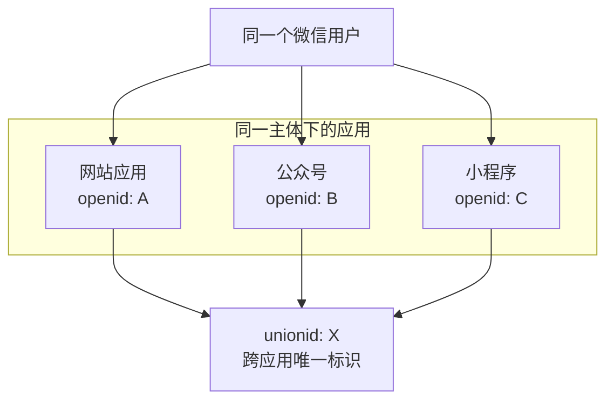

# 6.5.2 微信登录：微信开放平台与公众号登录

## 一句话破题

微信登录分两种场景：**网页扫码登录**（开放平台）和**公众号内登录**（公众平台）。二者 API 不同，需要分别接入。

## 核心价值

理解微信登录能让你：
- 为 C 端产品提供最主流的登录方式
- 理解 openid vs unionid 的区别
- 在公众号场景实现无感登录

## 两种登录方式对比

| 场景 | 平台 | 用户体验 | 适用产品 |
|------|------|----------|----------|
| 网页扫码 | 微信开放平台 | 打开微信扫码 | 独立网站/PC端 |
| 公众号内 | 微信公众平台 | 点击授权 | 公众号 H5 |

## 网页扫码登录

### 前置条件

1. 注册[微信开放平台](https://open.weixin.qq.com/)账号
2. 创建网站应用，通过审核
3. 获取 AppID 和 AppSecret

### 实现代码

```typescript
// app/api/auth/wechat/route.ts
export async function GET() {
  const state = generateSecureState()
  
  const params = new URLSearchParams({
    appid: process.env.WECHAT_OPEN_APP_ID!,
    redirect_uri: 'https://your-site.com/api/auth/wechat/callback',
    response_type: 'code',
    scope: 'snsapi_login',
    state,
  })
  
  return Response.redirect(
    `https://open.weixin.qq.com/connect/qrconnect?${params}#wechat_redirect`
  )
}
```

```typescript
// app/api/auth/wechat/callback/route.ts
export async function GET(request: Request) {
  const { searchParams } = new URL(request.url)
  const code = searchParams.get('code')
  
  // 换取 access_token
  const tokenRes = await fetch(
    `https://api.weixin.qq.com/sns/oauth2/access_token?` +
    `appid=${process.env.WECHAT_OPEN_APP_ID}` +
    `&secret=${process.env.WECHAT_OPEN_APP_SECRET}` +
    `&code=${code}&grant_type=authorization_code`
  )
  
  const { access_token, openid, unionid } = await tokenRes.json()
  
  // 获取用户信息
  const userRes = await fetch(
    `https://api.weixin.qq.com/sns/userinfo?access_token=${access_token}&openid=${openid}`
  )
  
  const { nickname, headimgurl } = await userRes.json()
  
  // 使用 unionid 关联用户（跨应用统一标识）
  const user = await findOrCreateUser({
    unionid,
    openid,
    nickname,
    avatar: headimgurl,
  })
  
  await createSession(user)
  return Response.redirect('/dashboard')
}
```

## 公众号内登录

### 前置条件

1. 拥有已认证的服务号
2. 在公众号后台配置授权域名

### 两种授权模式

| 模式 | scope | 用户感知 | 获取信息 |
|------|-------|----------|----------|
| 静默授权 | `snsapi_base` | 无 | 仅 openid |
| 弹窗授权 | `snsapi_userinfo` | 授权弹窗 | 完整信息 |

### 实现代码

```typescript
// 检测是否在微信内
function isWechatBrowser(ua: string) {
  return /MicroMessenger/i.test(ua)
}

// 公众号授权入口
export async function GET(request: Request) {
  const ua = request.headers.get('user-agent') || ''
  
  if (!isWechatBrowser(ua)) {
    // 非微信环境，使用扫码登录
    return redirectToQrLogin()
  }
  
  // 微信内，使用网页授权
  const params = new URLSearchParams({
    appid: process.env.WECHAT_MP_APP_ID!,
    redirect_uri: encodeURIComponent('https://your-site.com/api/auth/wechat-mp/callback'),
    response_type: 'code',
    scope: 'snsapi_userinfo',  // 或 snsapi_base
    state: generateSecureState(),
  })
  
  return Response.redirect(
    `https://open.weixin.qq.com/connect/oauth2/authorize?${params}#wechat_redirect`
  )
}
```

## openid vs unionid



::: tip 关键理解
- `openid`：同一用户在不同应用中不同
- `unionid`：同一用户在同一主体下的应用中相同
- 要获取 unionid，需要在开放平台绑定公众号/小程序
:::

## 避坑指南

::: danger 新手最容易犯的错
1. 混淆开放平台和公众平台的 API
2. 没有区分网页扫码和公众号内场景
3. 用 openid 而非 unionid 做用户唯一标识
4. 忘记处理用户拒绝授权的情况
:::
