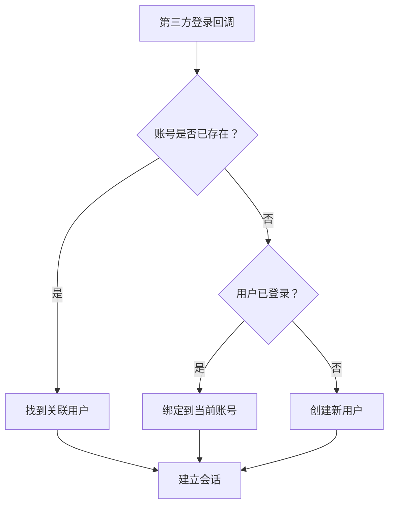

# 6.5.5 多平台账号如何统一——用户账号绑定与解绑

## 一句话破题

当用户可以通过微信、QQ、手机号等多种方式登录时，需要一套机制将这些身份**关联到同一个账号**，避免用户创建多个账号。

## 核心价值

理解账号绑定能让你：
- 避免用户因换登录方式而丢失数据
- 提供更灵活的登录体验
- 构建完整的用户身份体系

## 数据模型设计

```typescript
// prisma/schema.prisma
model User {
  id        String   @id @default(cuid())
  email     String?  @unique
  phone     String?  @unique
  name      String?
  avatar    String?
  accounts  Account[]
  createdAt DateTime @default(now())
}

model Account {
  id                String  @id @default(cuid())
  userId            String
  provider          String  // 'wechat' | 'qq' | 'dingtalk'
  providerAccountId String  // openid 或 unionid
  accessToken       String?
  refreshToken      String?
  user              User    @relation(fields: [userId], references: [id])

  @@unique([provider, providerAccountId])
}
```

## 登录与绑定策略



## 实现代码

```typescript
// lib/account-linking.ts
interface OAuthUserInfo {
  provider: 'wechat' | 'qq' | 'dingtalk'
  providerAccountId: string  // unionid 优先，否则 openid
  email?: string
  name?: string
  avatar?: string
}

export async function handleOAuthLogin(
  oauthInfo: OAuthUserInfo,
  currentUserId?: string  // 如果用户已登录
) {
  // 1. 查找是否已有此第三方账号
  const existingAccount = await prisma.account.findUnique({
    where: {
      provider_providerAccountId: {
        provider: oauthInfo.provider,
        providerAccountId: oauthInfo.providerAccountId,
      },
    },
    include: { user: true },
  })

  // 情况 A：账号已存在，直接登录
  if (existingAccount) {
    return existingAccount.user
  }

  // 情况 B：用户已登录，绑定到当前账号
  if (currentUserId) {
    await prisma.account.create({
      data: {
        userId: currentUserId,
        provider: oauthInfo.provider,
        providerAccountId: oauthInfo.providerAccountId,
      },
    })
    return prisma.user.findUnique({ where: { id: currentUserId } })
  }

  // 情况 C：尝试通过邮箱/手机号匹配现有用户
  if (oauthInfo.email) {
    const existingUser = await prisma.user.findUnique({
      where: { email: oauthInfo.email },
    })
    if (existingUser) {
      await prisma.account.create({
        data: {
          userId: existingUser.id,
          provider: oauthInfo.provider,
          providerAccountId: oauthInfo.providerAccountId,
        },
      })
      return existingUser
    }
  }

  // 情况 D：创建新用户
  return prisma.user.create({
    data: {
      name: oauthInfo.name,
      avatar: oauthInfo.avatar,
      email: oauthInfo.email,
      accounts: {
        create: {
          provider: oauthInfo.provider,
          providerAccountId: oauthInfo.providerAccountId,
        },
      },
    },
  })
}
```

## 账号解绑

```typescript
// app/api/account/unbind/route.ts
export async function POST(request: Request) {
  const session = await getSession()
  if (!session?.userId) {
    return Response.json({ error: '未登录' }, { status: 401 })
  }

  const { provider } = await request.json()

  // 检查是否至少保留一种登录方式
  const accounts = await prisma.account.findMany({
    where: { userId: session.userId },
  })

  const user = await prisma.user.findUnique({
    where: { id: session.userId },
  })

  const hasPassword = !!user?.password
  const hasEmail = !!user?.email
  const otherAccounts = accounts.filter((a) => a.provider !== provider)

  if (!hasPassword && !hasEmail && otherAccounts.length === 0) {
    return Response.json(
      { error: '至少保留一种登录方式' },
      { status: 400 }
    )
  }

  // 解绑
  await prisma.account.deleteMany({
    where: {
      userId: session.userId,
      provider,
    },
  })

  return Response.json({ success: true })
}
```

## 避坑指南

::: danger 新手最容易犯的错
1. 用 openid 而非 unionid 做账号关联——导致同一用户在不同应用中无法关联
2. 没有检查解绑后是否还有登录方式——用户可能无法登录
3. 没有处理账号合并冲突——两个账号都有数据时如何处理
4. 没有通知用户绑定状态变更——用户不知道自己绑定了哪些账号
:::
