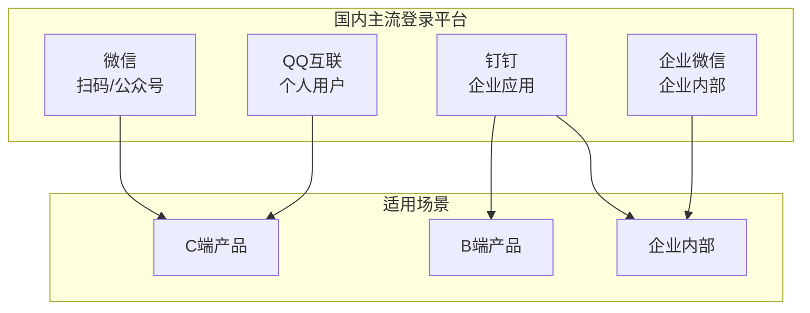

# 6.5 接入微信/QQ 登录——第三方登录集成深度

## 认知重构

国内第三方登录和 Google/GitHub 登录的技术原理完全相同——都是 OAuth 2.0 授权码模式。但实际接入时会遇到很多"中国特色"：

- 申请流程复杂，需要企业资质
- 微信生态碎片化（开放平台 vs 公众号）
- 钉钉/企微主要面向企业内部应用
- 文档和 SDK 的使用体验参差不齐



## 本节内容

| 小节 | 核心问题 | 你将学会 |
|------|----------|----------|
| 6.5.1 OAuth 流程 | 授权码模式是什么？ | 理解第三方登录的通用原理 |
| 6.5.2 微信登录 | 微信登录怎么接？ | 开放平台与公众号登录 |
| 6.5.3 QQ 登录 | QQ 登录怎么接？ | QQ 互联平台配置 |
| 6.5.4 钉钉登录 | 钉钉登录怎么接？ | 企业应用与第三方应用 |
| 6.5.5 账号绑定 | 多平台账号怎么统一？ | 用户账号合并策略 |
| 6.5.6 错误处理 | 登录失败怎么办？ | 异常情况与用户提示 |

## 平台对比速览

| 平台 | 申请难度 | 适用场景 | 是否需要企业资质 |
|------|----------|----------|------------------|
| 微信开放平台 | 高 | C 端产品 | 是 |
| 微信公众号 | 中 | H5/公众号内 | 是（服务号） |
| QQ 互联 | 中 | C 端产品 | 否（但需审核） |
| 钉钉 | 低 | B 端/企业内 | 企业入驻即可 |
| 企业微信 | 低 | 企业内部 | 企业入驻即可 |

## 通用开发模式

无论接入哪个平台，代码结构都类似：

```typescript
// 1. 生成授权 URL，重定向用户
export async function GET(request: Request) {
  const authUrl = buildAuthUrl({
    client_id: process.env.PLATFORM_CLIENT_ID,
    redirect_uri: 'https://your-site.com/api/auth/callback',
    state: generateState(),  // 防 CSRF
    scope: 'user_info',
  })
  return Response.redirect(authUrl)
}

// 2. 接收回调，换取 access_token
export async function GET(request: Request) {
  const { code, state } = getSearchParams(request)
  
  // 验证 state
  if (!verifyState(state)) {
    return Response.redirect('/login?error=invalid_state')
  }
  
  // 用 code 换 token
  const tokenResponse = await fetch(TOKEN_URL, {
    method: 'POST',
    body: new URLSearchParams({
      code,
      client_id: process.env.CLIENT_ID,
      client_secret: process.env.CLIENT_SECRET,
    }),
  })
  
  const { access_token } = await tokenResponse.json()
  
  // 3. 用 token 获取用户信息
  const userInfo = await fetchUserInfo(access_token)
  
  // 4. 创建或关联本地用户
  const user = await findOrCreateUser(userInfo)
  
  // 5. 创建会话
  await createSession(user)
  
  return Response.redirect('/dashboard')
}
```

## AI 协作提示

向 AI 描述国内第三方登录需求时：

- "实现微信扫码登录，使用 OAuth 2.0 授权码模式"
- "在服务端存储 state 防止 CSRF 攻击"
- "处理用户首次登录和账号绑定的逻辑"
- "添加登录失败的错误处理和用户提示"

::: warning 国内登录接入清单
1. [ ] 准备好企业资质材料
2. [ ] 在各平台完成应用注册
3. [ ] 配置正确的回调地址
4. [ ] 实现 state 参数防 CSRF
5. [ ] 处理多平台账号绑定逻辑
6. [ ] 完善错误提示和异常处理
:::
