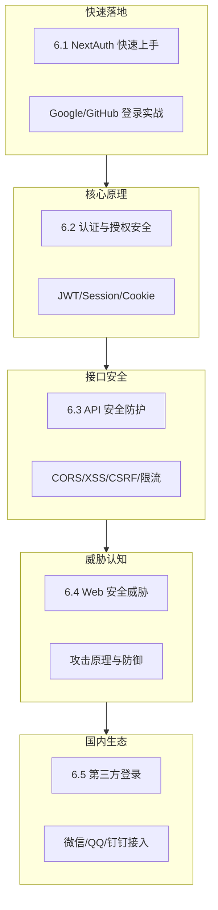

# 6 ｜认证与安全（Web 安全高级）

## 为什么安全是你绕不开的必修课

在 Vibe Coding 时代，AI 能帮你快速生成登录注册、表单提交、API 接口等代码。但 AI 不会主动替你思考安全问题——它可能漏掉 CSRF 防护、忘记对输入进行验证、或者把敏感信息暴露在客户端。

**安全不是"锦上添花"，而是"底线要求"。** 一个没有安全意识的产品，上线后可能面临：

- 用户数据泄露 → 法律风险
- 账号被盗 → 用户流失
- 接口被滥用 → 服务崩溃
- 支付漏洞 → 直接经济损失

## 本章的学习路径

## 章节概览

| 章节 | 核心问题 | 你将学会 |
|------|----------|----------|
| **6.1 NextAuth 快速上手** | 如何快速实现登录功能？ | 10 分钟搭建 Google/GitHub 登录 |
| **6.2 认证与授权安全** | JWT 和 Session 怎么选？ | 理解各种认证方案的安全边界 |
| **6.3 API 安全防护** | 接口如何防止被滥用？ | CORS 配置、限流、输入验证 |
| **6.4 Web 安全威胁** | 黑客怎么攻击网站？ | XSS/CSRF/注入的原理与防御 |
| **6.5 第三方登录集成** | 如何接入国内登录？ | 微信/QQ/钉钉 OAuth 实战 |

## 安全思维的核心原则

在深入技术细节之前，先建立正确的安全思维：

### 1. 永远不信任客户端

来自浏览器的任何数据都可能被篡改。所有验证必须在服务端再做一次。

### 2. 最小权限原则

用户只能访问他需要的资源，代码只能拥有它需要的权限。

### 3. 纵深防御

不要依赖单一防护手段。认证、授权、输入验证、加密——每一层都要设防。

### 4. 安全是持续过程

安全不是一次性配置。定期更新依赖、审计代码、监控异常行为。

## AI 协作提示

在让 AI 生成安全相关代码时，可以使用以下关键词提示：

- "请添加 CSRF 防护"
- "对用户输入进行验证和转义"
- "使用 HttpOnly 和 Secure 标志设置 Cookie"
- "实现请求限流防止滥用"
- "确保敏感信息不会暴露在客户端"

::: warning 安全代码审查清单
无论 AI 生成什么代码，务必检查：
1. 敏感信息是否暴露在前端？
2. 用户输入是否经过验证？
3. 数据库查询是否有注入风险？
4. Cookie 是否设置了安全属性？
5. API 是否有访问控制？
:::
