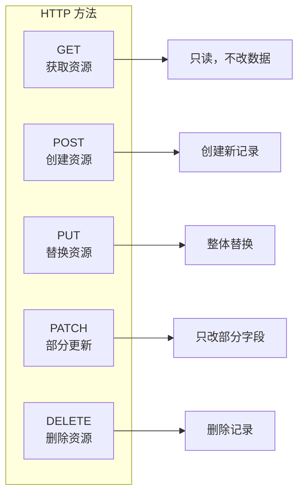

# 7.1.1 HTTP 方法语义

## 一句话破题

HTTP 方法就是告诉服务器"你要干什么"——GET 是看，POST 是创建，PUT 是改，DELETE 是删。用错方法就像用菜刀去拧螺丝。

## 五种核心方法



| 方法 | 语义 | 幂等性 | 请求体 | 典型场景 |
|------|------|--------|--------|----------|
| **GET** | 获取 | ✅ 是 | ❌ 无 | 获取用户列表、查看详情 |
| **POST** | 创建 | ❌ 否 | ✅ 有 | 注册用户、提交订单 |
| **PUT** | 替换 | ✅ 是 | ✅ 有 | 更新用户全部信息 |
| **PATCH** | 部分更新 | ✅ 是 | ✅ 有 | 只改用户昵称 |
| **DELETE** | 删除 | ✅ 是 | ❌ 无 | 删除文章 |

## Next.js 中的实现

### API Route 示例

```typescript
// app/api/users/route.ts
import { NextRequest, NextResponse } from 'next/server'

// GET /api/users - 获取用户列表
export async function GET(request: NextRequest) {
  const users = await prisma.user.findMany()
  return NextResponse.json(users)
}

// POST /api/users - 创建用户
export async function POST(request: NextRequest) {
  const body = await request.json()
  const user = await prisma.user.create({ data: body })
  return NextResponse.json(user, { status: 201 })
}
```

```typescript
// app/api/users/[id]/route.ts

// GET /api/users/:id - 获取单个用户
export async function GET(
  request: NextRequest,
  { params }: { params: { id: string } }
) {
  const user = await prisma.user.findUnique({
    where: { id: params.id }
  })
  
  if (!user) {
    return NextResponse.json(
      { error: 'User not found' },
      { status: 404 }
    )
  }
  
  return NextResponse.json(user)
}

// PUT /api/users/:id - 替换用户
export async function PUT(
  request: NextRequest,
  { params }: { params: { id: string } }
) {
  const body = await request.json()
  const user = await prisma.user.update({
    where: { id: params.id },
    data: body,  // 整体替换
  })
  return NextResponse.json(user)
}

// PATCH /api/users/:id - 部分更新
export async function PATCH(
  request: NextRequest,
  { params }: { params: { id: string } }
) {
  const body = await request.json()
  const user = await prisma.user.update({
    where: { id: params.id },
    data: body,  // 只更新传入的字段
  })
  return NextResponse.json(user)
}

// DELETE /api/users/:id - 删除用户
export async function DELETE(
  request: NextRequest,
  { params }: { params: { id: string } }
) {
  await prisma.user.delete({
    where: { id: params.id }
  })
  return new NextResponse(null, { status: 204 })
}
```

## PUT vs PATCH

```typescript
// 用户原数据
const user = {
  id: '1',
  name: 'Alice',
  email: 'alice@example.com',
  avatar: 'avatar.png',
}

// PUT：需要传入完整数据
// PUT /api/users/1
// Body: { name: 'Alice New', email: 'alice@example.com', avatar: 'avatar.png' }
// 如果漏传 avatar，avatar 会被清空

// PATCH：只传需要改的字段
// PATCH /api/users/1
// Body: { name: 'Alice New' }
// 只改 name，其他字段保持不变
```

| 场景 | 使用方法 |
|------|----------|
| 表单提交（全部字段） | PUT |
| 只改头像 | PATCH |
| 只改状态 | PATCH |
| 导入数据覆盖 | PUT |

## 觉知：常见错误

### 1. 用 POST 做所有事

```typescript
// ❌ 错误：全用 POST
POST /api/getUser      // 应该用 GET
POST /api/deleteUser   // 应该用 DELETE
POST /api/updateUser   // 应该用 PUT/PATCH

// ✅ 正确：语义清晰
GET /api/users/123
DELETE /api/users/123
PATCH /api/users/123
```

### 2. GET 请求带 Body

```typescript
// ❌ GET 请求不应该有 Body
GET /api/users
Body: { filter: 'active' }

// ✅ 用查询参数
GET /api/users?status=active
```

### 3. DELETE 返回被删除的数据

```typescript
// ❌ 不推荐：返回被删除的数据
DELETE /api/users/123
Response: { id: '123', name: 'Alice', ... }

// ✅ 推荐：返回 204 No Content
DELETE /api/users/123
Response: (无内容，状态码 204)
```

## 本节小结

| 要点 | 说明 |
|------|------|
| **GET 只读** | 不应该修改任何数据 |
| **POST 创建** | 每次调用可能创建新资源 |
| **PUT 替换** | 需要传完整数据 |
| **PATCH 更新** | 只传要改的字段 |
| **DELETE 删除** | 返回 204 无内容 |
