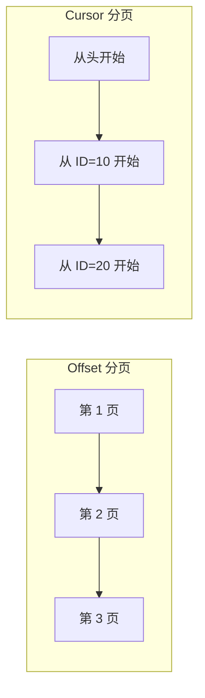
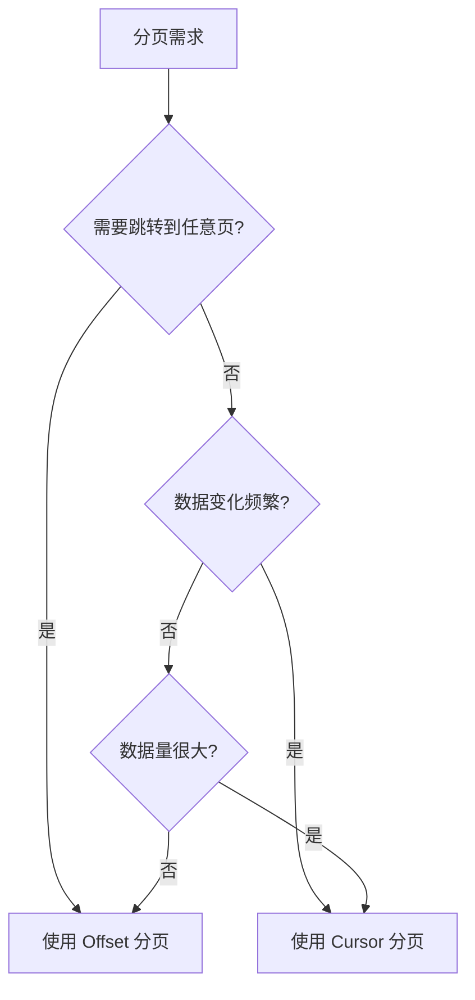

# 7.1.3 分页策略

## 一句话破题

当数据量超过一屏能显示的范围时，分页是必须的——问题是用哪种分页方式：传统的"第几页"还是更现代的"从哪条开始"。

## 两种分页方式



| 方式 | 原理 | 适用场景 |
|------|------|----------|
| **Offset** | 跳过前 N 条，取 M 条 | 传统分页、后台管理 |
| **Cursor** | 从某个位置开始，取 M 条 | 无限滚动、实时数据 |

## Offset 分页

### 请求格式

```
GET /api/posts?page=2&pageSize=10
```

### 实现代码

```typescript
// app/api/posts/route.ts
export async function GET(request: NextRequest) {
  const { searchParams } = new URL(request.url)
  const page = parseInt(searchParams.get('page') || '1')
  const pageSize = parseInt(searchParams.get('pageSize') || '10')
  
  const skip = (page - 1) * pageSize
  
  const [posts, total] = await Promise.all([
    prisma.post.findMany({
      skip,
      take: pageSize,
      orderBy: { createdAt: 'desc' },
    }),
    prisma.post.count(),
  ])
  
  return NextResponse.json({
    data: posts,
    pagination: {
      page,
      pageSize,
      total,
      totalPages: Math.ceil(total / pageSize),
    },
  })
}
```

### 响应示例

```json
{
  "data": [
    { "id": "11", "title": "Post 11" },
    { "id": "12", "title": "Post 12" }
  ],
  "pagination": {
    "page": 2,
    "pageSize": 10,
    "total": 100,
    "totalPages": 10
  }
}
```

### 优缺点

| 优点 | 缺点 |
|------|------|
| 可以跳转到任意页 | 数据变化时可能重复或遗漏 |
| 用户体验直观 | 大数据量时性能差 |
| 实现简单 | 需要 COUNT 查询 |

## Cursor 分页

### 请求格式

```
GET /api/posts?cursor=abc123&limit=10
```

### 实现代码

```typescript
// app/api/posts/route.ts
export async function GET(request: NextRequest) {
  const { searchParams } = new URL(request.url)
  const cursor = searchParams.get('cursor')
  const limit = parseInt(searchParams.get('limit') || '10')
  
  const posts = await prisma.post.findMany({
    take: limit + 1,  // 多取一条判断是否有下一页
    ...(cursor && {
      cursor: { id: cursor },
      skip: 1,  // 跳过 cursor 本身
    }),
    orderBy: { createdAt: 'desc' },
  })
  
  const hasMore = posts.length > limit
  const data = hasMore ? posts.slice(0, -1) : posts
  const nextCursor = hasMore ? data[data.length - 1].id : null
  
  return NextResponse.json({
    data,
    nextCursor,
    hasMore,
  })
}
```

### 响应示例

```json
{
  "data": [
    { "id": "abc123", "title": "Post 1" },
    { "id": "def456", "title": "Post 2" }
  ],
  "nextCursor": "def456",
  "hasMore": true
}
```

### 前端使用

```typescript
// 无限滚动加载
const [posts, setPosts] = useState<Post[]>([])
const [cursor, setCursor] = useState<string | null>(null)
const [hasMore, setHasMore] = useState(true)

async function loadMore() {
  const url = cursor 
    ? `/api/posts?cursor=${cursor}&limit=10`
    : '/api/posts?limit=10'
    
  const res = await fetch(url)
  const { data, nextCursor, hasMore } = await res.json()
  
  setPosts(prev => [...prev, ...data])
  setCursor(nextCursor)
  setHasMore(hasMore)
}
```

### 优缺点

| 优点 | 缺点 |
|------|------|
| 数据一致性好 | 不能跳转到任意页 |
| 性能稳定 | 实现相对复杂 |
| 适合实时数据 | 不知道总页数 |

## 如何选择？



| 场景 | 推荐方式 |
|------|----------|
| 后台管理列表 | Offset |
| 社交媒体信息流 | Cursor |
| 搜索结果 | Offset |
| 聊天记录 | Cursor |
| 电商商品列表 | Offset |
| 实时通知 | Cursor |

## 觉知：常见问题

### 1. Offset 分页的数据错乱

```
场景：用户在第 2 页，此时有人发了新帖子

原本第 1 页最后一条（第 10 条）被挤到了第 2 页
用户刷新第 2 页，会看到重复的内容
```

### 2. Cursor 不一定是 ID

```typescript
// cursor 可以是任意唯一且有序的值
const cursor = {
  id: 'abc123',           // 按 ID
  createdAt: '2024-01-15', // 按时间
  score: 100,             // 按分数
}

// 编码后传递
const encodedCursor = Buffer.from(JSON.stringify(cursor)).toString('base64')
```

### 3. 分页参数验证

```typescript
// 防止恶意请求
const page = Math.max(1, Math.min(100, parseInt(params.page || '1')))
const pageSize = Math.max(1, Math.min(100, parseInt(params.pageSize || '10')))
```

## 本节小结

| 要点 | 说明 |
|------|------|
| **Offset 分页** | 适合后台管理、需要跳转 |
| **Cursor 分页** | 适合无限滚动、实时数据 |
| **性能考虑** | 大数据量优先 Cursor |
| **一致性考虑** | 数据频繁变化用 Cursor |
