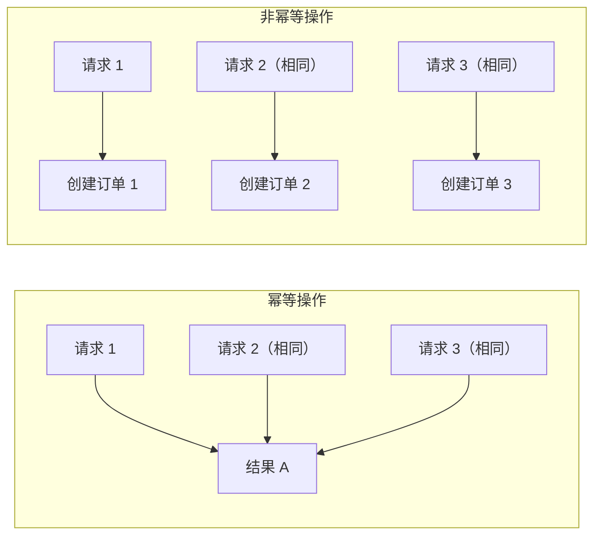

# 7.1.5 幂等性保证

## 一句话破题

幂等性就是"做一次和做一百次效果一样"——用户网络不好多点了几下提交按钮，不会创建多个订单。

## 什么是幂等性



| HTTP 方法 | 幂等性 | 说明 |
|-----------|--------|------|
| GET | ✅ 是 | 获取数据，不改变状态 |
| PUT | ✅ 是 | 替换资源，多次执行结果相同 |
| DELETE | ✅ 是 | 删除资源，删一次和删多次结果相同 |
| PATCH | ✅ 是 | 部分更新，多次执行结果相同 |
| POST | ❌ 否 | 创建资源，每次可能创建新资源 |

## 问题场景

### 用户重复提交

```
1. 用户点击"提交订单"
2. 网络慢，页面没反应
3. 用户又点了几次
4. 网络恢复，多个请求同时到达服务器
5. 创建了多个重复订单！
```

### 网络重试

```
1. 客户端发送请求
2. 服务器处理成功
3. 响应在网络中丢失
4. 客户端认为失败，自动重试
5. 服务器又处理了一次
```

## 解决方案

### 方案一：幂等 Key

```typescript
// 客户端生成唯一 Key
const idempotencyKey = crypto.randomUUID()

fetch('/api/orders', {
  method: 'POST',
  headers: {
    'Content-Type': 'application/json',
    'Idempotency-Key': idempotencyKey,
  },
  body: JSON.stringify(orderData),
})
```

```typescript
// 服务端处理
// app/api/orders/route.ts
export async function POST(request: NextRequest) {
  const idempotencyKey = request.headers.get('Idempotency-Key')
  
  if (!idempotencyKey) {
    return NextResponse.json(
      { error: '缺少 Idempotency-Key' },
      { status: 400 }
    )
  }
  
  // 检查是否已处理过
  const existing = await prisma.idempotencyRecord.findUnique({
    where: { key: idempotencyKey },
  })
  
  if (existing) {
    // 返回之前的结果
    return NextResponse.json(JSON.parse(existing.response))
  }
  
  // 处理请求
  const body = await request.json()
  const order = await prisma.order.create({ data: body })
  
  // 记录幂等 Key
  await prisma.idempotencyRecord.create({
    data: {
      key: idempotencyKey,
      response: JSON.stringify(order),
      expiresAt: new Date(Date.now() + 24 * 60 * 60 * 1000), // 24小时后过期
    },
  })
  
  return NextResponse.json(order, { status: 201 })
}
```

### 方案二：业务唯一约束

```typescript
// 利用业务字段的唯一性
// 例如：用户 + 商品 + 时间窗口 = 唯一订单

const orderKey = `${userId}_${productId}_${Date.now().toString().slice(0, -3)}`

try {
  const order = await prisma.order.create({
    data: {
      ...orderData,
      orderKey,  // 唯一约束
    },
  })
  return NextResponse.json(order, { status: 201 })
} catch (error) {
  if (error.code === 'P2002') {
    // 唯一约束冲突，说明已经创建过
    const existing = await prisma.order.findUnique({
      where: { orderKey },
    })
    return NextResponse.json(existing)
  }
  throw error
}
```

### 方案三：前端防抖

```typescript
// 按钮点击后禁用
function SubmitButton() {
  const [isSubmitting, setIsSubmitting] = useState(false)
  
  async function handleSubmit() {
    if (isSubmitting) return
    
    setIsSubmitting(true)
    try {
      await submitOrder()
    } finally {
      setIsSubmitting(false)
    }
  }
  
  return (
    <button 
      onClick={handleSubmit} 
      disabled={isSubmitting}
    >
      {isSubmitting ? '提交中...' : '提交订单'}
    </button>
  )
}
```

### 方案四：乐观锁

```typescript
// 使用版本号防止并发更新冲突
async function updateInventory(productId: string, quantity: number) {
  const product = await prisma.product.findUnique({
    where: { id: productId },
  })
  
  const updated = await prisma.product.updateMany({
    where: {
      id: productId,
      version: product.version,  // 版本号匹配才更新
    },
    data: {
      stock: { decrement: quantity },
      version: { increment: 1 },
    },
  })
  
  if (updated.count === 0) {
    throw new Error('并发冲突，请重试')
  }
}
```

## 最佳实践

### 组合使用

```typescript
// 1. 前端：防抖 + 幂等 Key
// 2. 后端：幂等 Key 检查 + 业务约束

// 前端
const [idempotencyKey] = useState(() => crypto.randomUUID())

async function submit() {
  if (isSubmitting) return
  setIsSubmitting(true)
  
  await fetch('/api/orders', {
    headers: { 'Idempotency-Key': idempotencyKey },
    body: JSON.stringify(data),
  })
}

// 后端
export async function POST(request: NextRequest) {
  const key = request.headers.get('Idempotency-Key')
  
  // 1. 检查幂等 Key
  const cached = await checkIdempotencyKey(key)
  if (cached) return cached
  
  // 2. 业务处理（有唯一约束兜底）
  try {
    const order = await createOrder(data)
    await saveIdempotencyKey(key, order)
    return NextResponse.json(order)
  } catch (error) {
    if (isDuplicateError(error)) {
      return getExistingOrder(data)
    }
    throw error
  }
}
```

## 觉知：常见误区

### 1. 只依赖前端防抖

```
❌ 只在前端禁用按钮
   - 用户可以刷新页面重新提交
   - 可以用开发者工具绕过
   
✅ 前端防抖 + 后端幂等保证
```

### 2. 幂等 Key 永久存储

```typescript
// ❌ 永久存储会导致数据膨胀
await prisma.idempotencyRecord.create({
  data: { key, response },
})

// ✅ 设置过期时间，定期清理
await prisma.idempotencyRecord.create({
  data: {
    key,
    response,
    expiresAt: new Date(Date.now() + 24 * 60 * 60 * 1000),
  },
})
```

### 3. 忽略响应一致性

```typescript
// ❌ 重复请求返回不同响应
// 第一次: { id: 1, status: 'created' }
// 第二次: { message: '已存在' }

// ✅ 返回相同的响应结构
// 第一次和第二次都返回: { id: 1, status: 'created' }
```

## 本节小结

| 要点 | 说明 |
|------|------|
| **幂等性** | 多次执行效果相同 |
| **幂等 Key** | 客户端生成，服务端去重 |
| **业务约束** | 利用唯一索引防止重复 |
| **多层防护** | 前端防抖 + 后端校验 |
