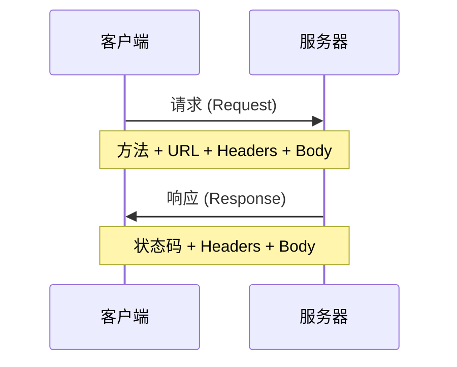

# 7.1 接口是合同不是暗语——HTTP 与 API

## 认知重构

API 接口就像餐厅的菜单：菜名（URL）要清晰、价格（参数）要明确、上菜流程（方法）要规范。如果菜单写得含糊不清，服务员和厨师都会崩溃。

```
好的 API：GET /users/123 → 获取 ID 为 123 的用户
烂的 API：POST /api/getData?type=user&action=get&id=123
```

## HTTP 请求的本质



一个完整的 HTTP 请求包含：

| 组成部分 | 说明 | 示例 |
|----------|------|------|
| **方法** | 要做什么操作 | GET, POST, PUT, DELETE |
| **URL** | 操作什么资源 | /api/users/123 |
| **Headers** | 附加信息 | Authorization, Content-Type |
| **Body** | 请求数据 | JSON 格式的数据 |

## 本节内容

- **7.1.1 HTTP 方法语义**：GET/POST/PUT/DELETE 的正确用法
- **7.1.2 JSON 数据格式**：前后端数据交换的通用语言
- **7.1.3 分页策略**：数据太多时如何分批获取
- **7.1.4 过滤与排序**：精确获取需要的数据
- **7.1.5 幂等性保证**：重复请求不会产生副作用

## 核心原则

| 原则 | 说明 |
|------|------|
| **语义清晰** | URL 和方法要能表达操作意图 |
| **格式统一** | 请求和响应使用一致的数据格式 |
| **可预测** | 相同的请求总是得到相同类型的响应 |
| **安全重试** | 网络问题时可以安全地重试请求 |
