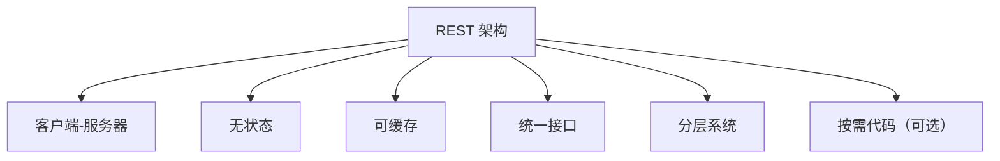
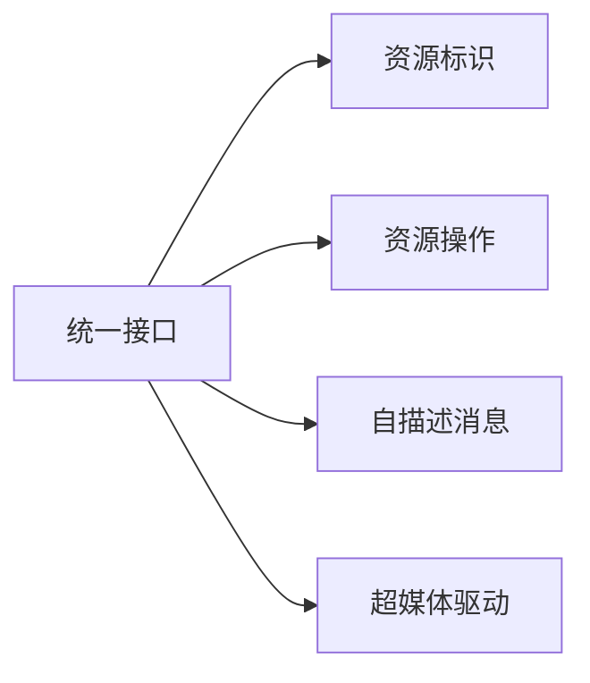
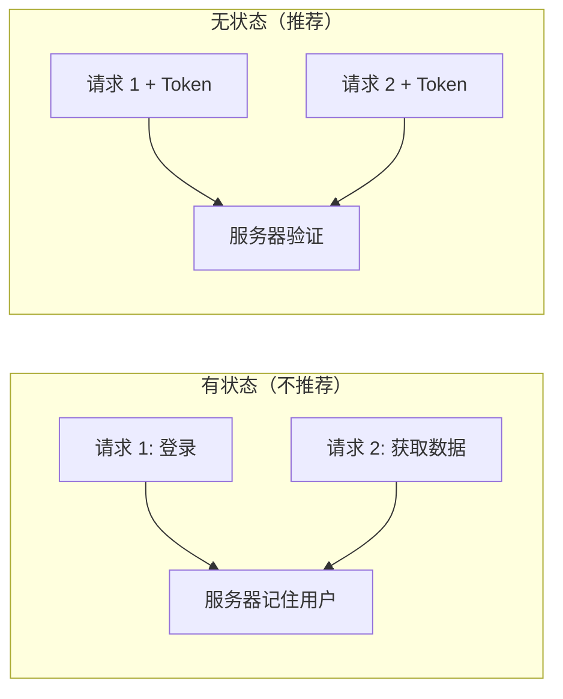
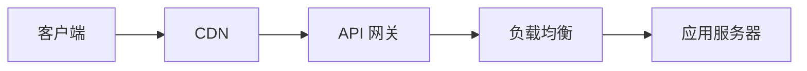

# 7.2.1 REST 约束

## 一句话破题

REST 不是一个技术，而是一套设计约束——遵守这些约束，你的 API 就会变得简单、可预测、易扩展。

## REST 六大约束



| 约束 | 含义 | 好处 |
|------|------|------|
| **客户端-服务器** | 前后端分离 | 各自独立演进 |
| **无状态** | 服务器不保存会话状态 | 易于扩展 |
| **可缓存** | 响应可以被缓存 | 提高性能 |
| **统一接口** | 使用标准的 HTTP 方法 | 接口可预测 |
| **分层系统** | 可以有中间层 | 灵活架构 |
| **按需代码** | 可下载可执行代码 | 可选特性 |

## 统一接口

### 核心原则

统一接口是 REST 最重要的约束，包含四个子约束：



### 资源标识

```typescript
// 每个资源都有唯一的 URL
/api/users/123        // 用户资源
/api/posts/456        // 文章资源
/api/users/123/posts  // 用户的文章
```

### 资源操作

```typescript
// 通过 HTTP 方法表达操作意图
GET    /api/users/123   // 读取
POST   /api/users       // 创建
PUT    /api/users/123   // 替换
PATCH  /api/users/123   // 更新
DELETE /api/users/123   // 删除
```

### 自描述消息

```typescript
// 请求头包含足够的元信息
fetch('/api/users', {
  method: 'POST',
  headers: {
    'Content-Type': 'application/json',  // 告知请求体格式
    'Accept': 'application/json',         // 期望响应格式
    'Authorization': 'Bearer xxx',        // 认证信息
  },
  body: JSON.stringify(data),
})
```

## 无状态

### 什么是无状态



### 无状态的实现

```typescript
// 每个请求都携带完整的认证信息
fetch('/api/users', {
  headers: {
    'Authorization': `Bearer ${token}`,  // 每次都带 Token
  },
})
```

### 好处

| 好处 | 说明 |
|------|------|
| **易扩展** | 请求可以发到任意服务器 |
| **高可用** | 服务器挂了换一台即可 |
| **简单** | 不需要维护会话状态 |

## 可缓存

### 缓存控制头

```typescript
// app/api/posts/route.ts
export async function GET() {
  const posts = await getPosts()
  
  return NextResponse.json(posts, {
    headers: {
      'Cache-Control': 'public, max-age=60',  // 可公开缓存，60秒有效
      'ETag': generateETag(posts),            // 资源指纹
    },
  })
}
```

### 常用缓存策略

| 策略 | Header | 适用场景 |
|------|--------|----------|
| **不缓存** | `no-store` | 敏感数据 |
| **验证缓存** | `no-cache` | 频繁更新 |
| **短期缓存** | `max-age=60` | 列表数据 |
| **长期缓存** | `max-age=31536000` | 静态资源 |

```typescript
// 不同场景的缓存策略
const cacheStrategies = {
  sensitive: 'private, no-store',           // 用户敏感数据
  dynamic: 'private, no-cache',             // 个人动态数据
  shared: 'public, max-age=60',             // 公共列表
  static: 'public, max-age=31536000',       // 静态资源
}
```

## 分层系统



客户端不需要知道中间有多少层，只需要知道最终的 API 地址。

## RESTful vs 非 RESTful

| 方面 | RESTful | 非 RESTful |
|------|---------|------------|
| URL 设计 | `/api/users/123` | `/api/getUser?id=123` |
| 操作表达 | HTTP 方法 | URL 或参数 |
| 状态管理 | Token | Session |
| 缓存 | HTTP 缓存头 | 自定义逻辑 |

## 觉知：常见误区

### 1. 把动作放到 URL 里

```
❌ POST /api/createUser
❌ GET  /api/getUsers
❌ POST /api/deleteUser

✅ POST   /api/users
✅ GET    /api/users
✅ DELETE /api/users/123
```

### 2. 滥用 POST

```
❌ 所有操作都用 POST
   POST /api/users/get
   POST /api/users/delete
   
✅ 根据语义选择方法
   GET    /api/users
   DELETE /api/users/123
```

### 3. 不区分公开和私有缓存

```typescript
// ❌ 用户私有数据使用公开缓存
headers: { 'Cache-Control': 'public, max-age=3600' }

// ✅ 私有数据使用私有缓存
headers: { 'Cache-Control': 'private, max-age=60' }
```

## 本节小结

| 要点 | 说明 |
|------|------|
| **统一接口** | 用 HTTP 方法表达操作意图 |
| **无状态** | 每个请求携带完整信息 |
| **可缓存** | 利用 HTTP 缓存机制 |
| **分层系统** | 客户端不感知中间层 |
