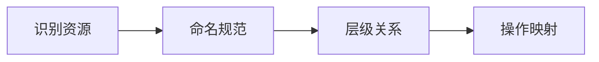
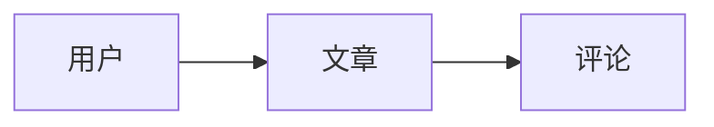

# 7.2.2 资源设计

## 一句话破题

REST 的 R 是 Resource（资源），URL 就是资源的地址——好的 URL 设计让 API 一目了然。

## URL 设计原则



| 原则 | 说明 | 示例 |
|------|------|------|
| **名词而非动词** | URL 表示资源 | `/users` 而非 `/getUsers` |
| **复数形式** | 资源集合用复数 | `/posts` 而非 `/post` |
| **小写字母** | 统一使用小写 | `/api/users` 而非 `/api/Users` |
| **连字符分隔** | 多词用连字符 | `/blog-posts` 而非 `/blogPosts` |

## 基本 CRUD 操作

```typescript
// 资源: 文章 (posts)

// 集合操作
GET    /api/posts          // 获取文章列表
POST   /api/posts          // 创建文章

// 单个资源操作
GET    /api/posts/:id      // 获取单篇文章
PUT    /api/posts/:id      // 替换文章
PATCH  /api/posts/:id      // 更新文章部分字段
DELETE /api/posts/:id      // 删除文章
```

### Next.js 实现

```typescript
// app/api/posts/route.ts - 集合操作
export async function GET(request: NextRequest) {
  const posts = await prisma.post.findMany()
  return NextResponse.json({ data: posts })
}

export async function POST(request: NextRequest) {
  const body = await request.json()
  const post = await prisma.post.create({ data: body })
  return NextResponse.json(post, { status: 201 })
}

// app/api/posts/[id]/route.ts - 单个资源操作
export async function GET(
  request: NextRequest,
  { params }: { params: { id: string } }
) {
  const post = await prisma.post.findUnique({
    where: { id: params.id },
  })
  
  if (!post) {
    return NextResponse.json(
      { error: { code: 'NOT_FOUND', message: '文章不存在' } },
      { status: 404 }
    )
  }
  
  return NextResponse.json(post)
}
```

## 嵌套资源



### 设计模式

```typescript
// 用户的文章
GET    /api/users/:userId/posts
POST   /api/users/:userId/posts

// 文章的评论
GET    /api/posts/:postId/comments
POST   /api/posts/:postId/comments

// 最多嵌套两层，更深用查询参数
GET    /api/comments?postId=123&userId=456
```

### 实现示例

```typescript
// app/api/users/[userId]/posts/route.ts
export async function GET(
  request: NextRequest,
  { params }: { params: { userId: string } }
) {
  const posts = await prisma.post.findMany({
    where: { authorId: params.userId },
  })
  return NextResponse.json({ data: posts })
}

export async function POST(
  request: NextRequest,
  { params }: { params: { userId: string } }
) {
  const body = await request.json()
  const post = await prisma.post.create({
    data: {
      ...body,
      authorId: params.userId,
    },
  })
  return NextResponse.json(post, { status: 201 })
}
```

## 非 CRUD 操作

有些操作不是简单的 CRUD，需要特殊处理：

### 方案一：使用动作资源

```typescript
// 发布文章
POST   /api/posts/:id/publish

// 取消发布
POST   /api/posts/:id/unpublish

// 归档
POST   /api/posts/:id/archive
```

### 方案二：使用 PATCH 更新状态

```typescript
// 更新状态字段
PATCH  /api/posts/:id
{ "status": "published" }
```

### 方案三：批量操作

```typescript
// 批量删除
POST   /api/posts/batch-delete
{ "ids": ["1", "2", "3"] }

// 批量更新
POST   /api/posts/batch-update
{ "ids": ["1", "2"], "data": { "status": "archived" } }
```

## URL 设计示例

### 电商系统

```typescript
// 商品
GET    /api/products
GET    /api/products/:id
GET    /api/products/:id/reviews

// 购物车
GET    /api/cart
POST   /api/cart/items
DELETE /api/cart/items/:itemId

// 订单
GET    /api/orders
POST   /api/orders
GET    /api/orders/:id
POST   /api/orders/:id/cancel
POST   /api/orders/:id/pay
```

### 博客系统

```typescript
// 文章
GET    /api/posts
GET    /api/posts/:id
GET    /api/posts/:slug          // 使用 slug 作为标识

// 分类和标签
GET    /api/categories
GET    /api/categories/:id/posts

GET    /api/tags
GET    /api/tags/:name/posts     // 标签关联的文章

// 评论
GET    /api/posts/:id/comments
POST   /api/posts/:id/comments
```

## 查询与过滤

```typescript
// 分页
GET /api/posts?page=2&pageSize=10

// 过滤
GET /api/posts?status=published&authorId=123

// 排序
GET /api/posts?sort=-createdAt

// 搜索
GET /api/posts?search=typescript

// 字段选择
GET /api/posts?fields=id,title,createdAt

// 组合使用
GET /api/posts?status=published&sort=-createdAt&page=1&pageSize=10
```

## 觉知：常见错误

### 1. 动词放入 URL

```
❌ GET  /api/getUsers
❌ POST /api/createPost
❌ POST /api/deleteUser/123

✅ GET    /api/users
✅ POST   /api/posts
✅ DELETE /api/users/123
```

### 2. 单复数混用

```
❌ GET /api/user          // 应该是复数
❌ GET /api/users/1/post  // 嵌套也应该是复数

✅ GET /api/users
✅ GET /api/users/1/posts
```

### 3. 过深的嵌套

```
❌ /api/users/1/posts/2/comments/3/replies/4
   太深了，难以维护

✅ /api/replies/4
✅ /api/comments?postId=2&replyTo=3
```

### 4. 使用 ID 以外的无意义标识

```
❌ /api/posts/abc123xyz   // 无意义的标识

✅ /api/posts/123         // 数据库 ID
✅ /api/posts/my-first-post  // 有意义的 slug
```

## 本节小结

| 要点 | 说明 |
|------|------|
| **名词复数** | `/users` 而非 `/getUser` |
| **HTTP 方法** | 用方法表达操作意图 |
| **嵌套两层** | 最多嵌套两层，更深用查询 |
| **非 CRUD** | 使用动作资源或状态更新 |
