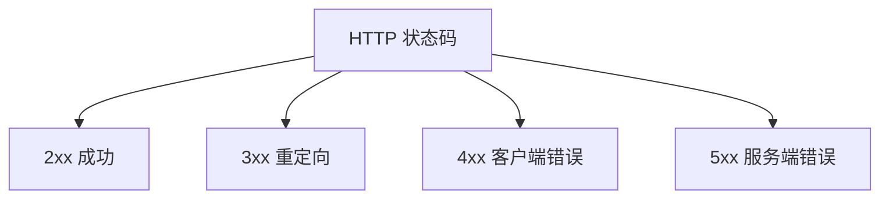
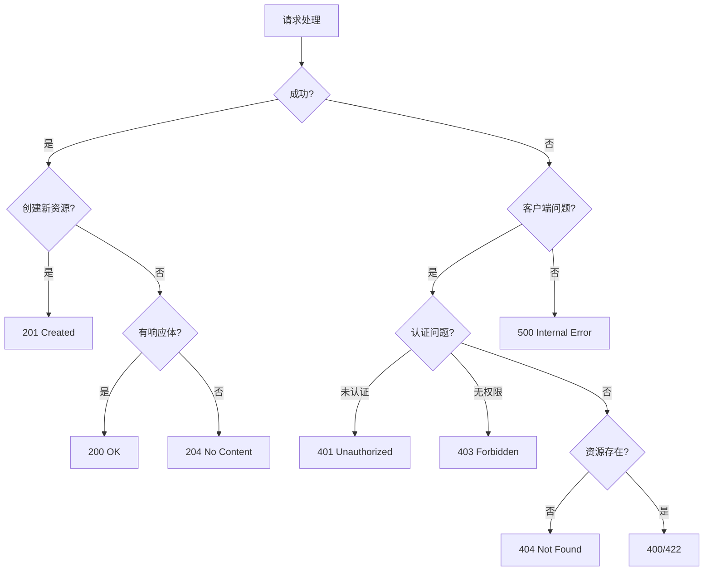

# 7.2.3 HTTP 状态码

## 一句话破题

状态码是服务器对请求的"判决结果"——2xx 是成功，4xx 是"你错了"，5xx 是"我错了"。

## 状态码分类



| 分类 | 含义 | 典型场景 |
|------|------|----------|
| **2xx** | 成功 | 请求正常处理 |
| **3xx** | 重定向 | 资源位置变更 |
| **4xx** | 客户端错误 | 请求有问题 |
| **5xx** | 服务端错误 | 服务器处理失败 |

## 常用 2xx 状态码

| 状态码 | 含义 | 使用场景 |
|--------|------|----------|
| **200 OK** | 请求成功 | GET、PUT、PATCH 成功 |
| **201 Created** | 资源已创建 | POST 创建成功 |
| **204 No Content** | 无内容返回 | DELETE 成功 |

### 使用示例

```typescript
// 200 OK - 获取成功
export async function GET() {
  const posts = await prisma.post.findMany()
  return NextResponse.json({ data: posts })  // 默认 200
}

// 201 Created - 创建成功
export async function POST(request: NextRequest) {
  const body = await request.json()
  const post = await prisma.post.create({ data: body })
  return NextResponse.json(post, { status: 201 })
}

// 204 No Content - 删除成功
export async function DELETE() {
  await prisma.post.delete({ where: { id } })
  return new NextResponse(null, { status: 204 })
}
```

## 常用 4xx 状态码

| 状态码 | 含义 | 使用场景 |
|--------|------|----------|
| **400 Bad Request** | 请求格式错误 | 参数验证失败 |
| **401 Unauthorized** | 未认证 | 未登录 |
| **403 Forbidden** | 无权限 | 权限不足 |
| **404 Not Found** | 资源不存在 | 找不到资源 |
| **409 Conflict** | 冲突 | 资源已存在 |
| **422 Unprocessable Entity** | 语义错误 | 业务规则验证失败 |
| **429 Too Many Requests** | 请求过多 | 触发限流 |

### 使用示例

```typescript
// 400 Bad Request - 参数格式错误
if (!body.email || !isValidEmail(body.email)) {
  return NextResponse.json(
    { error: { code: 'INVALID_EMAIL', message: '邮箱格式不正确' } },
    { status: 400 }
  )
}

// 401 Unauthorized - 未登录
const token = request.headers.get('Authorization')
if (!token) {
  return NextResponse.json(
    { error: { code: 'UNAUTHORIZED', message: '请先登录' } },
    { status: 401 }
  )
}

// 403 Forbidden - 无权限
if (post.authorId !== currentUser.id) {
  return NextResponse.json(
    { error: { code: 'FORBIDDEN', message: '无权操作此资源' } },
    { status: 403 }
  )
}

// 404 Not Found - 资源不存在
const post = await prisma.post.findUnique({ where: { id } })
if (!post) {
  return NextResponse.json(
    { error: { code: 'NOT_FOUND', message: '文章不存在' } },
    { status: 404 }
  )
}

// 409 Conflict - 资源冲突
const existing = await prisma.user.findUnique({ where: { email } })
if (existing) {
  return NextResponse.json(
    { error: { code: 'EMAIL_EXISTS', message: '邮箱已被注册' } },
    { status: 409 }
  )
}

// 429 Too Many Requests - 限流
if (await isRateLimited(ip)) {
  return NextResponse.json(
    { error: { code: 'RATE_LIMITED', message: '请求过于频繁' } },
    { status: 429 }
  )
}
```

## 常用 5xx 状态码

| 状态码 | 含义 | 使用场景 |
|--------|------|----------|
| **500 Internal Server Error** | 服务器内部错误 | 未知异常 |
| **502 Bad Gateway** | 网关错误 | 上游服务失败 |
| **503 Service Unavailable** | 服务不可用 | 维护中 |
| **504 Gateway Timeout** | 网关超时 | 上游超时 |

### 使用示例

```typescript
export async function GET() {
  try {
    const data = await fetchExternalAPI()
    return NextResponse.json(data)
  } catch (error) {
    console.error('API 调用失败:', error)
    
    // 500 Internal Server Error
    return NextResponse.json(
      { error: { code: 'INTERNAL_ERROR', message: '服务器内部错误' } },
      { status: 500 }
    )
  }
}
```

## 状态码选择指南



## 401 vs 403

| 场景 | 状态码 | 说明 |
|------|--------|------|
| 没有 Token | 401 | 需要登录 |
| Token 过期 | 401 | 需要重新登录 |
| Token 有效但无权限 | 403 | 权限不足 |
| 访问他人资源 | 403 | 无权访问 |

```typescript
// 认证中间件
async function authMiddleware(request: NextRequest) {
  const token = request.headers.get('Authorization')?.replace('Bearer ', '')
  
  if (!token) {
    return { status: 401, message: '请先登录' }
  }
  
  try {
    const user = await verifyToken(token)
    return { user }
  } catch {
    return { status: 401, message: 'Token 已过期' }
  }
}

// 权限检查
if (user.role !== 'admin') {
  return NextResponse.json(
    { error: { code: 'FORBIDDEN', message: '需要管理员权限' } },
    { status: 403 }
  )
}
```

## 400 vs 422

| 场景 | 状态码 | 说明 |
|------|--------|------|
| JSON 格式错误 | 400 | 语法错误 |
| 缺少必填字段 | 400 | 结构不完整 |
| 字段格式错误 | 422 | 语义错误 |
| 业务规则违反 | 422 | 逻辑错误 |

```typescript
// 400 - 请求格式错误
if (!request.body) {
  return NextResponse.json(
    { error: { code: 'MISSING_BODY', message: '请求体不能为空' } },
    { status: 400 }
  )
}

// 422 - 业务规则验证失败
if (user.age < 18) {
  return NextResponse.json(
    { error: { code: 'AGE_RESTRICTION', message: '必须年满 18 岁' } },
    { status: 422 }
  )
}
```

## 觉知：常见错误

### 1. 所有错误都返回 200

```typescript
// ❌ 把错误信息放在响应体里，状态码是 200
return NextResponse.json({
  success: false,
  error: '用户不存在',
})

// ✅ 使用正确的状态码
return NextResponse.json(
  { error: { code: 'NOT_FOUND', message: '用户不存在' } },
  { status: 404 }
)
```

### 2. 混淆 401 和 403

```typescript
// ❌ 无权限时返回 401
if (user.role !== 'admin') {
  return NextResponse.json({ error: '未授权' }, { status: 401 })
}

// ✅ 无权限应该返回 403
if (user.role !== 'admin') {
  return NextResponse.json(
    { error: { code: 'FORBIDDEN', message: '需要管理员权限' } },
    { status: 403 }
  )
}
```

### 3. 500 暴露内部细节

```typescript
// ❌ 把错误堆栈返回给客户端
return NextResponse.json({ error: error.stack }, { status: 500 })

// ✅ 只返回通用错误信息，详细日志在服务端
console.error('Internal error:', error)
return NextResponse.json(
  { error: { code: 'INTERNAL_ERROR', message: '服务器内部错误' } },
  { status: 500 }
)
```

## 本节小结

| 要点 | 说明 |
|------|------|
| **2xx** | 成功，201 表示创建 |
| **4xx** | 客户端错误 |
| **5xx** | 服务端错误 |
| **401 vs 403** | 未认证 vs 无权限 |
