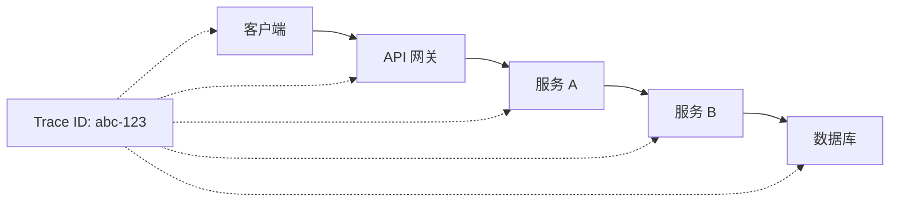

# 7.2.5 追踪 ID

## 一句话破题

当用户说"出错了"，你需要 Trace ID 来找到那一条请求的完整日志——这是定位问题的钥匙。

## 为什么需要 Trace ID



| 问题 | 没有 Trace ID | 有 Trace ID |
|------|--------------|-------------|
| 用户报错 | 哪个请求出错了？ | 根据 ID 查日志 |
| 定位问题 | 在海量日志中搜索 | 精确过滤 |
| 性能分析 | 无法串联请求链路 | 完整链路追踪 |

## 实现 Trace ID

### 生成 Trace ID

```typescript
// lib/trace.ts
import { v4 as uuidv4 } from 'uuid'

export function generateTraceId(): string {
  return uuidv4()
}

// 或使用更短的格式
export function generateShortTraceId(): string {
  return `${Date.now().toString(36)}-${Math.random().toString(36).slice(2, 8)}`
}
```

### 中间件注入

```typescript
// middleware.ts
import { NextResponse, NextRequest } from 'next/server'
import { generateTraceId } from '@/lib/trace'

export function middleware(request: NextRequest) {
  const traceId = request.headers.get('X-Trace-ID') || generateTraceId()
  
  const response = NextResponse.next()
  response.headers.set('X-Trace-ID', traceId)
  
  return response
}

export const config = {
  matcher: '/api/:path*',
}
```

### API 路由使用

```typescript
// app/api/posts/route.ts
export async function GET(request: NextRequest) {
  const traceId = request.headers.get('X-Trace-ID') || generateTraceId()
  
  try {
    const posts = await prisma.post.findMany()
    
    console.log(`[${traceId}] GET /api/posts - success, count: ${posts.length}`)
    
    return NextResponse.json(
      { data: posts },
      { headers: { 'X-Trace-ID': traceId } }
    )
  } catch (error) {
    console.error(`[${traceId}] GET /api/posts - error:`, error)
    
    return NextResponse.json(
      {
        error: {
          code: 'INTERNAL_ERROR',
          message: '服务器内部错误',
          traceId,
        },
      },
      { status: 500, headers: { 'X-Trace-ID': traceId } }
    )
  }
}
```

## 结构化日志

### 日志工具

```typescript
// lib/logger.ts
interface LogContext {
  traceId?: string
  userId?: string
  method?: string
  path?: string
}

class Logger {
  private context: LogContext = {}
  
  withContext(context: LogContext): Logger {
    const logger = new Logger()
    logger.context = { ...this.context, ...context }
    return logger
  }
  
  info(message: string, data?: Record<string, unknown>) {
    this.log('INFO', message, data)
  }
  
  error(message: string, error?: Error, data?: Record<string, unknown>) {
    this.log('ERROR', message, { ...data, error: error?.message, stack: error?.stack })
  }
  
  warn(message: string, data?: Record<string, unknown>) {
    this.log('WARN', message, data)
  }
  
  private log(level: string, message: string, data?: Record<string, unknown>) {
    const logEntry = {
      timestamp: new Date().toISOString(),
      level,
      message,
      ...this.context,
      ...data,
    }
    console.log(JSON.stringify(logEntry))
  }
}

export const logger = new Logger()
```

### 使用示例

```typescript
// app/api/posts/route.ts
export async function POST(request: NextRequest) {
  const traceId = request.headers.get('X-Trace-ID') || generateTraceId()
  
  const log = logger.withContext({
    traceId,
    method: 'POST',
    path: '/api/posts',
  })
  
  try {
    const body = await request.json()
    log.info('Creating post', { title: body.title })
    
    const post = await prisma.post.create({ data: body })
    log.info('Post created', { postId: post.id })
    
    return NextResponse.json(post, {
      status: 201,
      headers: { 'X-Trace-ID': traceId },
    })
  } catch (error) {
    log.error('Failed to create post', error as Error)
    
    return NextResponse.json(
      { error: { code: 'INTERNAL_ERROR', message: '创建失败', traceId } },
      { status: 500 }
    )
  }
}
```

### 日志输出

```json
{"timestamp":"2024-01-15T10:30:00.000Z","level":"INFO","message":"Creating post","traceId":"abc-123","method":"POST","path":"/api/posts","title":"My Post"}
{"timestamp":"2024-01-15T10:30:00.100Z","level":"INFO","message":"Post created","traceId":"abc-123","method":"POST","path":"/api/posts","postId":"1"}
```

## 前端集成

### 请求拦截器

```typescript
// lib/api-client.ts
class ApiClient {
  private traceId: string | null = null
  
  async fetch<T>(url: string, options?: RequestInit): Promise<T> {
    const traceId = crypto.randomUUID()
    
    const response = await fetch(url, {
      ...options,
      headers: {
        ...options?.headers,
        'X-Trace-ID': traceId,
      },
    })
    
    // 保存响应中的 Trace ID
    this.traceId = response.headers.get('X-Trace-ID')
    
    if (!response.ok) {
      const error = await response.json()
      throw new ApiError(error.error)
    }
    
    return response.json()
  }
  
  // 获取最后一次请求的 Trace ID
  getLastTraceId(): string | null {
    return this.traceId
  }
}

export const apiClient = new ApiClient()
```

### 错误展示

```typescript
// 错误提示组件
function ErrorMessage({ error }: { error: ApiError }) {
  return (
    <div className="error-message">
      <p>{error.message}</p>
      {error.traceId && (
        <p className="trace-id">
          如需帮助，请提供错误代码：{error.traceId}
        </p>
      )}
    </div>
  )
}
```

## 跨服务传递

### 调用外部 API

```typescript
// 调用其他服务时传递 Trace ID
async function callExternalService(data: unknown, traceId: string) {
  const response = await fetch('https://external-api.com/endpoint', {
    method: 'POST',
    headers: {
      'Content-Type': 'application/json',
      'X-Trace-ID': traceId,  // 传递 Trace ID
    },
    body: JSON.stringify(data),
  })
  
  return response.json()
}
```

## 日志查询

### 按 Trace ID 搜索

```bash
# 在日志系统中搜索
grep "abc-123" /var/log/app.log

# 使用 jq 过滤 JSON 日志
cat /var/log/app.log | jq 'select(.traceId == "abc-123")'
```

### 云服务查询

```
// AWS CloudWatch
fields @timestamp, @message
| filter traceId = "abc-123"
| sort @timestamp asc

// Google Cloud Logging
trace="abc-123"
```

## 觉知：最佳实践

### 1. 统一 Header 名称

```typescript
// ✅ 使用标准命名
'X-Trace-ID'
'X-Request-ID'

// ❌ 自定义奇怪的名称
'My-Trace'
'RequestTrace'
```

### 2. 日志包含 Trace ID

```typescript
// ❌ 日志没有 Trace ID
console.log('User created')

// ✅ 日志包含 Trace ID
logger.info('User created', { traceId, userId: user.id })
```

### 3. 错误响应包含 Trace ID

```typescript
// ❌ 错误响应没有 Trace ID
return NextResponse.json({ error: '失败' }, { status: 500 })

// ✅ 错误响应包含 Trace ID
return NextResponse.json(
  { error: { code: 'ERROR', message: '失败', traceId } },
  { status: 500 }
)
```

### 4. 适当的 ID 长度

```typescript
// UUID (36 字符) - 保证唯一性
'550e8400-e29b-41d4-a716-446655440000'

// 短 ID (16 字符) - 更易读
'lxq8z3k2-a1b2c3'
```

## 本节小结

| 要点 | 说明 |
|------|------|
| **生成** | 每个请求分配唯一 ID |
| **传递** | 通过 Header 在服务间传递 |
| **记录** | 所有日志包含 Trace ID |
| **返回** | 错误响应包含 Trace ID |
