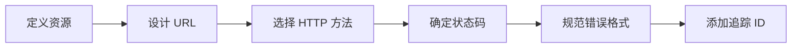

# 7.2 REST 与错误处理

## 核心问题

| 问题 | 本节解答 |
|------|----------|
| REST 是什么？ | 一套 API 设计约束，让接口更统一可预测 |
| URL 怎么设计？ | 资源导向，名词复数，层级清晰 |
| 状态码怎么用？ | 2xx 成功、4xx 客户端错误、5xx 服务端错误 |
| 错误信息怎么返回？ | 统一结构，包含错误码、消息、详情 |
| 怎么追踪请求？ | 每个请求分配唯一 Trace ID |

## REST 设计流程



## 本节内容

| 小节 | 主题 | 核心知识点 |
|------|------|------------|
| 7.2.1 | REST 约束 | 统一接口、无状态、可缓存 |
| 7.2.2 | 资源设计 | URL 路径、资源映射、命名规范 |
| 7.2.3 | 状态码标准 | HTTP 状态码使用规范 |
| 7.2.4 | 错误响应格式 | 统一的错误信息结构 |
| 7.2.5 | 追踪 ID | 请求链路跟踪与调试 |

## 快速示例

### REST API 设计

```typescript
// 资源: 用户 (users)
GET    /api/users         // 获取用户列表
GET    /api/users/:id     // 获取单个用户
POST   /api/users         // 创建用户
PUT    /api/users/:id     // 更新用户
DELETE /api/users/:id     // 删除用户

// 嵌套资源: 用户的文章
GET    /api/users/:id/posts      // 获取用户的文章
POST   /api/users/:id/posts      // 为用户创建文章
```

### 统一错误格式

```json
{
  "error": {
    "code": "VALIDATION_ERROR",
    "message": "请求参数验证失败",
    "details": [
      { "field": "email", "message": "邮箱格式不正确" }
    ],
    "traceId": "abc-123-xyz"
  }
}
```

## 学习目标

完成本节后，你将能够：

1. 理解 REST 架构约束及其意义
2. 设计符合 RESTful 规范的 API URL
3. 正确使用 HTTP 状态码
4. 实现统一的错误响应格式
5. 使用 Trace ID 追踪请求链路
