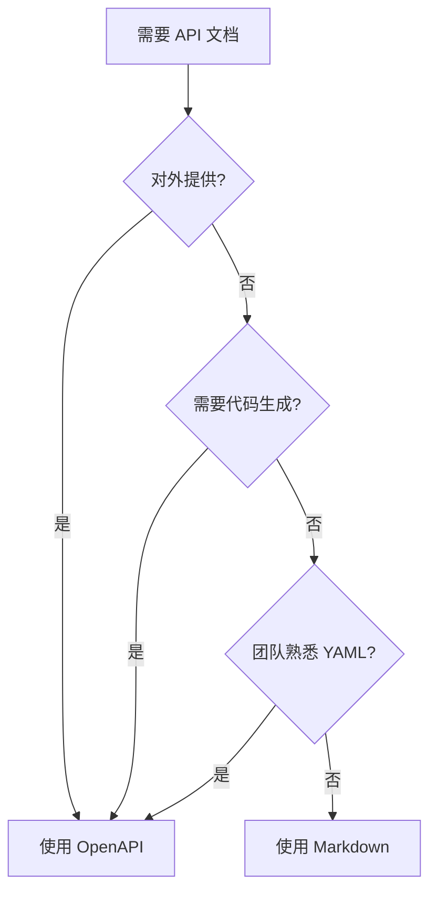

# 7.3.1 文档格式选择

## 一句话破题

Markdown 适合快速记录，OpenAPI 适合正式发布——选择取决于谁在读文档、怎么用文档。

## 两种格式对比

| 方面 | Markdown | OpenAPI |
|------|----------|---------|
| **学习成本** | 低 | 中 |
| **编写速度** | 快 | 慢 |
| **可交互性** | 无 | 有 |
| **代码生成** | 不支持 | 支持 |
| **验证能力** | 无 | 有 |
| **适用场景** | 内部文档 | 对外 API |

## Markdown 文档

### 优势

- 所有人都会写
- Git 版本控制友好
- 与代码放在一起
- 无需额外工具

### 模板示例

```markdown
# 用户管理 API

## 创建用户

**POST** `/api/users`

创建一个新的用户账户。

### 认证

需要 `Admin` 权限的 Token。

### 请求

**Headers:**

| Header | 类型 | 必需 | 说明 |
|--------|------|------|------|
| Authorization | string | 是 | Bearer Token |

**Body:**

| 字段 | 类型 | 必需 | 说明 |
|------|------|------|------|
| email | string | 是 | 用户邮箱，需要唯一 |
| password | string | 是 | 密码，至少 8 位 |
| name | string | 否 | 显示名称 |

**示例:**

\`\`\`json
{
  "email": "user@example.com",
  "password": "securepassword123",
  "name": "张三"
}
\`\`\`

### 响应

**成功 (201 Created):**

\`\`\`json
{
  "data": {
    "id": "user_abc123",
    "email": "user@example.com",
    "name": "张三",
    "createdAt": "2024-01-15T10:30:00Z"
  }
}
\`\`\`

**错误 (400 Bad Request):**

\`\`\`json
{
  "error": {
    "code": "VALIDATION_ERROR",
    "message": "请求参数验证失败",
    "details": [
      { "field": "email", "message": "邮箱格式不正确" }
    ]
  }
}
\`\`\`

**错误 (409 Conflict):**

\`\`\`json
{
  "error": {
    "code": "EMAIL_EXISTS",
    "message": "邮箱已被注册"
  }
}
\`\`\`
```

### 项目结构

```
docs/
├── api/
│   ├── README.md        # API 概述
│   ├── auth.md          # 认证相关
│   ├── users.md         # 用户管理
│   ├── posts.md         # 文章管理
│   └── errors.md        # 错误码列表
```

## OpenAPI 文档

### 优势

- 标准化格式
- 可生成交互 UI
- 可生成客户端代码
- 可做请求验证

### 基本结构

```yaml
# openapi.yaml
openapi: 3.0.0
info:
  title: 用户管理 API
  version: 1.0.0
  description: 用户相关的 API 接口

servers:
  - url: https://api.example.com
    description: 生产环境
  - url: http://localhost:3000
    description: 本地开发

paths:
  /api/users:
    post:
      summary: 创建用户
      description: 创建一个新的用户账户
      tags:
        - 用户管理
      security:
        - bearerAuth: []
      requestBody:
        required: true
        content:
          application/json:
            schema:
              $ref: '#/components/schemas/CreateUserRequest'
            example:
              email: user@example.com
              password: securepassword123
              name: 张三
      responses:
        '201':
          description: 创建成功
          content:
            application/json:
              schema:
                $ref: '#/components/schemas/UserResponse'
        '400':
          description: 验证失败
          content:
            application/json:
              schema:
                $ref: '#/components/schemas/ErrorResponse'
        '409':
          description: 邮箱已存在
          content:
            application/json:
              schema:
                $ref: '#/components/schemas/ErrorResponse'

components:
  securitySchemes:
    bearerAuth:
      type: http
      scheme: bearer
      bearerFormat: JWT

  schemas:
    CreateUserRequest:
      type: object
      required:
        - email
        - password
      properties:
        email:
          type: string
          format: email
          description: 用户邮箱
        password:
          type: string
          minLength: 8
          description: 密码，至少 8 位
        name:
          type: string
          description: 显示名称

    UserResponse:
      type: object
      properties:
        data:
          type: object
          properties:
            id:
              type: string
            email:
              type: string
            name:
              type: string
            createdAt:
              type: string
              format: date-time

    ErrorResponse:
      type: object
      properties:
        error:
          type: object
          properties:
            code:
              type: string
            message:
              type: string
            details:
              type: array
              items:
                type: object
                properties:
                  field:
                    type: string
                  message:
                    type: string
```

## 如何选择？



| 场景 | 推荐格式 |
|------|----------|
| 内部微服务 | Markdown |
| 公开 REST API | OpenAPI |
| 小团队项目 | Markdown |
| 需要 SDK 生成 | OpenAPI |
| 快速原型 | Markdown |
| 正式产品 API | OpenAPI |

## 混合使用

```
docs/
├── api/
│   ├── overview.md      # Markdown: 概述和快速入门
│   ├── openapi.yaml     # OpenAPI: 详细接口定义
│   └── examples/        # Markdown: 使用示例
```

## 觉知：常见问题

### 1. 文档过于简略

```markdown
❌ 
## 创建用户
POST /api/users

✅
## 创建用户
POST /api/users

创建新用户账户。需要管理员权限。

**请求参数：**
| 字段 | 类型 | 必需 | 说明 |
|------|------|------|------|
| email | string | 是 | 有效的邮箱地址 |
...
```

### 2. 缺少错误响应

```markdown
❌ 只写成功响应

✅ 包含所有可能的错误
- 400: 参数验证失败
- 401: 未认证
- 403: 无权限
- 409: 资源冲突
```

### 3. 示例数据不真实

```json
// ❌ 无意义的示例
{ "name": "test", "email": "test@test.com" }

// ✅ 真实的示例
{ "name": "张三", "email": "zhangsan@company.com" }
```

## 本节小结

| 要点 | 说明 |
|------|------|
| **Markdown** | 简单快速，适合内部 |
| **OpenAPI** | 标准化，可交互 |
| **选择依据** | 谁读、怎么用 |
| **混合使用** | 概述用 MD，详情用 OpenAPI |
