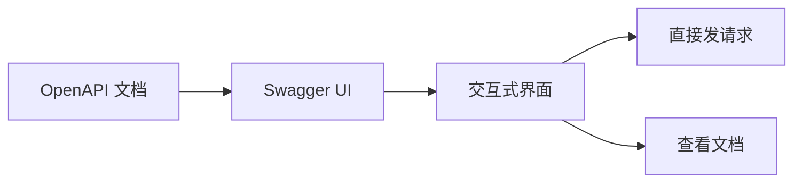

# 7.3.2 Swagger UI

## 一句话破题

Swagger UI 把你的 OpenAPI 文档变成一个可以直接点击测试的网页——比静态文档好用得多。

## 什么是 Swagger UI



| 功能 | 说明 |
|------|------|
| **可视化** | 自动渲染 API 文档 |
| **可测试** | 在浏览器中直接调用 API |
| **认证** | 支持输入 Token |
| **自动生成** | 根据 OpenAPI 自动生成 |

## 在 Next.js 中使用

### 安装依赖

```bash
npm install swagger-ui-react next-swagger-doc
```

### 创建 OpenAPI 文档

```typescript
// lib/swagger.ts
import { createSwaggerSpec } from 'next-swagger-doc'

export const getApiDocs = () => {
  return createSwaggerSpec({
    apiFolder: 'app/api',
    definition: {
      openapi: '3.0.0',
      info: {
        title: '我的 API',
        version: '1.0.0',
        description: 'API 文档',
      },
      servers: [
        { url: 'http://localhost:3000', description: '开发环境' },
      ],
      components: {
        securitySchemes: {
          bearerAuth: {
            type: 'http',
            scheme: 'bearer',
            bearerFormat: 'JWT',
          },
        },
      },
    },
  })
}
```

### 添加 JSDoc 注释

```typescript
// app/api/users/route.ts

/**
 * @swagger
 * /api/users:
 *   get:
 *     summary: 获取用户列表
 *     tags:
 *       - 用户管理
 *     security:
 *       - bearerAuth: []
 *     parameters:
 *       - name: page
 *         in: query
 *         schema:
 *           type: integer
 *           default: 1
 *       - name: pageSize
 *         in: query
 *         schema:
 *           type: integer
 *           default: 10
 *     responses:
 *       200:
 *         description: 成功
 *         content:
 *           application/json:
 *             schema:
 *               type: object
 *               properties:
 *                 data:
 *                   type: array
 *                   items:
 *                     $ref: '#/components/schemas/User'
 *   post:
 *     summary: 创建用户
 *     tags:
 *       - 用户管理
 *     requestBody:
 *       required: true
 *       content:
 *         application/json:
 *           schema:
 *             $ref: '#/components/schemas/CreateUserRequest'
 *     responses:
 *       201:
 *         description: 创建成功
 */
export async function GET(request: NextRequest) {
  // 实现...
}

export async function POST(request: NextRequest) {
  // 实现...
}
```

### 创建文档页面

```typescript
// app/api-docs/page.tsx
'use client'

import dynamic from 'next/dynamic'
import 'swagger-ui-react/swagger-ui.css'

const SwaggerUI = dynamic(() => import('swagger-ui-react'), { ssr: false })

export default function ApiDocsPage() {
  return (
    <div className="swagger-container">
      <SwaggerUI url="/api/docs" />
    </div>
  )
}
```

### 提供 OpenAPI JSON

```typescript
// app/api/docs/route.ts
import { getApiDocs } from '@/lib/swagger'

export async function GET() {
  return Response.json(getApiDocs())
}
```

## 常用注释语法

### 路径参数

```typescript
/**
 * @swagger
 * /api/users/{id}:
 *   get:
 *     summary: 获取单个用户
 *     parameters:
 *       - name: id
 *         in: path
 *         required: true
 *         schema:
 *           type: string
 *         description: 用户 ID
 */
```

### 请求体

```typescript
/**
 * @swagger
 * components:
 *   schemas:
 *     CreateUserRequest:
 *       type: object
 *       required:
 *         - email
 *         - password
 *       properties:
 *         email:
 *           type: string
 *           format: email
 *           example: user@example.com
 *         password:
 *           type: string
 *           minLength: 8
 *           example: password123
 */
```

### 错误响应

```typescript
/**
 * @swagger
 * /api/users:
 *   post:
 *     responses:
 *       201:
 *         description: 创建成功
 *       400:
 *         description: 参数错误
 *         content:
 *           application/json:
 *             schema:
 *               $ref: '#/components/schemas/ErrorResponse'
 *       401:
 *         description: 未认证
 *       409:
 *         description: 邮箱已存在
 */
```

## 定义公共组件

```typescript
// lib/swagger-components.ts

/**
 * @swagger
 * components:
 *   schemas:
 *     User:
 *       type: object
 *       properties:
 *         id:
 *           type: string
 *         email:
 *           type: string
 *         name:
 *           type: string
 *         createdAt:
 *           type: string
 *           format: date-time
 *     
 *     ErrorResponse:
 *       type: object
 *       properties:
 *         error:
 *           type: object
 *           properties:
 *             code:
 *               type: string
 *             message:
 *               type: string
 *             traceId:
 *               type: string
 *     
 *     PaginationMeta:
 *       type: object
 *       properties:
 *         page:
 *           type: integer
 *         pageSize:
 *           type: integer
 *         total:
 *           type: integer
 *         totalPages:
 *           type: integer
 */
```

## 自定义样式

```css
/* app/api-docs/swagger.css */
.swagger-container {
  margin: 0 auto;
  max-width: 1200px;
}

.swagger-ui .topbar {
  display: none;
}

.swagger-ui .info {
  margin: 20px 0;
}
```

## 觉知：注意事项

### 1. 生产环境保护

```typescript
// 只在开发环境启用
// app/api-docs/page.tsx
export default function ApiDocsPage() {
  if (process.env.NODE_ENV === 'production') {
    return <div>文档在生产环境不可用</div>
  }
  
  return <SwaggerUI url="/api/docs" />
}
```

### 2. 认证配置

```typescript
// 在 Swagger UI 中配置默认 Token
<SwaggerUI 
  url="/api/docs"
  requestInterceptor={(req) => {
    req.headers['Authorization'] = `Bearer ${getToken()}`
    return req
  }}
/>
```

### 3. 保持文档同步

```typescript
// 注释要紧跟代码
/**
 * @swagger
 * /api/users:
 *   post:
 *     summary: 创建用户
 */
export async function POST(request: NextRequest) {
  // 修改代码时记得更新上面的注释
}
```

## 本节小结

| 要点 | 说明 |
|------|------|
| **Swagger UI** | 可视化、可交互的 API 文档 |
| **JSDoc 注释** | 在代码中定义 OpenAPI |
| **自动生成** | 从注释生成文档 |
| **安全** | 生产环境要保护 |
