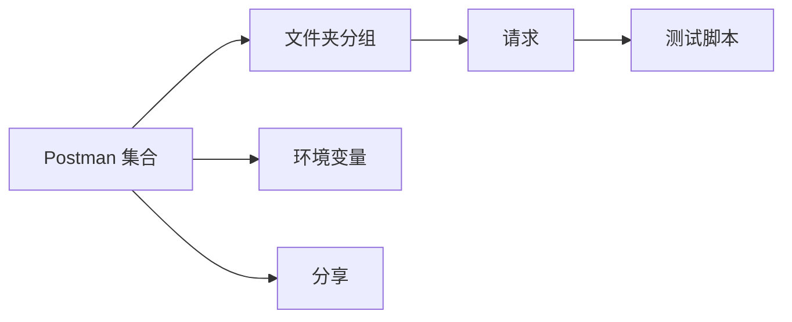

# 7.3.3 Postman 集合

## 一句话破题

Postman 不只是测试工具，更是可以分享给团队的"活文档"——一个集合就包含了所有 API 的调用示例。

## 什么是 Postman 集合



| 组件 | 作用 |
|------|------|
| **集合** | API 请求的容器 |
| **文件夹** | 按模块分组 |
| **请求** | 具体的 API 调用 |
| **环境** | 不同环境的变量 |
| **脚本** | 自动化测试 |

## 创建集合

### 集合结构

```
我的 API
├── 认证
│   ├── 登录
│   ├── 注册
│   └── 刷新 Token
├── 用户管理
│   ├── 获取用户列表
│   ├── 获取单个用户
│   ├── 创建用户
│   ├── 更新用户
│   └── 删除用户
└── 文章管理
    ├── 获取文章列表
    ├── 创建文章
    └── ...
```

### 环境变量

```json
// 开发环境
{
  "base_url": "http://localhost:3000",
  "token": ""
}

// 生产环境
{
  "base_url": "https://api.example.com",
  "token": ""
}
```

### 请求配置

```
POST {{base_url}}/api/auth/login

Headers:
  Content-Type: application/json

Body:
{
  "email": "user@example.com",
  "password": "password123"
}
```

## 自动化脚本

### 保存 Token

```javascript
// 登录请求的 Tests 脚本
const response = pm.response.json()

if (response.data && response.data.token) {
  pm.environment.set('token', response.data.token)
  console.log('Token saved!')
}
```

### 使用 Token

```
GET {{base_url}}/api/users

Headers:
  Authorization: Bearer {{token}}
```

### 测试响应

```javascript
// Tests 脚本
pm.test('状态码是 200', () => {
  pm.response.to.have.status(200)
})

pm.test('返回数据是数组', () => {
  const response = pm.response.json()
  pm.expect(response.data).to.be.an('array')
})

pm.test('响应时间小于 500ms', () => {
  pm.expect(pm.response.responseTime).to.be.below(500)
})
```

## 预请求脚本

### 生成动态数据

```javascript
// Pre-request Script
const timestamp = Date.now()
const email = `user_${timestamp}@test.com`

pm.environment.set('test_email', email)
```

### 使用动态数据

```json
{
  "email": "{{test_email}}",
  "password": "password123"
}
```

## 导出与分享

### 导出集合

```json
// collection.json
{
  "info": {
    "name": "我的 API",
    "schema": "https://schema.getpostman.com/json/collection/v2.1.0/collection.json"
  },
  "item": [
    {
      "name": "认证",
      "item": [
        {
          "name": "登录",
          "request": {
            "method": "POST",
            "url": "{{base_url}}/api/auth/login",
            "body": {
              "mode": "raw",
              "raw": "{\"email\":\"user@example.com\",\"password\":\"password123\"}"
            }
          }
        }
      ]
    }
  ]
}
```

### 放入代码仓库

```
project/
├── src/
├── docs/
│   └── postman/
│       ├── collection.json      # 集合
│       ├── env.development.json # 开发环境
│       └── env.production.json  # 生产环境
```

## 从 OpenAPI 导入

### 步骤

1. 打开 Postman
2. 点击 Import
3. 选择 OpenAPI 文件
4. 自动生成集合

### 同步更新

```bash
# 每次 API 变更后
# 1. 更新 OpenAPI 文档
# 2. 重新导入到 Postman
# 3. 合并变更
```

## 运行测试

### 使用 Newman（命令行）

```bash
# 安装
npm install -g newman

# 运行集合
newman run collection.json -e env.development.json

# 生成报告
newman run collection.json -e env.development.json -r html
```

### CI/CD 集成

```yaml
# .github/workflows/api-test.yml
name: API Tests

on: [push]

jobs:
  test:
    runs-on: ubuntu-latest
    steps:
      - uses: actions/checkout@v3
      
      - name: Start server
        run: npm start &
        
      - name: Run Postman tests
        run: |
          npm install -g newman
          newman run docs/postman/collection.json \
            -e docs/postman/env.development.json
```

## 最佳实践

### 1. 使用变量

```
❌ 硬编码 URL
   http://localhost:3000/api/users

✅ 使用变量
   {{base_url}}/api/users
```

### 2. 添加描述

```markdown
## 创建用户

创建一个新的用户账户。

**权限要求：** Admin

**注意事项：**
- 邮箱必须唯一
- 密码至少 8 位
```

### 3. 保存示例响应

```
每个请求保存至少两个示例：
- 成功响应
- 常见错误响应
```

### 4. 环境隔离

```
开发环境：真实测试数据
测试环境：自动化测试数据
生产环境：只读操作
```

## 本节小结

| 要点 | 说明 |
|------|------|
| **集合** | 组织所有 API 请求 |
| **环境** | 管理不同环境变量 |
| **脚本** | 自动化测试和数据提取 |
| **分享** | 导出放入代码仓库 |
