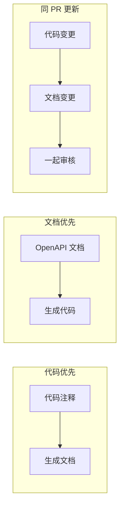

# 7.3.4 文档同步

## 一句话破题

过时的文档比没有文档更糟糕——让文档跟着代码一起变，才能保证文档永远是对的。

## 同步策略



| 策略 | 优势 | 劣势 |
|------|------|------|
| **代码优先** | 代码即文档，不会过时 | 注释可能不够详细 |
| **文档优先** | 设计先行，接口稳定 | 需要额外维护 |
| **同 PR 更新** | 简单可行 | 依赖人的自觉 |

## 代码优先：注释生成文档

### JSDoc + TypeScript

```typescript
// app/api/users/route.ts

/**
 * @swagger
 * /api/users:
 *   post:
 *     summary: 创建用户
 *     description: 创建一个新的用户账户
 *     tags: [用户管理]
 *     requestBody:
 *       required: true
 *       content:
 *         application/json:
 *           schema:
 *             type: object
 *             required: [email, password]
 *             properties:
 *               email:
 *                 type: string
 *                 format: email
 *               password:
 *                 type: string
 *                 minLength: 8
 *     responses:
 *       201:
 *         description: 创建成功
 */
export async function POST(request: NextRequest) {
  // 实现代码和注释放在一起
  // 修改代码时自然会注意到注释
}
```

### 从类型生成

```typescript
// types/api.ts
import { z } from 'zod'

export const CreateUserSchema = z.object({
  email: z.string().email(),
  password: z.string().min(8),
  name: z.string().optional(),
})

export type CreateUserInput = z.infer<typeof CreateUserSchema>
```

```typescript
// 使用 zod-to-openapi 生成文档
import { extendZodWithOpenApi } from '@asteasolutions/zod-to-openapi'

extendZodWithOpenApi(z)

const CreateUserSchema = z.object({
  email: z.string().email().openapi({ example: 'user@example.com' }),
  password: z.string().min(8).openapi({ example: 'password123' }),
}).openapi('CreateUserRequest')
```

## 同 PR 更新

### PR 检查清单

```markdown
## PR Checklist

- [ ] 代码实现
- [ ] 单元测试
- [ ] API 文档更新  <-- 强制检查
- [ ] 更新 Postman 集合（如有需要）
```

### PR 模板

```markdown
<!-- .github/pull_request_template.md -->

## 变更说明

### API 变更

- [ ] 新增接口
- [ ] 修改接口
- [ ] 删除接口
- [ ] 无 API 变更

### 文档更新

- [ ] 已更新 JSDoc 注释
- [ ] 已更新 README
- [ ] 已更新 Postman 集合
- [ ] 不需要更新文档
```

### CI 检查

```yaml
# .github/workflows/docs-check.yml
name: Docs Check

on: [pull_request]

jobs:
  check:
    runs-on: ubuntu-latest
    steps:
      - uses: actions/checkout@v3
      
      - name: Check API changes
        run: |
          # 检查是否修改了 API 文件
          API_CHANGED=$(git diff --name-only origin/main | grep -E "app/api/.*\.ts$" | wc -l)
          
          # 检查是否更新了文档
          DOCS_CHANGED=$(git diff --name-only origin/main | grep -E "\.md$|openapi|swagger" | wc -l)
          
          if [ $API_CHANGED -gt 0 ] && [ $DOCS_CHANGED -eq 0 ]; then
            echo "Warning: API files changed but no documentation updated"
            echo "Please update API documentation"
            # exit 1  # 可选：强制失败
          fi
```

## 自动化工具

### 生成 OpenAPI 文档

```typescript
// scripts/generate-docs.ts
import { writeFileSync } from 'fs'
import { getApiDocs } from '../lib/swagger'

const spec = getApiDocs()
writeFileSync('docs/openapi.json', JSON.stringify(spec, null, 2))
console.log('OpenAPI spec generated!')
```

```json
// package.json
{
  "scripts": {
    "docs:generate": "ts-node scripts/generate-docs.ts",
    "docs:serve": "npx swagger-ui-watcher docs/openapi.json"
  }
}
```

### 文档变更检测

```typescript
// scripts/check-api-changes.ts
import { execSync } from 'child_process'

// 获取变更的文件
const changedFiles = execSync('git diff --name-only HEAD~1')
  .toString()
  .split('\n')

const apiFiles = changedFiles.filter(f => f.startsWith('app/api/'))
const docFiles = changedFiles.filter(f => 
  f.endsWith('.md') || 
  f.includes('openapi') || 
  f.includes('swagger')
)

if (apiFiles.length > 0 && docFiles.length === 0) {
  console.warn('API 变更但未更新文档：')
  apiFiles.forEach(f => console.warn(`  - ${f}`))
  process.exit(1)
}
```

## 文档版本控制

### 与代码同仓库

```
project/
├── src/
│   └── app/
│       └── api/           # API 代码
├── docs/
│   ├── api/               # Markdown 文档
│   ├── openapi.json       # OpenAPI 规范
│   └── postman/           # Postman 集合
├── scripts/
│   └── generate-docs.ts   # 文档生成脚本
```

### Git Hooks

```bash
# .husky/pre-commit
#!/bin/sh

# 生成最新文档
npm run docs:generate

# 添加到提交
git add docs/openapi.json
```

## 觉知：常见问题

### 1. 注释和代码不同步

```typescript
// ❌ 注释说的和代码做的不一样
/**
 * @swagger
 * /api/users:
 *   get:
 *     parameters:
 *       - name: status
 *         in: query          // 文档说有这个参数
 */
export async function GET(request: NextRequest) {
  // 代码里没用 status 参数
}

// ✅ 修改代码时同步更新注释
```

### 2. 文档更新不及时

```
问题：PR 合并后才发现忘了更新文档

解决：
1. PR 模板强制勾选
2. CI 检查 API 变更
3. Code Review 时检查
```

### 3. 示例数据过时

```json
// ❌ 示例还是旧字段
{ "userName": "张三" }

// ✅ 应该是新字段
{ "name": "张三", "displayName": "张三" }
```

## 本节小结

| 要点 | 说明 |
|------|------|
| **代码优先** | 注释生成文档，不会过时 |
| **同 PR 更新** | 代码和文档一起提交 |
| **CI 检查** | 自动检测 API 变更 |
| **同仓库** | 文档和代码放在一起 |
