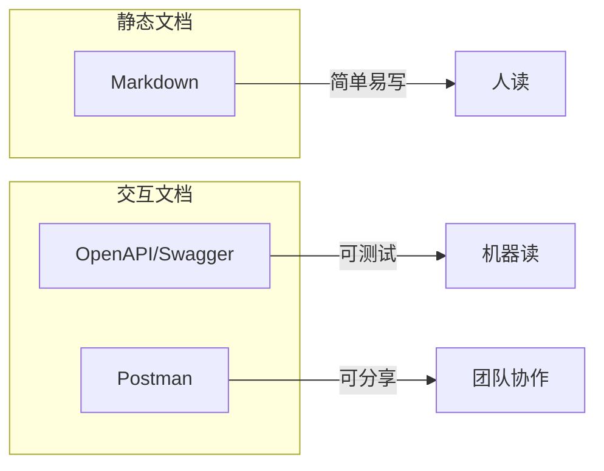

# 7.3 API 文档

## 核心问题

| 问题 | 本节解答 |
|------|----------|
| 文档用什么格式？ | Markdown 简单直接，OpenAPI 可交互 |
| 怎么让文档可以点着试？ | 使用 Swagger UI |
| 怎么测试 API？ | 使用 Postman 集合 |
| 代码改了文档怎么同步？ | 代码注释自动生成文档 |

## 文档类型对比



| 格式 | 优势 | 适用场景 |
|------|------|----------|
| **Markdown** | 简单、版本控制友好 | 内部文档、快速记录 |
| **OpenAPI** | 标准化、可生成 UI | 正式 API、对外接口 |
| **Postman** | 可测试、可分享 | 接口调试、团队协作 |

## 本节内容

| 小节 | 主题 | 核心知识点 |
|------|------|------------|
| 7.3.1 | 文档格式选择 | Markdown vs OpenAPI |
| 7.3.2 | Swagger UI | 交互式 API 文档 |
| 7.3.3 | Postman 集合 | API 测试与分享 |
| 7.3.4 | 文档同步 | 代码变更驱动文档更新 |

## 好文档的标准

### 必备内容

```markdown
## POST /api/users

创建新用户

### 请求

**Headers:**
- `Authorization: Bearer <token>` (必需)

**Body:**
| 字段 | 类型 | 必需 | 说明 |
|------|------|------|------|
| email | string | 是 | 用户邮箱 |
| password | string | 是 | 密码，至少 8 位 |
| name | string | 否 | 显示名称 |

### 响应

**成功 (201):**
```json
{
  "data": {
    "id": "user_123",
    "email": "user@example.com",
    "name": "张三"
  }
}
```

**错误 (400):**
```json
{
  "error": {
    "code": "VALIDATION_ERROR",
    "message": "邮箱格式不正确"
  }
}
```
```

### 文档清单

| 项目 | 必需 | 说明 |
|------|------|------|
| 接口地址 | ✅ | 完整 URL 路径 |
| HTTP 方法 | ✅ | GET/POST/PUT/DELETE |
| 功能描述 | ✅ | 一句话说明作用 |
| 请求参数 | ✅ | 参数名、类型、是否必需 |
| 请求示例 | ✅ | 实际的请求 JSON |
| 响应示例 | ✅ | 成功和错误响应 |
| 状态码 | ✅ | 可能返回的状态码 |
| 认证方式 | ✅ | 需要什么认证 |
| 错误码 | 推荐 | 业务错误码列表 |

## 学习目标

完成本节后，你将能够：

1. 选择合适的文档格式
2. 编写清晰的 API 文档
3. 使用 Swagger UI 创建交互文档
4. 使用 Postman 测试和分享 API
5. 实现文档与代码同步更新
