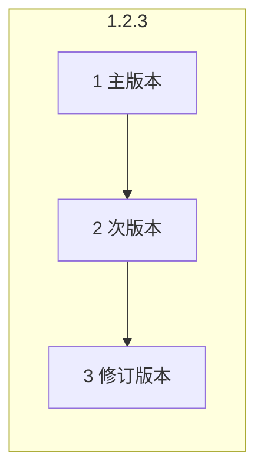
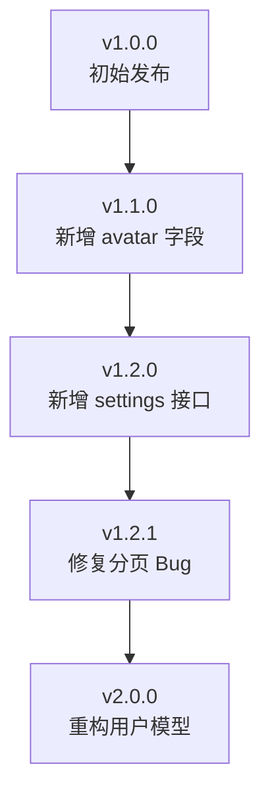

# 7.4.1 语义化版本

## 一句话破题

版本号不是随便取的数字——主版本变化意味着不兼容的改动，次版本意味着新功能，修订版本意味着修复。

## 语义化版本格式

```
MAJOR.MINOR.PATCH
主版本.次版本.修订版本
```



| 部分 | 何时变更 | 示例 |
|------|----------|------|
| **主版本 (MAJOR)** | 不兼容的 API 变更 | 1.0.0 → 2.0.0 |
| **次版本 (MINOR)** | 新增功能，向后兼容 | 1.0.0 → 1.1.0 |
| **修订版本 (PATCH)** | Bug 修复，向后兼容 | 1.0.0 → 1.0.1 |

## 版本变更规则

### 主版本变更 (MAJOR)

**不兼容的变更**：

```typescript
// v1.0.0
interface User {
  id: string
  name: string
}

// v2.0.0 - 字段重命名，不兼容
interface User {
  id: string
  fullName: string  // name → fullName
}
```

### 次版本变更 (MINOR)

**新增功能，保持兼容**：

```typescript
// v1.0.0
interface User {
  id: string
  name: string
}

// v1.1.0 - 新增可选字段，向后兼容
interface User {
  id: string
  name: string
  avatar?: string  // 新增
}
```

### 修订版本变更 (PATCH)

**Bug 修复**：

```typescript
// v1.0.0 - 有 Bug
function getAge(birthDate: string) {
  return new Date().getFullYear() - new Date(birthDate).getFullYear()
}

// v1.0.1 - 修复了 Bug
function getAge(birthDate: string) {
  const today = new Date()
  const birth = new Date(birthDate)
  let age = today.getFullYear() - birth.getFullYear()
  // 修复：检查是否已过生日
  if (today.getMonth() < birth.getMonth()) age--
  return age
}
```

## API 版本控制

### 简化版本号

对于 API，通常只使用主版本号：

```
/api/v1/users    # 主版本 1
/api/v2/users    # 主版本 2
```

### 何时升级主版本

| 变更类型 | 是否需要新版本 |
|----------|---------------|
| 删除字段 | ✅ 是 |
| 重命名字段 | ✅ 是 |
| 改变字段类型 | ✅ 是 |
| 改变必填状态（可选→必填） | ✅ 是 |
| 新增必填字段 | ✅ 是 |
| 新增可选字段 | ❌ 否 |
| 新增接口 | ❌ 否 |
| 修复 Bug | ❌ 否 |

## 版本演进示例



### 版本历史

```
v1.0.0 (2024-01-01)
- 初始发布
- 用户 CRUD 接口

v1.1.0 (2024-02-01)
- 新增: 用户头像字段 (avatar)
- 新增: 头像上传接口

v1.2.0 (2024-03-01)
- 新增: 用户设置接口

v1.2.1 (2024-03-15)
- 修复: 分页参数验证问题

v2.0.0 (2024-06-01)
- 破坏性变更: name 字段拆分为 firstName 和 lastName
- 破坏性变更: 删除废弃的 nickname 字段
```

## 预发布版本

```
1.0.0-alpha    # 内部测试
1.0.0-beta     # 公开测试
1.0.0-rc.1     # 发布候选
1.0.0          # 正式发布
```

### 适用场景

| 阶段 | 用途 |
|------|------|
| **alpha** | 功能不完整，仅内部测试 |
| **beta** | 功能完整，可能有 Bug |
| **rc** | 准备发布，最后测试 |
| **正式版** | 稳定可用 |

## 版本比较

```typescript
// 版本比较规则
// 1.0.0 < 1.0.1 < 1.1.0 < 2.0.0
// 1.0.0-alpha < 1.0.0-beta < 1.0.0-rc.1 < 1.0.0

function compareVersions(v1: string, v2: string): number {
  const parts1 = v1.split('.').map(Number)
  const parts2 = v2.split('.').map(Number)
  
  for (let i = 0; i < 3; i++) {
    if (parts1[i] > parts2[i]) return 1
    if (parts1[i] < parts2[i]) return -1
  }
  return 0
}
```

## 觉知：常见错误

### 1. 版本号随意增加

```
❌ 修复一个小 Bug 就升到 2.0.0
❌ 每次发布都升主版本号

✅ 按照语义化规则升级
   - 不兼容变更 → 主版本
   - 新功能 → 次版本
   - Bug 修复 → 修订版本
```

### 2. 忽视 0.x.x 的含义

```
0.x.x 表示开发阶段，API 可能随时变化
1.0.0 是第一个稳定版本

0.1.0 → 0.2.0  可以有不兼容变更
1.1.0 → 1.2.0  必须向后兼容
```

### 3. API 版本与包版本混淆

```
API 版本: /api/v1/users, /api/v2/users
包版本: 1.2.3, 2.0.0

两者独立管理，不需要同步
```

## 本节小结

| 要点 | 说明 |
|------|------|
| **主版本** | 不兼容的变更 |
| **次版本** | 新功能，向后兼容 |
| **修订版本** | Bug 修复 |
| **API 版本** | 通常只用主版本号 |
