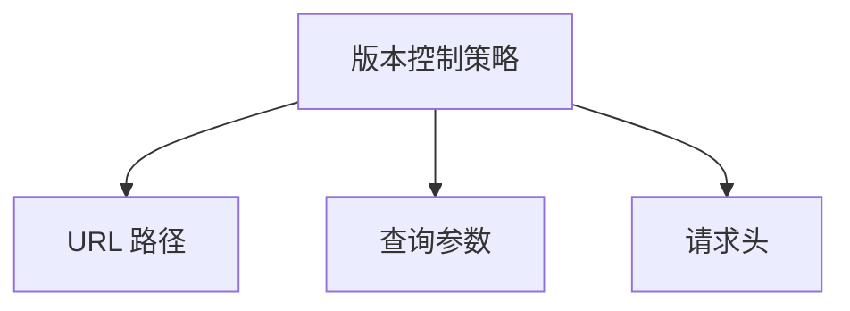
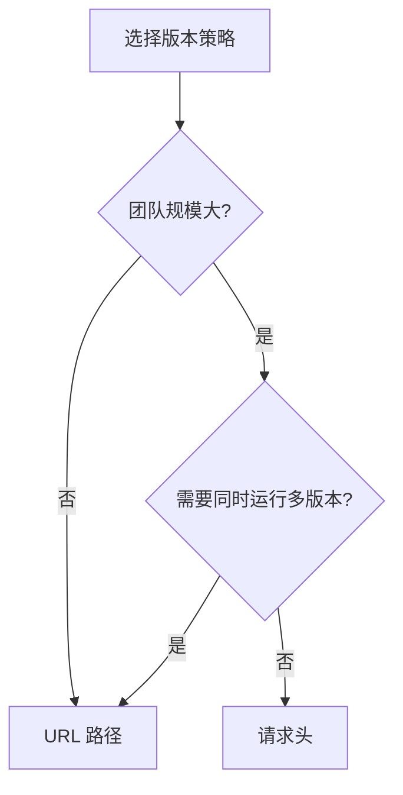

# 7.4.2 版本控制策略

## 一句话破题

版本号放在 URL 里直观易懂，放在 Header 里更加灵活——小项目用 URL，大项目可以考虑 Header。

## 三种策略



| 策略 | 示例 | 优势 | 劣势 |
|------|------|------|------|
| **URL 路径** | `/api/v1/users` | 直观、易缓存 | URL 变化大 |
| **查询参数** | `/api/users?v=1` | 简单、可选 | 不够语义化 |
| **请求头** | `Accept: application/vnd.api.v1+json` | 灵活、URL 稳定 | 不直观 |

## URL 路径版本

### 实现方式

```
GET /api/v1/users
GET /api/v2/users
```

### Next.js 实现

```
app/
├── api/
│   ├── v1/
│   │   └── users/
│   │       └── route.ts    # v1 版本
│   └── v2/
│       └── users/
│           └── route.ts    # v2 版本
```

```typescript
// app/api/v1/users/route.ts
export async function GET() {
  const users = await prisma.user.findMany({
    select: { id: true, name: true }  // v1: 简单结构
  })
  return NextResponse.json({ data: users })
}

// app/api/v2/users/route.ts
export async function GET() {
  const users = await prisma.user.findMany({
    select: {
      id: true,
      firstName: true,
      lastName: true,  // v2: 拆分了 name
      avatar: true,
    }
  })
  return NextResponse.json({ data: users })
}
```

### 共享代码

```typescript
// lib/services/user.service.ts
export class UserService {
  async getUsers() {
    return prisma.user.findMany()
  }
}

// app/api/v1/users/route.ts
export async function GET() {
  const users = await userService.getUsers()
  return NextResponse.json({
    data: users.map(u => ({
      id: u.id,
      name: `${u.firstName} ${u.lastName}`,  // v1 格式
    }))
  })
}

// app/api/v2/users/route.ts
export async function GET() {
  const users = await userService.getUsers()
  return NextResponse.json({
    data: users.map(u => ({
      id: u.id,
      firstName: u.firstName,
      lastName: u.lastName,  // v2 格式
    }))
  })
}
```

## 请求头版本

### 实现方式

```
GET /api/users
Accept: application/vnd.myapp.v1+json
```

### Next.js 实现

```typescript
// app/api/users/route.ts
export async function GET(request: NextRequest) {
  const accept = request.headers.get('Accept') || ''
  const version = extractVersion(accept) || 'v1'  // 默认 v1
  
  const users = await prisma.user.findMany()
  
  if (version === 'v2') {
    return NextResponse.json({
      data: users.map(formatUserV2),
    })
  }
  
  return NextResponse.json({
    data: users.map(formatUserV1),
  })
}

function extractVersion(accept: string): string | null {
  const match = accept.match(/application\/vnd\.myapp\.(v\d+)\+json/)
  return match ? match[1] : null
}
```

## 如何选择？



| 场景 | 推荐策略 |
|------|----------|
| 小型项目 | URL 路径 |
| 公开 API | URL 路径 |
| 内部微服务 | URL 路径 |
| 需要细粒度控制 | 请求头 |
| 移动端 App | URL 路径 |

## 版本命名规范

### 仅主版本号

```
/api/v1/users
/api/v2/users
```

**适用场景**：大多数 API

### 日期版本

```
/api/2024-01-15/users
/api/2024-06-01/users
```

**适用场景**：频繁迭代的 API（如 Stripe）

### 无版本号

```
/api/users
```

**适用场景**：GraphQL、内部 API

## 默认版本

```typescript
// 最佳实践：指定默认版本
export async function GET(request: NextRequest) {
  const version = getVersion(request) || 'v1'  // 默认 v1
  
  // ...
}

// 或者：最新版本为默认
const LATEST_VERSION = 'v2'
const version = getVersion(request) || LATEST_VERSION
```

## 版本路由中间件

```typescript
// middleware.ts
import { NextResponse } from 'next/server'

export function middleware(request: NextRequest) {
  // 检查废弃版本
  if (request.nextUrl.pathname.startsWith('/api/v1')) {
    const response = NextResponse.next()
    response.headers.set(
      'Deprecation',
      'true'
    )
    response.headers.set(
      'Sunset',
      'Sat, 01 Jan 2025 00:00:00 GMT'
    )
    return response
  }
}
```

## 觉知：常见问题

### 1. 版本过多难以维护

```
❌ /api/v1, /api/v2, /api/v3, /api/v4...

✅ 同时只维护 2-3 个版本
   - 当前版本 (v2)
   - 上一版本 (v1) - 废弃中
   - 下一版本 (v3) - beta
```

### 2. 忘记设置默认版本

```typescript
// ❌ 没有默认版本，新客户端不知道用哪个
if (version === 'v1') { ... }
else if (version === 'v2') { ... }
// else ???

// ✅ 设置明确的默认版本
const version = getVersion(request) || 'v2'
```

### 3. URL 版本和实际版本不一致

```
❌ /api/v2 返回的是 v1 的数据结构

✅ 确保版本号与实现一致
   版本号改变 = 数据结构改变
```

## 本节小结

| 要点 | 说明 |
|------|------|
| **URL 路径** | 最常用，直观易懂 |
| **请求头** | 更灵活，URL 不变 |
| **默认版本** | 必须指定 |
| **版本数量** | 同时维护 2-3 个 |
