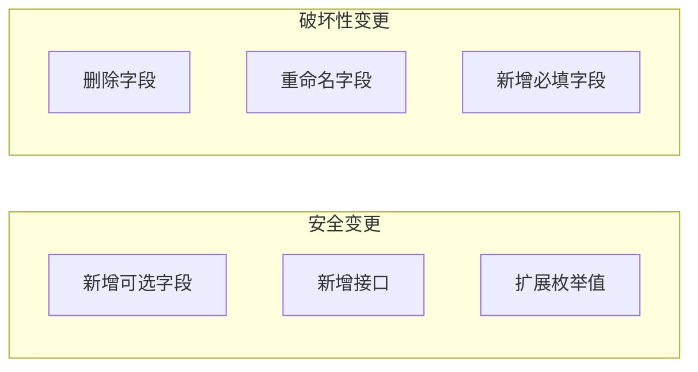
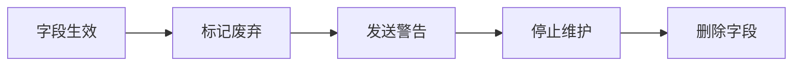

# 7.4.3 向后兼容

## 一句话破题

好的 API 升级就像换飞机引擎——用户还在飞行中，但引擎悄悄换好了，用户完全感知不到。

## 兼容性原则



| 变更类型 | 是否兼容 | 处理方式 |
|----------|---------|----------|
| 新增可选字段 | ✅ 兼容 | 直接添加 |
| 新增接口 | ✅ 兼容 | 直接添加 |
| 删除字段 | ❌ 不兼容 | 先废弃，再删除 |
| 重命名字段 | ❌ 不兼容 | 新增 + 废弃旧字段 |
| 改变字段类型 | ❌ 不兼容 | 新版本 |
| 新增必填字段 | ❌ 不兼容 | 新版本 |

## 安全的变更

### 新增可选字段

```typescript
// 原版本
interface User {
  id: string
  name: string
}

// 新版本 - 新增 avatar，向后兼容
interface User {
  id: string
  name: string
  avatar?: string  // 可选，旧客户端忽略
}
```

### 新增接口

```typescript
// 原有接口不变
GET /api/users
GET /api/users/:id

// 新增接口，不影响现有客户端
POST /api/users/:id/avatar
GET /api/users/:id/settings
```

### 扩展枚举值

```typescript
// 原版本
type Status = 'pending' | 'completed'

// 新版本 - 新增 cancelled，向后兼容
type Status = 'pending' | 'completed' | 'cancelled'

// 客户端应该处理未知值
function handleStatus(status: string) {
  if (status === 'pending') { ... }
  else if (status === 'completed') { ... }
  else { /* 处理未知状态 */ }
}
```

## 字段废弃策略

### 废弃标记

```typescript
// 响应中包含废弃警告
interface UserResponse {
  id: string
  name: string        // 将废弃
  firstName: string   // 新字段
  lastName: string    // 新字段
}

// 设置废弃响应头
response.headers.set('Deprecation', 'true')
response.headers.set('Sunset', '2025-01-01')
response.headers.set('Link', '</api/v2/users>; rel="successor-version"')
```

### 废弃流程



### 时间规划

| 阶段 | 时间 | 行动 |
|------|------|------|
| 废弃公告 | T+0 | 发布废弃通知 |
| 警告期 | T+3个月 | 响应包含警告 |
| 停止更新 | T+6个月 | 不再修复 Bug |
| 删除 | T+12个月 | 完全移除 |

## 字段重命名

### 错误方式

```typescript
// ❌ 直接重命名，破坏兼容性
// 旧版本
{ "name": "张三" }
// 新版本
{ "fullName": "张三" }  // 旧客户端找不到 name
```

### 正确方式

```typescript
// ✅ 同时返回两个字段
{
  "name": "张三",        // 废弃中，将在 2025-01-01 移除
  "fullName": "张三"     // 新字段，请使用这个
}
```

```typescript
// 服务端实现
function formatUser(user: User) {
  return {
    id: user.id,
    name: user.fullName,      // 废弃，保持兼容
    fullName: user.fullName,  // 新字段
  }
}
```

## 类型变更

### 数字变字符串

```typescript
// 原版本
{ "id": 123 }

// 错误：直接改变类型
{ "id": "user_123" }

// 正确：新增字段
{
  "id": 123,              // 保留
  "userId": "user_123"    // 新字段
}
```

### 结构变更

```typescript
// 原版本
{
  "address": "北京市朝阳区xxx"
}

// 正确：新增结构化字段
{
  "address": "北京市朝阳区xxx",  // 保留
  "addressDetail": {              // 新字段
    "province": "北京市",
    "district": "朝阳区",
    "street": "xxx"
  }
}
```

## 请求兼容

### 同时接受新旧格式

```typescript
// app/api/users/route.ts
export async function POST(request: NextRequest) {
  const body = await request.json()
  
  // 同时支持新旧格式
  const name = body.fullName || body.name
  const avatar = body.avatarUrl || body.avatar
  
  const user = await prisma.user.create({
    data: {
      name,
      avatar,
    }
  })
  
  return NextResponse.json(user)
}
```

### 验证兼容

```typescript
import { z } from 'zod'

const CreateUserSchema = z.object({
  // 新旧字段都可以
  name: z.string().optional(),
  fullName: z.string().optional(),
}).refine(
  data => data.name || data.fullName,
  { message: 'name 或 fullName 至少提供一个' }
)
```

## 客户端最佳实践

### 忽略未知字段

```typescript
// ✅ 只取需要的字段
const { id, name } = await response.json()

// ❌ 严格校验所有字段
const user: StrictUser = await response.json()  // 新字段会报错
```

### 处理新枚举值

```typescript
function renderStatus(status: string) {
  switch (status) {
    case 'pending':
      return '待处理'
    case 'completed':
      return '已完成'
    default:
      return '未知状态'  // 处理未来可能新增的值
  }
}
```

## 觉知：常见错误

### 1. 直接删除字段

```typescript
// ❌ 突然删除
v1: { id, name, nickname }
v2: { id, name }  // nickname 没了，旧客户端报错

// ✅ 渐进式删除
v1.0: { id, name, nickname }
v1.1: { id, name, nickname: "deprecated" }  // 标记废弃
v1.2: { id, name }  // 6个月后删除
```

### 2. 必填变可选

```typescript
// ❌ 客户端期望有值
v1: { name: "张三" }  // 必填
v2: { name: null }    // 变可选，客户端可能崩溃

// ✅ 保持必填，或提供默认值
v2: { name: "" }  // 空字符串而非 null
```

### 3. 不通知变更

```
❌ 悄悄修改，没人知道

✅ 完整的变更流程：
   1. 更新 Changelog
   2. 发送邮件通知
   3. 文档标记废弃
   4. 响应头包含警告
```

## 本节小结

| 要点 | 说明 |
|------|------|
| **安全变更** | 新增可选字段、新增接口 |
| **废弃流程** | 标记 → 警告 → 删除 |
| **字段重命名** | 同时返回新旧字段 |
| **客户端** | 忽略未知字段 |
