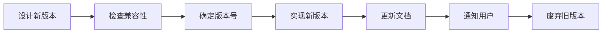

# 7.4 API 版本管理

## 核心问题

| 问题 | 本节解答 |
|------|----------|
| 版本号怎么定？ | 使用语义化版本：主版本.次版本.修订版本 |
| 版本号放哪里？ | URL 路径简单直观，Header 更灵活 |
| 新版本发布了，旧版本怎么办？ | 保持向后兼容，渐进式废弃 |
| 怎么通知用户？ | 维护 Changelog，发送变更通知 |

## 版本管理流程



## 本节内容

| 小节 | 主题 | 核心知识点 |
|------|------|------------|
| 7.4.1 | 语义化版本 | 主版本/次版本/修订版本 |
| 7.4.2 | 版本控制策略 | URL 路径 vs 请求头 |
| 7.4.3 | 向后兼容 | 字段添加与废弃策略 |
| 7.4.4 | 变更日志 | API 变更记录与通知 |

## 快速示例

### URL 版本

```
GET /api/v1/users
GET /api/v2/users
```

### Header 版本

```
GET /api/users
Accept: application/vnd.myapp.v2+json
```

### 向后兼容

```typescript
// 新增字段，不破坏旧客户端
interface User {
  id: string
  name: string
  email: string
  avatar?: string  // 新增，可选
}
```

## 学习目标

完成本节后，你将能够：

1. 正确使用语义化版本号
2. 选择合适的版本控制策略
3. 设计向后兼容的 API
4. 管理 API 变更和废弃流程
5. 维护清晰的变更日志
