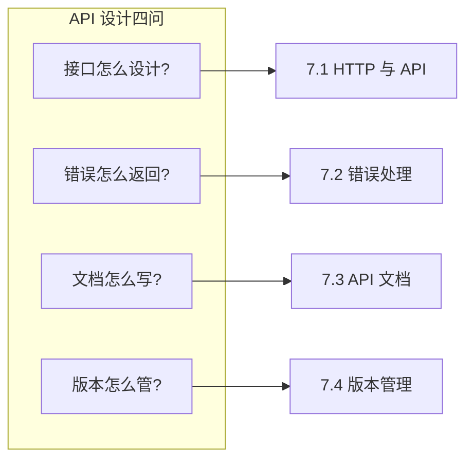

# 7 ｜API 设计与开发规范

## 认知重构

API 不是技术细节，而是**前后端之间的合同**。一份好的合同，双方都能看懂、都愿意遵守；一份烂的合同，开发时吵架、上线后背锅。

```
传统认知：API 就是写几个接口
正确认知：API 是系统的对外承诺，需要像法律合同一样严谨
```

## 本章核心问题



## 章节导航

### 7.1 接口是合同不是暗语——HTTP 与 API

- HTTP 方法语义：GET/POST/PUT/DELETE 该怎么用
- JSON 数据格式：序列化与反序列化
- 分页策略：offset 和 cursor 分页的取舍
- 过滤与排序：查询参数的设计规范
- 幂等性保证：重复请求不会搞砸数据

### 7.2 报错也要说人话——REST 与错误处理

- REST 约束：统一接口/无状态/可缓存
- 资源设计：URL 路径与资源映射
- 状态码标准：404/500 到底什么意思
- 错误响应格式：统一的错误信息结构
- 追踪 ID：请求链路跟踪与调试

### 7.3 活的文档才有用——API 文档

- 文档格式选择：Markdown vs OpenAPI
- Swagger UI：可交互的 API 文档
- Postman 集合：API 测试与分享
- 文档同步：代码变更驱动文档更新

### 7.4 接口升级了旧版怎么办——版本管理

- 语义化版本：v1/v2 的讲究
- 版本控制策略：URL 路径 vs 请求头
- 向前兼容：字段添加与废弃策略
- 变更日志：API 变更记录与通知

## 本章学习目标

| 目标 | 能力 |
|------|------|
| **设计规范的 API** | 遵循 RESTful 原则设计接口 |
| **处理错误情况** | 返回清晰、可追踪的错误信息 |
| **维护 API 文档** | 文档与代码同步更新 |
| **管理 API 版本** | 平滑升级，不破坏现有客户端 |
