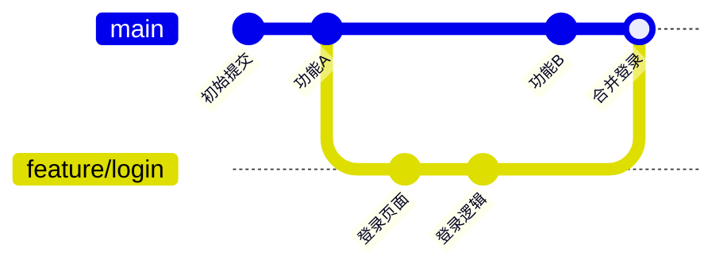
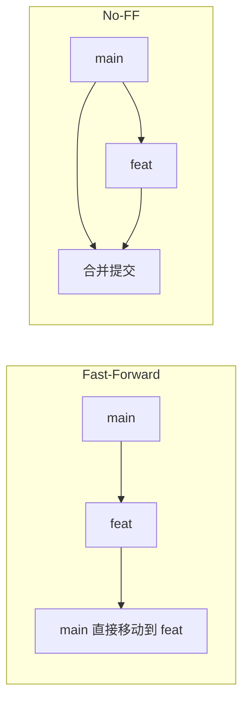

# 8.1.2 平行世界里写代码——分支操作

分支让你可以在不影响主代码的情况下进行实验——就像在平行世界里开发，满意了再合并回来。

## 分支的本质

分支本质上是一个指向某个提交的可移动指针。创建分支几乎不消耗资源，合并分支也只是移动指针。



## 核心分支操作

### 创建与切换分支

```bash
# 查看所有分支
git branch

# 创建新分支
git branch feat/user-profile

# 切换到分支
git checkout feat/user-profile

# 创建并切换（推荐）
git checkout -b feat/user-profile

# 新版本命令（Git 2.23+）
git switch -c feat/user-profile
```

### 分支命名规范

| 前缀 | 用途 | 示例 |
|------|------|------|
| `feat/` | 新功能开发 | `feat/user-login` |
| `fix/` | Bug 修复 | `fix/login-validation` |
| `hotfix/` | 紧急修复 | `hotfix/security-patch` |
| `refactor/` | 代码重构 | `refactor/auth-module` |
| `docs/` | 文档更新 | `docs/api-guide` |

### 合并分支

```bash
# 切换到目标分支（通常是 main 或 develop）
git checkout main

# 合并指定分支到当前分支
git merge feat/user-profile

# 合并时创建合并提交（保留分支历史）
git merge --no-ff feat/user-profile
```

**合并策略对比**：



- **Fast-Forward**：如果目标分支没有新提交，直接移动指针
- **No-FF**：始终创建合并提交，保留分支历史

### 删除分支

```bash
# 删除已合并的本地分支
git branch -d feat/user-profile

# 强制删除未合并的分支
git branch -D feat/user-profile

# 删除远程分支
git push origin --delete feat/user-profile
```

## 远程分支操作

```bash
# 查看远程分支
git branch -r

# 查看所有分支（本地+远程）
git branch -a

# 拉取远程分支到本地
git checkout -b feat/login origin/feat/login

# 推送本地分支到远程
git push -u origin feat/login

# 同步远程分支信息
git fetch --prune
```

## 常见场景

### 场景1：从 main 创建功能分支

```bash
# 确保 main 是最新的
git checkout main
git pull

# 创建功能分支
git checkout -b feat/new-feature

# 开发完成后推送
git push -u origin feat/new-feature
```

### 场景2：同步主分支更新到功能分支

```bash
# 方法1：合并（保留历史）
git checkout feat/my-feature
git merge main

# 方法2：变基（线性历史）
git checkout feat/my-feature
git rebase main
```

### 场景3：清理已合并的分支

```bash
# 列出已合并到 main 的分支
git branch --merged main

# 批量删除已合并的本地分支
git branch --merged main | grep -v "main" | xargs git branch -d
```

## AI 协作指南

**核心意图**：告诉 AI 你想实现的分支操作目标。

**关键术语**：`checkout`、`branch`、`merge`、`rebase`、`fast-forward`

**示例 Prompt**：
> "我在 feat/login 分支开发了一半，main 分支有了新的更新，我想把 main 的更新同步到我的分支，但保持提交历史整洁，应该怎么做？"

## 避坑指南

| 问题 | 原因 | 解决方案 |
|------|------|----------|
| 切换分支失败 | 有未提交的变更 | 先 commit 或 stash |
| 合并后代码丢失 | 合并冲突未正确处理 | 仔细检查冲突标记 |
| 分支删不掉 | 分支未合并 | 确认是否要用 `-D` 强删 |
| 远程分支不存在 | 未 push 或已删除 | 用 `git fetch --prune` 同步 |
