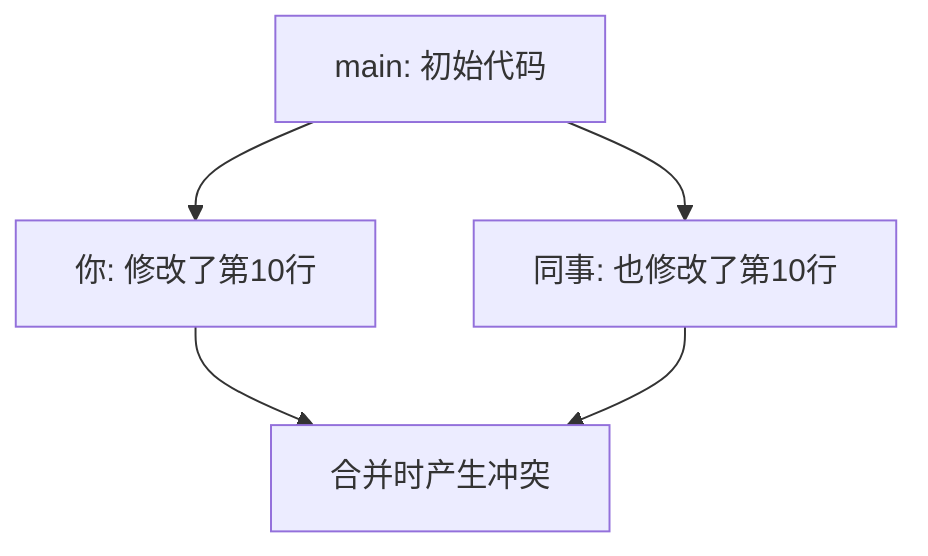

# 8.1.3 代码打架了怎么办——冲突解决

当两个人同时修改了同一个文件的同一部分，Git 无法自动判断该保留哪个版本，这就产生了冲突。

## 冲突是如何产生的



**冲突产生的条件**：
- 两个分支修改了**同一文件的同一区域**
- Git 无法自动决定保留哪个版本

**不会产生冲突的情况**：
- 修改不同文件
- 修改同一文件的不同区域
- 一方只是新增内容

## 冲突的表现形式

当冲突发生时，Git 会在文件中插入冲突标记：

```
<<<<<<< HEAD
你的修改内容
=======
对方的修改内容
>>>>>>> feat/other-branch
```

| 标记 | 含义 |
|------|------|
| `<<<<<<< HEAD` | 当前分支的内容开始 |
| `=======` | 分隔线 |
| `>>>>>>> branch` | 被合并分支的内容结束 |

## 解决冲突的步骤

### 步骤1：识别冲突文件

```bash
# 合并时出现冲突
git merge feat/login
# Auto-merging src/auth.ts
# CONFLICT (content): Merge conflict in src/auth.ts

# 查看冲突状态
git status
# Unmerged paths:
#   both modified: src/auth.ts
```

### 步骤2：打开文件查看冲突

```typescript
// src/auth.ts
function login(user: string) {
<<<<<<< HEAD
  // 你的版本：使用 JWT
  return jwt.sign({ user });
=======
  // 同事的版本：使用 Session
  return session.create({ user });
>>>>>>> feat/session-auth
}
```

### 步骤3：手动解决冲突

根据业务需求，选择保留哪个版本（或两者结合）：

```typescript
// 解决后的代码
function login(user: string) {
  // 最终决定：使用 JWT
  return jwt.sign({ user });
}
```

**删除所有冲突标记**（`<<<<<<<`、`=======`、`>>>>>>>`）后保存文件。

### 步骤4：标记冲突已解决

```bash
# 将解决后的文件加入暂存区
git add src/auth.ts

# 完成合并
git commit -m "merge: 解决 auth 模块冲突，采用 JWT 方案"
```

## 使用 IDE 解决冲突

现代 IDE（如 VS Code、Cursor）提供可视化的冲突解决工具：

```
┌─────────────────────────────────────────┐
│  Accept Current Change  │  当前分支版本  │
│  Accept Incoming Change │  被合并分支版本│
│  Accept Both Changes    │  保留两者      │
│  Compare Changes        │  对比查看      │
└─────────────────────────────────────────┘
```

**推荐做法**：
1. 点击 "Compare Changes" 查看差异
2. 理解两边的修改意图
3. 选择合适的方案或手动编辑

## 预防冲突的最佳实践

1. **频繁同步**：经常 pull 远程更新，减少分支差异
2. **小步提交**：每次提交改动范围小，冲突更容易解决
3. **分工明确**：团队成员尽量避免同时修改同一文件
4. **及时沟通**：修改公共模块前先知会队友

## 复杂冲突处理技巧

### 放弃合并，回到合并前

```bash
git merge --abort
```

### 使用某一方的版本

```bash
# 使用当前分支的版本
git checkout --ours src/auth.ts

# 使用被合并分支的版本
git checkout --theirs src/auth.ts
```

### 查看冲突的详细信息

```bash
# 查看冲突的三方对比
git diff --cc src/auth.ts

# 查看公共祖先的内容
git show :1:src/auth.ts  # 公共祖先
git show :2:src/auth.ts  # 当前分支
git show :3:src/auth.ts  # 被合并分支
```

## AI 协作指南

遇到复杂冲突时，可以请 AI 帮忙分析：

**示例 Prompt**：
> "这是我遇到的 Git 冲突：
> ```
> <<<<<<< HEAD
> function validateUser(user) { return user.email && user.password; }
> =======
> function validateUser(user) { return user.email?.trim() && user.password?.length > 6; }
> >>>>>>> feat/validation
> ```
> 请帮我分析两个版本的差异，并建议如何合并？"

## 验收清单

- [ ] 理解冲突产生的原因
- [ ] 能识别冲突标记并手动解决
- [ ] 能使用 IDE 的可视化工具解决冲突
- [ ] 知道如何放弃合并或选择某一方版本
