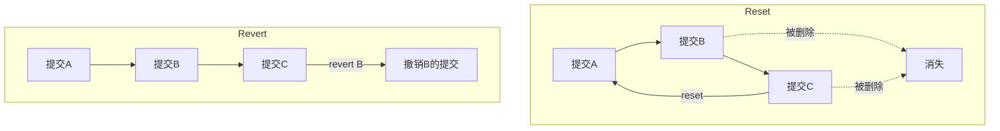
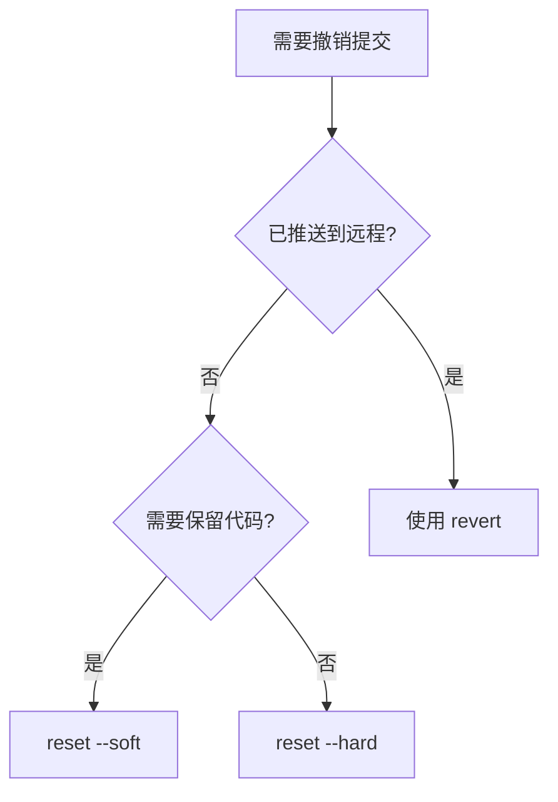

# 8.1.4 一键还原到昨天——版本回滚

代码写崩了？别慌，Git 的回滚功能就是你的后悔药——但不同的药治不同的病。

## reset vs revert：核心区别

| 特性 | git reset | git revert |
|------|-----------|------------|
| 原理 | 移动 HEAD 指针，"删除"历史 | 创建新提交来"撤销"变更 |
| 历史记录 | 会改变历史 | 保留完整历史 |
| 已推送代码 | 不推荐使用 | 安全使用 |
| 适用场景 | 本地未推送的提交 | 已推送到远程的提交 |



## git reset：回到过去

### reset 的三种模式

```bash
# --soft: 保留工作区和暂存区的变更
git reset --soft HEAD~1

# --mixed (默认): 保留工作区，清空暂存区
git reset HEAD~1

# --hard: 工作区和暂存区全部丢弃（慎用！）
git reset --hard HEAD~1
```

| 模式 | 工作区 | 暂存区 | 提交历史 |
|------|--------|--------|----------|
| --soft | 保留 | 保留 | 回退 |
| --mixed | 保留 | 清空 | 回退 |
| --hard | 清空 | 清空 | 回退 |

### 常见使用场景

```bash
# 场景1：撤销最近一次提交，但保留代码继续修改
git reset --soft HEAD~1

# 场景2：撤销最近3次提交
git reset --hard HEAD~3

# 场景3：回退到指定提交
git reset --hard abc1234

# 场景4：撤销 git add，但保留文件修改
git reset HEAD file.ts
```

### 危险操作的补救

如果不小心 `reset --hard` 了，可以用 reflog 找回：

```bash
# 查看操作历史
git reflog

# 找到丢失的提交 hash，然后恢复
git reset --hard abc1234
```

## git revert：创建"反向提交"

revert 不会删除历史，而是创建一个新提交来"抵消"之前的变更。

```bash
# 撤销最近一次提交
git revert HEAD

# 撤销指定提交
git revert abc1234

# 撤销多个连续提交
git revert HEAD~3..HEAD

# 撤销但不自动提交
git revert --no-commit abc1234
```

### revert 合并提交

合并提交需要指定保留哪个父分支：

```bash
# -m 1 表示保留主分支（第一个父提交）
git revert -m 1 merge-commit-hash
```

## 场景决策指南



### 场景对照表

| 场景 | 推荐命令 | 原因 |
|------|----------|------|
| 刚 commit 发现写错了 | `git reset --soft HEAD~1` | 保留代码继续修改 |
| 想彻底删除最近几次提交 | `git reset --hard HEAD~n` | 本地清理 |
| 已 push 的代码有 bug | `git revert HEAD` | 不改变远程历史 |
| 想撤销某个中间提交 | `git revert abc1234` | 精准撤销单个提交 |
| 不小心合并了错误分支 | `git revert -m 1 merge` | 撤销合并 |

## 其他回滚技巧

### 恢复单个文件到指定版本

```bash
# 恢复文件到上一个版本
git checkout HEAD~1 -- src/file.ts

# 恢复文件到指定提交
git checkout abc1234 -- src/file.ts
```

### 暂存当前工作

```bash
# 临时保存当前工作
git stash

# 查看 stash 列表
git stash list

# 恢复最近的 stash
git stash pop

# 恢复指定的 stash
git stash apply stash@{1}
```

## AI 协作指南

**核心意图**：告诉 AI 你的具体情况（是否已推送、是否需要保留代码）。

**示例 Prompt**：
> "我刚 push 了一个提交到 main 分支，但发现代码有严重 bug，需要立即撤销这次提交，同时保留 Git 历史完整性，应该怎么做？"

## 验收清单

- [ ] 理解 reset 和 revert 的区别
- [ ] 能根据场景选择正确的回滚方式
- [ ] 知道如何用 reflog 找回误删的提交
- [ ] 能使用 stash 暂存工作进度
