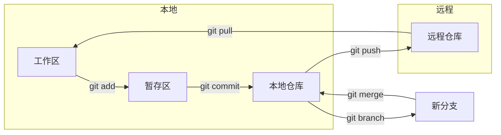

# 8.1 你的时光机和安全网——Git 基本流程

Git 是代码的时光机——让你随时回到过去，也是安全网——让你大胆尝试而不怕失败。

## 核心价值

Git 解决的不是"如何写代码"，而是"如何安全地管理代码变化"：

- **版本追溯**：每次提交都是一个快照，可以随时回退
- **并行开发**：通过分支，多人可以同时开发不同功能
- **变更审查**：通过 PR，代码上线前必须经过审核
- **冲突解决**：当多人修改同一文件时，提供合并机制

## Git 工作流全景

## 核心命令速查

| 场景 | 命令 | 说明 |
|------|------|------|
| 保存修改 | `git add .` | 将所有变更加入暂存区 |
| 提交快照 | `git commit -m "msg"` | 创建一个版本快照 |
| 推送远程 | `git push` | 将本地提交推送到远程 |
| 拉取更新 | `git pull` | 获取远程最新代码 |
| 创建分支 | `git checkout -b feat/xx` | 创建并切换到新分支 |
| 合并分支 | `git merge feat/xx` | 将指定分支合并到当前分支 |
| 版本回退 | `git reset --hard HEAD~1` | 回退到上一个版本 |

## 本节结构

本节将从实际操作出发，带你掌握 Git 的核心技能：

1. **基础命令**：add/commit/push/pull 的日常使用
2. **分支操作**：创建、切换、合并、删除分支
3. **冲突解决**：当代码"打架"时如何处理
4. **版本回滚**：reset 和 revert 的区别与使用
5. **gitignore**：哪些文件不应该被版本控制

## 验收清单

- [ ] 能独立完成 clone → 修改 → commit → push 流程
- [ ] 能创建分支、切换分支、合并分支
- [ ] 能处理简单的合并冲突
- [ ] 理解 reset 和 revert 的区别
- [ ] 能正确配置 .gitignore 文件
