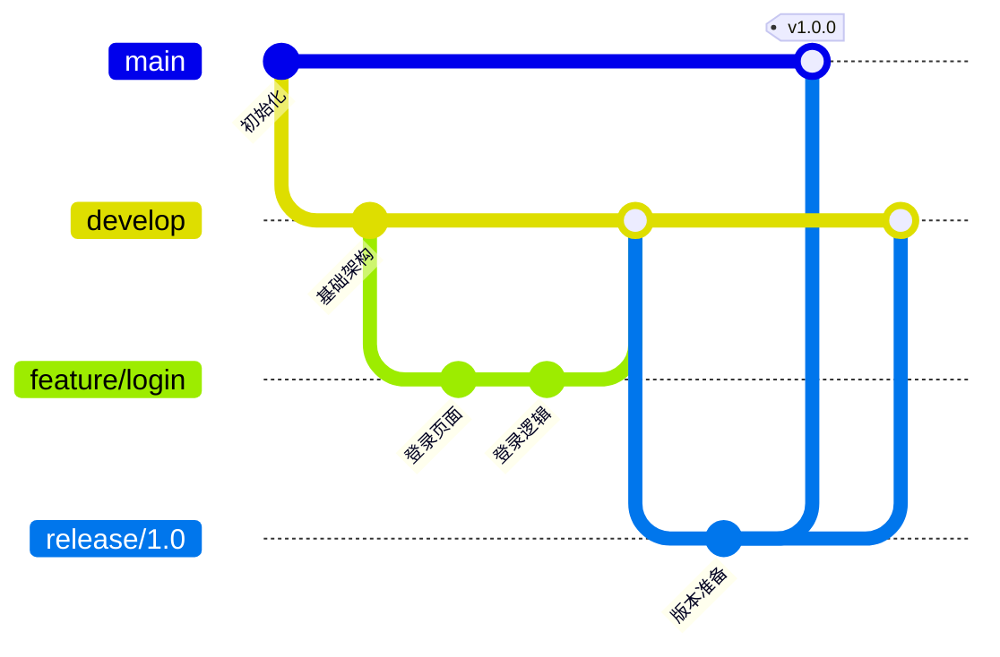
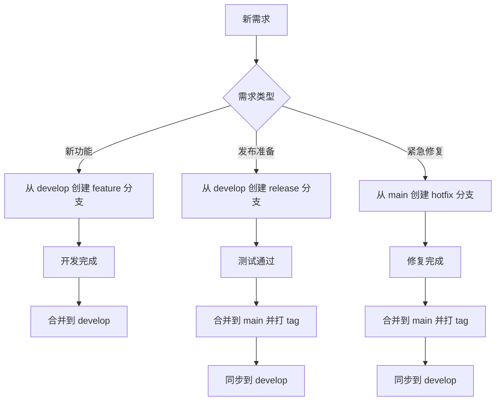

# 8.2.1 专业团队的工作流——Git Flow

Git Flow 是一套成熟的分支管理规范，适合有明确版本发布周期的项目。

## Git Flow 分支结构



## 五种分支类型

| 分支类型 | 命名规范 | 生命周期 | 来源 | 合并目标 |
|----------|----------|----------|------|----------|
| main | `main` | 永久 | - | - |
| develop | `develop` | 永久 | main | release |
| feature | `feature/*` | 临时 | develop | develop |
| release | `release/*` | 临时 | develop | main + develop |
| hotfix | `hotfix/*` | 临时 | main | main + develop |

### 1. main 分支

- **作用**：生产环境代码，始终保持可部署状态
- **规则**：只接受 release 和 hotfix 的合并，禁止直接提交
- **标签**：每次合并后打上版本标签（如 `v1.0.0`）

### 2. develop 分支

- **作用**：开发主线，包含最新的开发进度
- **规则**：只接受 feature、release、hotfix 的合并
- **状态**：可能包含未完成功能，不保证可部署

### 3. feature 分支

```bash
# 创建功能分支
git checkout develop
git checkout -b feature/user-profile

# 开发完成后合并回 develop
git checkout develop
git merge --no-ff feature/user-profile
git branch -d feature/user-profile
```

- **作用**：开发新功能
- **命名**：`feature/功能名称`（如 `feature/user-login`）
- **生命周期**：功能开发期间

### 4. release 分支

```bash
# 准备发布
git checkout develop
git checkout -b release/1.0.0

# 修复发现的问题、更新版本号...

# 发布到 main
git checkout main
git merge --no-ff release/1.0.0
git tag -a v1.0.0 -m "Release 1.0.0"

# 同步回 develop
git checkout develop
git merge --no-ff release/1.0.0
git branch -d release/1.0.0
```

- **作用**：版本发布准备，只做 bug 修复和版本号更新
- **命名**：`release/版本号`（如 `release/1.0.0`）
- **规则**：不允许添加新功能

### 5. hotfix 分支

```bash
# 紧急修复
git checkout main
git checkout -b hotfix/security-fix

# 修复问题...

# 合并到 main
git checkout main
git merge --no-ff hotfix/security-fix
git tag -a v1.0.1 -m "Hotfix: security issue"

# 同步到 develop
git checkout develop
git merge --no-ff hotfix/security-fix
git branch -d hotfix/security-fix
```

- **作用**：生产环境紧急 bug 修复
- **命名**：`hotfix/问题描述`（如 `hotfix/login-crash`）
- **规则**：修复后同时合并到 main 和 develop

## Git Flow 工作流程



## Git Flow 工具

可以使用 `git-flow` 扩展简化操作：

```bash
# 安装（macOS）
brew install git-flow

# 初始化
git flow init

# 开始功能开发
git flow feature start user-login

# 完成功能开发
git flow feature finish user-login

# 开始发布
git flow release start 1.0.0

# 完成发布
git flow release finish 1.0.0
```

## 适用场景与局限

**适合**：
- 有明确版本发布周期的产品
- 需要同时维护多个版本
- 团队规模较大，需要严格流程

**不适合**：
- 持续部署的 Web 应用
- 小团队快速迭代项目
- 只维护单一版本的产品

## AI 协作指南

**示例 Prompt**：
> "我们的项目使用 Git Flow，现在需要紧急修复一个生产环境的安全漏洞，请帮我列出完整的操作步骤。"

## 验收清单

- [ ] 理解五种分支类型的作用
- [ ] 能正确执行 feature 分支的创建和合并
- [ ] 理解 release 和 hotfix 的区别
- [ ] 了解 Git Flow 的适用场景
