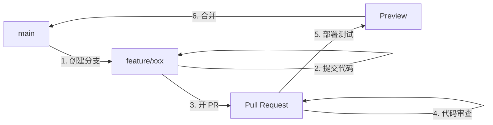
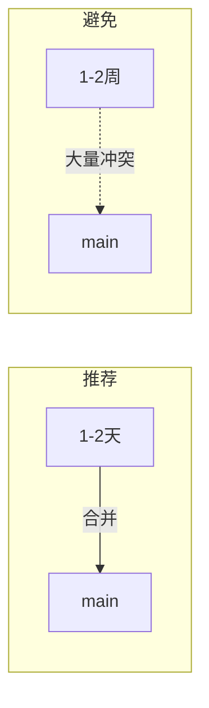

# 8.2.2 小团队的敏捷工作流——GitHub Flow

GitHub Flow 只有一个核心原则：main 分支始终可部署。其余一切从简。

## GitHub Flow 核心流程



## 六步工作流

### 步骤1：从 main 创建分支

```bash
git checkout main
git pull origin main
git checkout -b feat/user-dashboard
```

**命名规范**：
- `feat/xxx` - 新功能
- `fix/xxx` - bug 修复
- `docs/xxx` - 文档更新
- `refactor/xxx` - 代码重构

### 步骤2：提交代码

```bash
# 频繁提交，每个提交都应该是一个逻辑单元
git add .
git commit -m "feat: 添加用户仪表盘布局"
git commit -m "feat: 完成数据获取逻辑"
git commit -m "style: 调整仪表盘样式"
```

### 步骤3：推送并创建 Pull Request

```bash
git push -u origin feat/user-dashboard
```

然后在 GitHub 上创建 PR，填写：
- **标题**：简洁描述变更内容
- **描述**：详细说明改了什么、为什么改
- **关联 Issue**：如果有的话

### 步骤4：代码审查

团队成员审查代码：
- 代码质量
- 业务逻辑正确性
- 测试覆盖
- 安全隐患

### 步骤5：部署预览

现代 CI/CD 工具（如 Vercel）会自动为每个 PR 创建预览环境：

```
Preview: https://project-feat-user-dashboard.vercel.app
```

在预览环境测试通过后，才能合并。

### 步骤6：合并到 main

审查通过后，通过 GitHub UI 合并 PR：
- **Merge commit**：保留完整历史
- **Squash and merge**：压缩为单个提交（推荐）
- **Rebase and merge**：变基合并，保持线性历史

合并后 main 会自动触发生产部署。

## GitHub Flow vs Git Flow

| 特性 | GitHub Flow | Git Flow |
|------|-------------|----------|
| 分支数量 | 2 种（main + feature） | 5 种 |
| 复杂度 | 简单 | 复杂 |
| 发布节奏 | 持续部署 | 定期发布 |
| 版本管理 | 无需 | 需要 |
| 适合团队 | 小团队 | 大团队 |
| 最佳场景 | Web 应用 | 传统软件 |

## 紧急修复流程

GitHub Flow 中的紧急修复与普通功能开发流程相同：

```bash
# 1. 从 main 创建修复分支
git checkout main && git pull
git checkout -b fix/critical-bug

# 2. 修复问题
git add . && git commit -m "fix: 修复登录失败问题"

# 3. 推送并创建 PR
git push -u origin fix/critical-bug

# 4. 快速审查后合并
# 5. main 自动部署
```

## 最佳实践

### 1. 保持分支短命



### 2. 小步提交

```bash
# 好的做法：每个提交聚焦一件事
git commit -m "feat: 添加用户头像组件"
git commit -m "feat: 集成头像到用户卡片"
git commit -m "test: 添加头像组件测试"

# 避免：一个巨大的提交
git commit -m "feat: 添加用户系统"  # 包含 50 个文件变更
```

### 3. 及时同步 main

```bash
# 开发过程中定期同步
git fetch origin main
git rebase origin/main
```

### 4. 使用 PR 模板

在仓库根目录创建 `.github/PULL_REQUEST_TEMPLATE.md`：

```markdown
## 变更类型
- [ ] 新功能
- [ ] Bug 修复
- [ ] 重构
- [ ] 文档

## 变更描述
<!-- 描述你做了什么变更 -->

## 测试
- [ ] 已添加/更新测试
- [ ] 本地测试通过

## 截图（如适用）
```

## AI 协作指南

**示例 Prompt**：
> "我正在开发一个新功能，已经在 feat/user-profile 分支上提交了几次代码。现在发现 main 分支有新的更新，我想把 main 的更新同步到我的分支，同时保持提交历史整洁，应该怎么做？"

## 验收清单

- [ ] 理解 GitHub Flow 的六步流程
- [ ] 能独立完成从创建分支到合并的完整流程
- [ ] 了解 GitHub Flow 与 Git Flow 的区别
- [ ] 掌握分支同步和 PR 最佳实践
