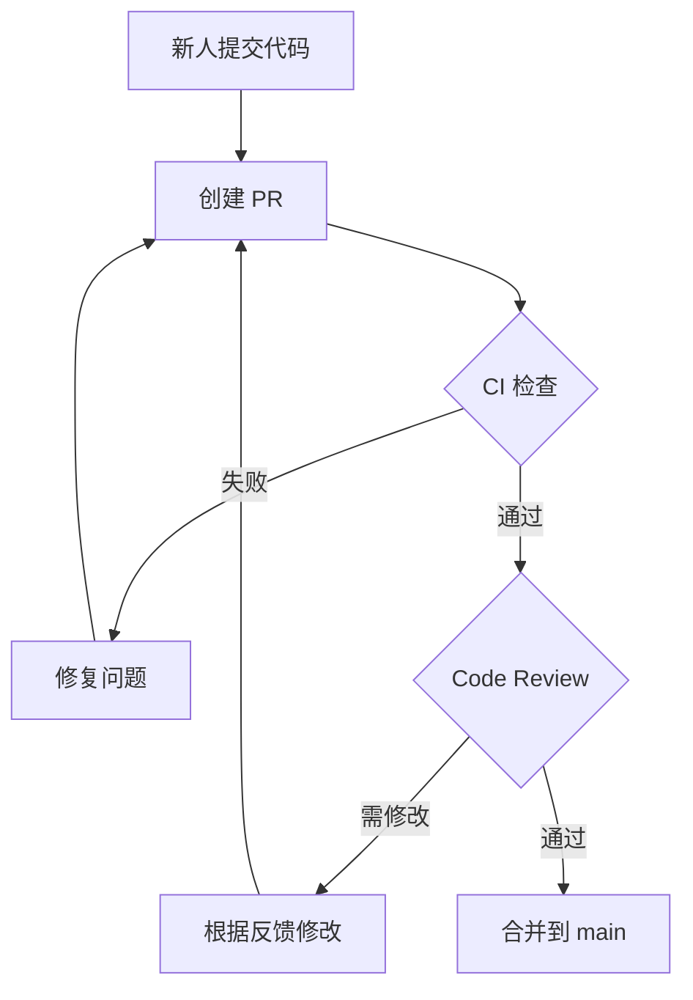

# 8.2.3 主分支不是谁都能动——分支保护

分支保护规则是团队协作的"交通信号灯"——没有规则，再好的流程也会被打破。

## 为什么需要分支保护

没有分支保护时可能发生的问题：

- 有人直接 push 到 main，跳过代码审查
- 未通过测试的代码被合并
- 强制推送覆盖他人代码
- main 分支进入不可部署状态

**分支保护的核心目标**：确保 main 分支上的代码始终处于可部署状态。

## GitHub 分支保护配置

### 进入设置

```
仓库 → Settings → Branches → Add branch protection rule
```

### 核心保护规则

| 规则 | 作用 | 推荐 |
|------|------|------|
| Require a pull request | 禁止直接 push，必须通过 PR | 必选 |
| Require approvals | 需要指定数量的审批 | 至少 1 人 |
| Require status checks | CI 检查必须通过 | 必选 |
| Require branches to be up to date | PR 必须与目标分支同步 | 推荐 |
| Require signed commits | 要求 GPG 签名 | 可选 |
| Include administrators | 管理员也受规则约束 | 推荐 |

### 配置示例

```yaml
# 分支保护规则配置示意
Branch name pattern: main

Protection rules:
  - Require a pull request before merging: ✅
    - Required approving reviews: 1
    - Dismiss stale reviews: ✅
    - Require review from code owners: ✅
  
  - Require status checks to pass: ✅
    - Required checks:
      - build
      - test
      - lint
    - Require branches to be up to date: ✅
  
  - Do not allow bypassing: ✅
```

## 状态检查集成

分支保护可以与 CI/CD 集成，确保代码质量：

```yaml
# .github/workflows/ci.yml
name: CI

on:
  pull_request:
    branches: [main]

jobs:
  build:
    runs-on: ubuntu-latest
    steps:
      - uses: actions/checkout@v4
      - uses: actions/setup-node@v4
        with:
          node-version: '20'
      - run: pnpm install
      - run: pnpm build

  test:
    runs-on: ubuntu-latest
    steps:
      - uses: actions/checkout@v4
      - uses: actions/setup-node@v4
      - run: pnpm install
      - run: pnpm test

  lint:
    runs-on: ubuntu-latest
    steps:
      - uses: actions/checkout@v4
      - uses: actions/setup-node@v4
      - run: pnpm install
      - run: pnpm lint
```

配置后，PR 页面会显示检查状态：

```
┌─────────────────────────────────────────┐
│ ✅ build — All checks have passed       │
│ ✅ test — All checks have passed        │
│ ✅ lint — All checks have passed        │
├─────────────────────────────────────────┤
│ ✅ Ready to merge                       │
└─────────────────────────────────────────┘
```

## Code Owners 配置

通过 `CODEOWNERS` 文件指定代码负责人：

```bash
# .github/CODEOWNERS

# 默认审查者
* @team-lead

# 前端代码
/src/components/ @frontend-team
/src/app/ @frontend-team

# 后端代码
/src/api/ @backend-team
/prisma/ @backend-team

# 基础设施
/.github/ @devops-team
/docker/ @devops-team

# 文档
/docs/ @docs-team
```

配置后，修改对应目录的代码会自动请求相关负责人审查。

## 保护规则实践场景

### 场景1：新人加入团队



### 场景2：紧急修复

即使紧急情况，也应遵循流程：

1. 创建 hotfix 分支
2. 快速修复并提交
3. 创建 PR，标记为 `urgent`
4. 请求快速审查（可在群里 @审查者）
5. 审查通过后合并

**不推荐**：临时禁用分支保护（会留下安全隐患）

## 常见问题

### Q: 管理员可以绕过保护吗？

如果启用了 "Include administrators"，则管理员也必须遵循规则。

### Q: 如何处理 CI 检查偶尔失败？

1. 确保 CI 配置稳定可靠
2. 使用重试机制
3. 必要时可以 "Re-run" 失败的检查

### Q: 紧急情况无人审批怎么办？

1. 设置多个可审批人
2. 建立紧急联系机制
3. 考虑设置自动合并（不推荐用于 main）

## AI 协作指南

**示例 Prompt**：
> "请帮我配置一个 GitHub Actions workflow，用于在 PR 时运行 Next.js 项目的构建、测试和类型检查，并将这些作为分支保护的必需检查。"

## 验收清单

- [ ] 理解分支保护的必要性
- [ ] 能在 GitHub 上配置基本的分支保护规则
- [ ] 了解 CI 状态检查的集成方式
- [ ] 知道如何配置 CODEOWNERS
