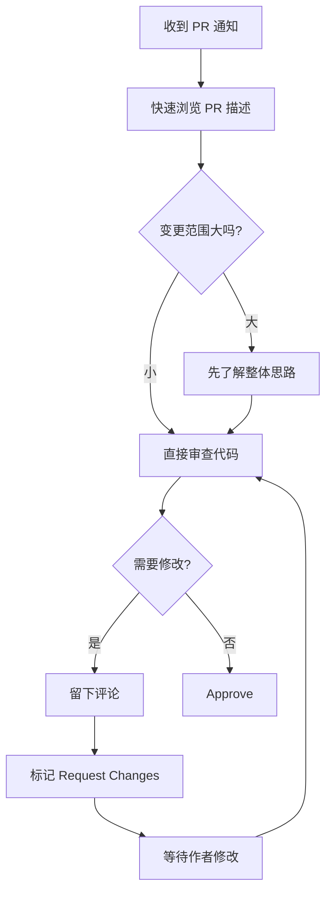

# 8.2.4 同事帮你看代码——代码审查

代码审查不是挑刺大会，而是团队知识共享和质量保障的核心环节。

## 代码审查的价值

| 价值 | 说明 |
|------|------|
| 发现 Bug | 两双眼睛比一双更容易发现问题 |
| 知识传递 | 审查者学习作者的思路，反之亦然 |
| 代码质量 | 维护团队一致的代码风格和架构 |
| 减少风险 | 降低单点故障，多人了解代码 |

## PR 模板配置

在仓库中创建 `.github/PULL_REQUEST_TEMPLATE.md`：

```markdown
## 变更类型

- [ ] 新功能 (feat)
- [ ] Bug 修复 (fix)
- [ ] 代码重构 (refactor)
- [ ] 样式调整 (style)
- [ ] 文档更新 (docs)
- [ ] 测试相关 (test)
- [ ] 构建配置 (build)

## 变更描述

<!-- 简要描述你做了什么变更，为什么需要这个变更 -->

## 关联 Issue

<!-- 如果有的话，填写关联的 Issue 编号 -->
Closes #

## 自测清单

- [ ] 代码符合项目规范
- [ ] 已添加必要的测试
- [ ] 本地测试全部通过
- [ ] 已更新相关文档

## 截图 / 录屏（如适用）

<!-- 如果是 UI 变更，请附上截图或录屏 -->

## 其他说明

<!-- 任何需要审查者特别注意的地方 -->
```

## 审查者清单

### 功能正确性

- [ ] 代码逻辑是否正确实现了需求
- [ ] 边界条件是否处理得当
- [ ] 错误处理是否完善
- [ ] 是否考虑了并发/竞态问题

### 代码质量

- [ ] 代码是否清晰易读
- [ ] 命名是否准确描述了意图
- [ ] 函数/组件是否职责单一
- [ ] 是否有重复代码可以抽取

### 安全性

- [ ] 是否有 SQL 注入风险
- [ ] 用户输入是否经过验证
- [ ] 敏感数据是否正确处理
- [ ] 是否有硬编码的密钥

### 性能

- [ ] 是否有明显的性能问题
- [ ] 数据库查询是否高效
- [ ] 是否有 N+1 查询问题
- [ ] 前端是否避免了不必要的渲染

### 测试

- [ ] 是否有足够的测试覆盖
- [ ] 测试用例是否覆盖边界情况
- [ ] 测试是否易于维护

## 审查评论规范

### 评论类型标记

```markdown
[必须] 这里有内存泄漏，需要在 useEffect 的清理函数中取消订阅

[建议] 可以考虑用 useMemo 优化这个计算

[疑问] 为什么选择在这里处理而不是在服务层？

[赞] 这个封装很优雅！

[提示] FYI：这个库最新版本有 breaking change
```

### 评论最佳实践

**要做**：
- 解释问题的原因，而不仅仅指出问题
- 提供具体的改进建议
- 肯定代码中做得好的地方
- 区分必须修改和可选建议

**避免**：
- 使用贬低性语言
- 仅说"这样不对"而不说原因
- 追求完美主义而阻塞合并
- 评论与代码无关的问题

## 高效审查流程



## 审查时间管理

| 原则 | 说明 |
|------|------|
| 及时响应 | 24 小时内完成首次审查 |
| 分批审查 | 每天固定时间处理 PR，避免频繁打断 |
| 优先级 | 紧急修复 > 阻塞他人 > 普通功能 |
| 沟通 | 大型 PR 先沟通，避免来回修改 |

## 作者最佳实践

### 创建 PR 前

- 自己先 Review 一遍代码
- 确保 CI 检查通过
- 写清楚 PR 描述
- 控制 PR 大小（推荐 < 400 行变更）

### 响应评论

```markdown
# 同意并已修改
已修复，采用了你建议的 useMemo 方案

# 解释原因
保留原方案，因为这里的计算复杂度很低，useMemo 反而会增加内存开销

# 需要讨论
这个问题比较复杂，能否线下讨论一下？
```

## AI 辅助代码审查

可以让 AI 帮助进行初步审查：

**示例 Prompt**：
> "请审查以下代码变更，关注以下几点：
> 1. 是否有明显的 bug 或逻辑错误
> 2. 是否有安全隐患
> 3. 是否有性能问题
> 4. 代码风格是否符合 React/TypeScript 最佳实践
>
> ```tsx
> // 你的代码...
> ```"

## 验收清单

- [ ] 了解代码审查的价值
- [ ] 能配置 PR 模板
- [ ] 掌握审查评论的规范
- [ ] 理解作者和审查者各自的职责
