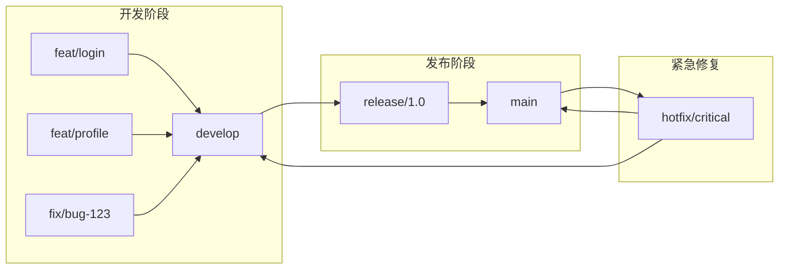

# 8.2 为什么不能随便提交代码——分支策略

直接往 main 分支提交代码，就像在高速公路上随意变道——看似方便，实则危险。

## 为什么需要分支策略

没有分支策略的团队常常遇到这些问题：

- 未经测试的代码直接上线，导致生产事故
- 多人同时开发，代码频繁冲突
- 出了问题不知道是哪次提交引入的
- 紧急 bug 修复被未完成的功能代码阻塞

**分支策略的本质是隔离风险**——让不同阶段的代码在不同的"车道"上行驶。

## 分支策略全景

## 两种主流分支模型

| 模型 | 适用场景 | 复杂度 | 分支数量 |
|------|----------|--------|----------|
| Git Flow | 传统软件、定期发布 | 高 | 多 |
| GitHub Flow | 持续部署、Web 应用 | 低 | 少 |

**推荐**：对于 Next.js 全栈项目，**GitHub Flow** 更为合适——简单、快速、适合持续部署。

## 本节结构

1. **Git Flow**：功能/发布/热修复分支的完整工作流
2. **GitHub Flow**：适合小团队的简化分支模型
3. **分支保护**：如何强制 PR 和状态检查
4. **代码审查**：PR 模板和 Review 最佳实践

## 核心原则

无论选择哪种模型，都应遵循以下原则：

1. **main 分支始终可部署**：main 上的代码随时可以上线
2. **功能开发在独立分支**：一个功能一个分支，互不干扰
3. **通过 PR 合并代码**：所有代码必须经过审查才能进入主分支
4. **小步快跑**：分支生命周期越短越好，避免大规模合并

## 验收清单

- [ ] 理解分支策略的必要性
- [ ] 能根据项目特点选择合适的分支模型
- [ ] 知道如何配置分支保护规则
- [ ] 掌握 PR 和代码审查的基本流程
