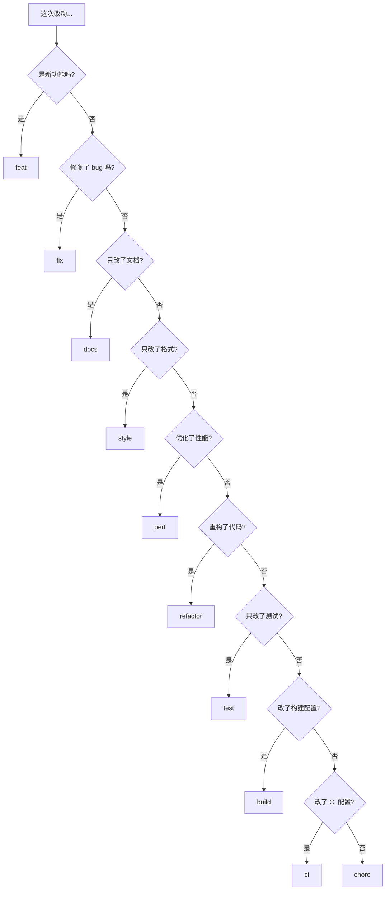

# 8.3.2 feat 和 fix 是什么意思——类型分类

不同类型的变更使用不同的 type 前缀——这是 Conventional Commits 的核心。

## 类型速查表

| Type | 说明 | 触发版本变更 | 示例 |
|------|------|--------------|------|
| feat | 新功能 | minor (1.x.0) | 添加用户登录 |
| fix | 修复 bug | patch (1.0.x) | 修复登录失败 |
| docs | 文档更新 | 无 | 更新 README |
| style | 代码格式 | 无 | 调整缩进 |
| refactor | 重构 | 无 | 优化代码结构 |
| perf | 性能优化 | patch | 优化查询速度 |
| test | 测试相关 | 无 | 添加单元测试 |
| build | 构建相关 | 无 | 升级依赖版本 |
| ci | CI 配置 | 无 | 修改 workflow |
| chore | 杂项 | 无 | 更新 .gitignore |
| revert | 回滚 | 取决于原提交 | 撤销某次提交 |

## 详细说明

### feat - 新功能

用于添加新功能或特性，会影响用户体验或 API：

```bash
feat: 添加用户注册功能
feat(auth): 支持 GitHub 第三方登录
feat(api): 新增获取用户列表接口
```

**判断标准**：用户/调用方能感知到的新能力。

### fix - Bug 修复

修复代码中的错误或问题：

```bash
fix: 修复首页白屏问题
fix(auth): 修复 token 过期后无法刷新的问题
fix(ui): 修复移动端按钮点击区域过小
```

**判断标准**：修复了一个已存在的问题。

### docs - 文档

仅涉及文档的变更：

```bash
docs: 更新安装说明
docs(api): 添加接口使用示例
docs(readme): 补充项目架构说明
```

**判断标准**：只改了 .md 文件或代码注释。

### style - 代码格式

不影响代码逻辑的格式调整：

```bash
style: 统一使用单引号
style: 调整代码缩进为 2 空格
style: 移除多余的空行
```

**判断标准**：纯格式调整，运行结果完全不变。

### refactor - 重构

既不是新功能也不是 bug 修复的代码重构：

```bash
refactor: 提取公共验证逻辑
refactor(auth): 使用策略模式重构登录流程
refactor: 将类组件改为函数组件
```

**判断标准**：优化代码结构，但功能行为不变。

### perf - 性能优化

提升性能的代码变更：

```bash
perf: 使用虚拟列表优化长列表渲染
perf(api): 添加数据库查询缓存
perf: 图片懒加载优化首屏速度
```

**判断标准**：专门为了提升性能的改动。

### test - 测试

添加或修改测试代码：

```bash
test: 添加用户服务单元测试
test(e2e): 补充登录流程端到端测试
test: 修复测试用例中的 mock 数据
```

**判断标准**：只涉及测试代码。

### build - 构建

影响构建系统或外部依赖的变更：

```bash
build: 升级 Next.js 到 14.0
build: 添加 webpack 别名配置
build(deps): 更新 prisma 到最新版本
```

**判断标准**：package.json 依赖变更或构建配置修改。

### ci - 持续集成

CI 配置文件和脚本的变更：

```bash
ci: 添加 GitHub Actions 部署流程
ci: 配置自动化测试 workflow
ci: 添加代码覆盖率检查
```

**判断标准**：只涉及 CI/CD 配置。

### chore - 杂项

其他不影响源代码或测试的变更：

```bash
chore: 更新 .gitignore
chore: 添加 EditorConfig 配置
chore: 清理无用的注释代码
```

**判断标准**：不属于以上任何类型。

### revert - 回滚

撤销之前的提交：

```bash
revert: revert "feat(auth): 添加 Google 登录"

This reverts commit abc1234.
```

## 类型选择决策树



## 常见误区

| 误区 | 正确做法 |
|------|----------|
| 用 fix 表示"修改" | fix 只用于修复 bug |
| 用 feat 表示"完成功能" | feat 只用于新增功能 |
| 用 refactor 表示"修改代码" | refactor 只用于不改变行为的重构 |
| 用 chore 作为万能类型 | 优先使用更具体的类型 |

## 验收清单

- [ ] 能准确区分 feat 和 fix
- [ ] 理解 refactor 与 fix 的区别
- [ ] 知道 style 和 refactor 的界限
- [ ] 能根据变更内容选择正确的类型
