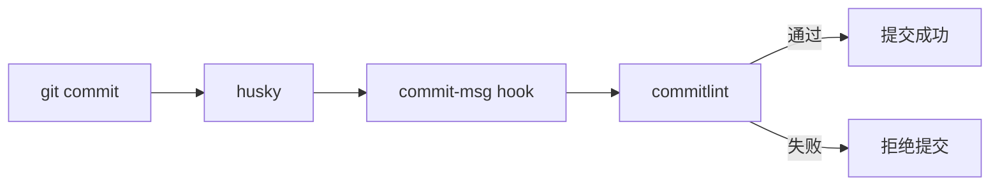

# 8.3.3 机器人帮检查格式——自动化检查

靠人记住规范是不可靠的——用工具自动检查，提交前就拦住不规范的信息。

## 工具链概览



| 工具 | 作用 |
|------|------|
| husky | Git hooks 管理工具 |
| commitlint | 检查提交信息是否符合规范 |
| lint-staged | 只对暂存文件运行 linter |

## 安装配置

### 1. 安装依赖

```bash
# 安装 husky 和 commitlint
pnpm add -D husky @commitlint/cli @commitlint/config-conventional

# 初始化 husky
pnpm exec husky init
```

### 2. 配置 commitlint

创建 `commitlint.config.js`：

```javascript
module.exports = {
  extends: ['@commitlint/config-conventional'],
  rules: {
    // type 必须是以下之一
    'type-enum': [
      2,
      'always',
      [
        'feat',     // 新功能
        'fix',      // 修复
        'docs',     // 文档
        'style',    // 格式
        'refactor', // 重构
        'perf',     // 性能
        'test',     // 测试
        'build',    // 构建
        'ci',       // CI
        'chore',    // 杂项
        'revert',   // 回滚
      ],
    ],
    // type 不能为空
    'type-empty': [2, 'never'],
    // subject 不能为空
    'subject-empty': [2, 'never'],
    // subject 最大长度 100
    'subject-max-length': [2, 'always', 100],
  },
};
```

### 3. 配置 husky hook

```bash
# 创建 commit-msg hook
echo "pnpm exec commitlint --edit \$1" > .husky/commit-msg
```

或手动编辑 `.husky/commit-msg`：

```bash
#!/usr/bin/env sh
. "$(dirname -- "$0")/_/husky.sh"

pnpm exec commitlint --edit $1
```

## 验证配置

```bash
# 测试：不规范的提交会被拒绝
git commit -m "update code"
# ⧗   input: update code
# ✖   subject may not be empty [subject-empty]
# ✖   type may not be empty [type-empty]

# 测试：规范的提交会通过
git commit -m "feat: 添加用户登录"
# ✔ Commit successful!
```

## 进阶配置

### 自定义 scope

```javascript
// commitlint.config.js
module.exports = {
  extends: ['@commitlint/config-conventional'],
  rules: {
    'scope-enum': [
      2,
      'always',
      [
        'auth',      // 认证模块
        'user',      // 用户模块
        'api',       // API 相关
        'ui',        // UI 组件
        'database',  // 数据库
        'config',    // 配置
      ],
    ],
  },
};
```

### 支持中文

默认配置支持中文 subject，无需额外配置：

```bash
git commit -m "feat(auth): 添加用户登录功能"  # ✅ 通过
```

### 集成 lint-staged

在提交前同时检查代码质量：

```bash
pnpm add -D lint-staged
```

在 `package.json` 中配置：

```json
{
  "lint-staged": {
    "*.{ts,tsx}": [
      "eslint --fix",
      "prettier --write"
    ],
    "*.{json,md}": [
      "prettier --write"
    ]
  }
}
```

配置 pre-commit hook：

```bash
echo "pnpm exec lint-staged" > .husky/pre-commit
```

## 完整配置示例

### package.json

```json
{
  "scripts": {
    "prepare": "husky"
  },
  "devDependencies": {
    "@commitlint/cli": "^18.0.0",
    "@commitlint/config-conventional": "^18.0.0",
    "husky": "^9.0.0",
    "lint-staged": "^15.0.0"
  },
  "lint-staged": {
    "*.{ts,tsx}": ["eslint --fix", "prettier --write"]
  }
}
```

### 目录结构

```
project/
├── .husky/
│   ├── _/
│   ├── commit-msg      # commitlint 检查
│   └── pre-commit      # lint-staged 检查
├── commitlint.config.js
└── package.json
```

## 常见问题

### Q: hook 没有执行？

```bash
# 确保 husky 已初始化
pnpm exec husky init

# 检查 hook 文件权限
chmod +x .husky/commit-msg
```

### Q: 如何跳过检查？

```bash
# 紧急情况可以跳过（不推荐）
git commit -m "feat: xxx" --no-verify
```

### Q: CI 中如何检查？

```yaml
# .github/workflows/ci.yml
- name: Validate commits
  run: |
    pnpm exec commitlint --from ${{ github.event.pull_request.base.sha }} --to ${{ github.event.pull_request.head.sha }}
```

## AI 协作指南

**示例 Prompt**：
> "请帮我配置 commitlint，要求：
> 1. 使用 Conventional Commits 规范
> 2. scope 限制为 auth、user、api、ui
> 3. subject 最大长度 80 字符"

## 验收清单

- [ ] 成功安装 husky 和 commitlint
- [ ] 配置了 commit-msg hook
- [ ] 不规范的提交会被拒绝
- [ ] 可选：配置了 lint-staged
