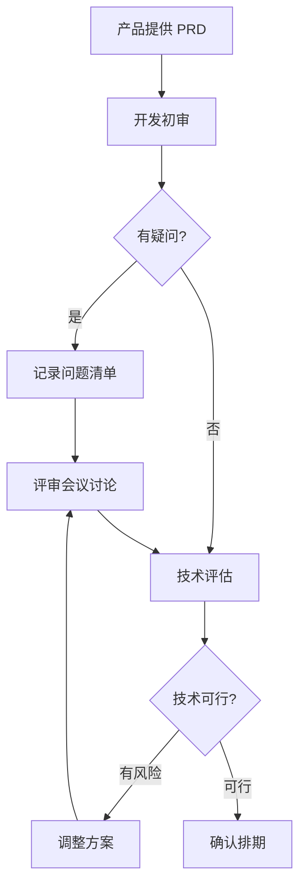

# 8.5.1 做之前先确认——需求对齐

做错了方向，代码写得再漂亮也是浪费——需求对齐是开发的第一步。

## 需求对齐的目标

| 目标 | 说明 |
|------|------|
| 理解一致 | 产品、开发、测试对需求理解一致 |
| 边界清晰 | 明确要做什么、不做什么 |
| 验收明确 | 完成标准有明确定义 |
| 风险识别 | 提前发现技术难点和依赖 |

## PRD 关键要素

一份好的 PRD（产品需求文档）应该包含：

### 1. 背景与目标

```markdown
## 背景
用户反馈登录流程太复杂，流失率高。

## 目标
简化登录流程，将登录转化率提升 10%。

## 成功指标
- 登录完成时间从 30s 降到 15s
- 登录页面跳出率降低 20%
```

### 2. 用户故事

```markdown
## 用户故事

作为【新用户】
我想要【通过手机验证码快速登录】
以便【无需记住密码即可访问服务】

验收标准：
- 输入手机号后 5 秒内收到验证码
- 验证码有效期 5 分钟
- 错误 3 次后需等待 1 分钟
```

### 3. 功能清单

| 功能 | 优先级 | 状态 |
|------|--------|------|
| 手机验证码登录 | P0 | 待开发 |
| 记住登录状态 | P0 | 待开发 |
| 第三方登录(微信) | P1 | 待排期 |
| 邮箱登录 | P2 | 暂缓 |

### 4. 原型/交互稿

- 页面原型链接
- 交互说明
- 特殊状态处理

## 需求评审流程



## 评审检查清单

### 产品角度

- [ ] 需求背景和目标是否清晰？
- [ ] 用户场景是否完整？
- [ ] 优先级是否合理？
- [ ] 有没有遗漏的边界情况？

### 开发角度

- [ ] 技术上是否可行？
- [ ] 是否有外部依赖？
- [ ] 工作量评估是否合理？
- [ ] 是否影响现有功能？

### 测试角度

- [ ] 验收标准是否明确？
- [ ] 测试用例能否覆盖？
- [ ] 性能要求是否明确？

## 简化版需求记录

对于个人项目或小团队，可以用简化的 Feature List：

```markdown
# Feature: 用户登录优化

## 要做的
- [ ] 手机验证码登录
- [ ] 登录态保持 7 天
- [ ] 登录失败错误提示

## 不做的
- 第三方登录（下期）
- 找回密码（现有流程）

## 验收标准
- 验证码 5 秒内送达
- 登录后跳转到首页
- 错误信息清晰可理解

## 技术备注
- 使用阿里云短信服务
- JWT 实现登录态
- 需要后端接口配合
```

## AI 辅助需求分析

**示例 Prompt**：
> "我要做一个用户登录功能，支持手机验证码和密码两种方式。请帮我：
> 1. 列出需要考虑的边界情况
> 2. 拆分成具体的开发任务
> 3. 估算每个任务的开发时间"

## 常见问题

### Q: 需求变更怎么办？

1. 评估变更影响
2. 记录变更原因
3. 调整排期和资源
4. 同步给所有相关方

### Q: 需求不明确怎么办？

1. 列出所有疑问点
2. 约会议或文档确认
3. 明确答案后同步更新 PRD
4. 如果持续不明确，先做确定的部分

## 验收清单

- [ ] 理解 PRD 的关键要素
- [ ] 能编写简化版的 Feature List
- [ ] 知道需求评审的检查点
- [ ] 理解如何处理需求变更
