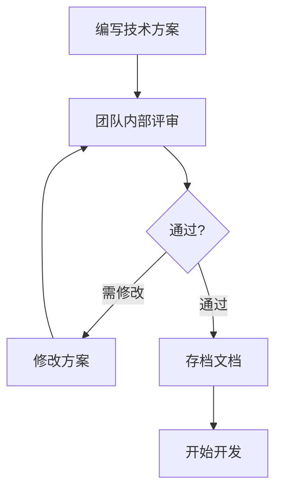

# 8.5.2 技术方案靠不靠谱——技术评审

代码写到一半发现方案走不通，是最浪费时间的事——技术评审让你提前避坑。

## 技术评审的目标

| 目标 | 说明 |
|------|------|
| 方案可行 | 确保技术方案能落地 |
| 风险识别 | 提前发现潜在问题 |
| 知识共享 | 团队成员了解系统设计 |
| 优化方案 | 集思广益改进设计 |

## 什么情况需要技术评审

| 场景 | 需要评审 | 示例 |
|------|----------|------|
| 新系统 | 是 | 新项目架构设计 |
| 重大重构 | 是 | 数据库迁移、框架升级 |
| 复杂功能 | 是 | 支付系统、权限系统 |
| 简单功能 | 否 | 加个按钮、改个文案 |
| 性能优化 | 视情况 | 涉及架构变更需要 |

## 技术方案文档模板

### ADR (Architecture Decision Record)

```markdown
# ADR-001: 用户认证方案选型

## 状态
已采纳

## 背景
需要实现用户认证功能，支持多端登录、token 刷新等场景。

## 决策
采用 JWT + Refresh Token 方案，配合 NextAuth.js 实现。

## 方案对比

| 方案 | 优点 | 缺点 |
|------|------|------|
| Session | 简单、可随时失效 | 需要服务端存储、扩展性差 |
| JWT | 无状态、扩展性好 | Token 泄露风险、无法主动失效 |
| JWT + Refresh | 平衡安全与体验 | 实现复杂度略高 |

## 实现方案

### 1. Token 设计
- Access Token: 有效期 15 分钟
- Refresh Token: 有效期 7 天，存储在 HttpOnly Cookie

### 2. 刷新机制
- 前端拦截 401 响应
- 自动使用 Refresh Token 获取新的 Access Token
- Refresh Token 失效则跳转登录页

### 3. 安全措施
- Access Token 存储在内存
- Refresh Token 使用 HttpOnly Cookie
- 支持单点登出（Redis 黑名单）

## 后果
- 需要引入 Redis 存储 Token 黑名单
- 前端需要实现 Token 刷新逻辑
- 预估开发周期 3 天
```

### 技术设计文档（简版）

```markdown
# 技术设计：消息通知系统

## 1. 需求概述
实现站内消息通知，支持系统通知和用户消息。

## 2. 架构设计

```
┌──────────┐     ┌──────────┐     ┌──────────┐
│  Producer │ --> │  Queue   │ --> │ Consumer │
│  (API)   │     │  (Redis) │     │ (Worker) │
└──────────┘     └──────────┘     └──────────┘
                                       │
                                       ▼
                               ┌──────────────┐
                               │   Database   │
                               └──────────────┘
```

## 3. 数据模型

```prisma
model Notification {
  id        String   @id @default(cuid())
  userId    String
  type      String   // system, mention, reply
  content   Json
  read      Boolean  @default(false)
  createdAt DateTime @default(now())
}
```

## 4. API 设计

- GET /api/notifications - 获取通知列表
- PATCH /api/notifications/:id/read - 标记已读
- DELETE /api/notifications/:id - 删除通知

## 5. 风险与对策

| 风险 | 对策 |
|------|------|
| 消息量大导致性能问题 | 分页查询 + 索引优化 |
| 消息丢失 | Redis 持久化 + 重试机制 |
| 并发写入 | 消息队列削峰 |

## 6. 排期
- 基础功能：2 天
- 消息队列：1 天
- 测试上线：1 天
```

## 技术评审流程



## 评审检查清单

### 可行性

- [ ] 技术方案是否完整？
- [ ] 是否有技术风险？
- [ ] 依赖的服务是否可用？
- [ ] 有没有更简单的方案？

### 性能

- [ ] 预估的 QPS 是多少？
- [ ] 数据量增长后能否支撑？
- [ ] 有没有潜在的性能瓶颈？

### 安全

- [ ] 敏感数据如何存储？
- [ ] 接口是否需要鉴权？
- [ ] 有没有注入风险？

### 可维护性

- [ ] 方案是否易于理解？
- [ ] 后续扩展是否方便？
- [ ] 是否有过度设计？

## AI 辅助技术评审

**示例 Prompt**：
> "我设计了一个消息队列方案，使用 Redis 的 List 结构实现。请帮我评审：
> 1. 可能存在的技术风险
> 2. 性能瓶颈在哪里
> 3. 有没有更好的替代方案"

## 验收清单

- [ ] 能编写基本的技术方案文档
- [ ] 理解 ADR 的结构和用途
- [ ] 知道技术评审的关键检查点
- [ ] 能识别方案中的潜在风险
