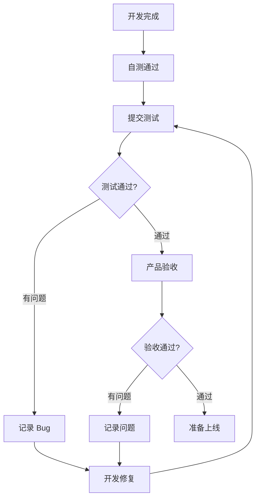

# 8.5.3 做完了怎么算——验收标准

"做完了"不等于"做好了"——明确的验收标准让双方都有共识。

## 验收标准的作用

| 问题 | 后果 | 解决方案 |
|------|------|----------|
| 标准模糊 | 做完不知道算不算完 | 量化验收标准 |
| 边界不清 | 反复返工修改 | 明确边界条件 |
| 质量不一 | 每次交付质量波动 | 统一质量门禁 |

## 验收标准分类

### 1. 功能验收

**核心问题**：功能是否按需求正确实现？

```markdown
## 登录功能验收标准

### 正常流程
- [ ] 输入正确手机号+验证码，登录成功
- [ ] 登录后正确跳转到首页
- [ ] 登录态保持 7 天

### 异常流程
- [ ] 手机号格式错误，提示"手机号格式不正确"
- [ ] 验证码错误，提示"验证码错误"
- [ ] 连续错误 3 次，锁定 1 分钟
- [ ] 验证码过期，提示"验证码已过期"

### 边界条件
- [ ] 空手机号提交，禁用提交按钮
- [ ] 验证码非 6 位数字，提交按钮禁用
- [ ] 弱网环境下有 loading 状态
```

### 2. 性能验收

**核心问题**：系统是否够快、够稳定？

| 指标 | 标准 | 说明 |
|------|------|------|
| 页面加载 | < 3s | 首屏完全加载时间 |
| API 响应 | < 500ms | 95 分位响应时间 |
| 并发能力 | > 100 QPS | 单实例压测结果 |
| 错误率 | < 0.1% | 生产环境监控 |

### 3. 兼容性验收

```markdown
## 浏览器兼容性

### 必须支持
- [ ] Chrome 最新两个版本
- [ ] Safari 最新两个版本
- [ ] Firefox 最新版本

### 移动端
- [ ] iOS Safari 15+
- [ ] Android Chrome 最新版

### 可降级
- [ ] IE（不支持，显示升级提示）
```

### 4. 安全验收

```markdown
## 安全检查清单

### 认证授权
- [ ] 未登录无法访问受保护页面
- [ ] 无法访问其他用户数据
- [ ] Token 过期后正确处理

### 输入验证
- [ ] XSS 攻击防护
- [ ] SQL 注入防护
- [ ] CSRF 防护

### 敏感数据
- [ ] 密码不明文存储
- [ ] 敏感信息不记录日志
- [ ] HTTPS 传输
```

## 验收流程



## 自动化测试作为验收

用自动化测试替代部分人工验收：

### 单元测试

```typescript
describe('登录表单验证', () => {
  it('手机号格式不正确时显示错误', () => {
    render(<LoginForm />);
    fireEvent.change(screen.getByPlaceholderText('手机号'), {
      target: { value: '123' }
    });
    expect(screen.getByText('手机号格式不正确')).toBeInTheDocument();
  });

  it('验证码长度不足时提交按钮禁用', () => {
    render(<LoginForm />);
    fireEvent.change(screen.getByPlaceholderText('验证码'), {
      target: { value: '12' }
    });
    expect(screen.getByRole('button', { name: '登录' })).toBeDisabled();
  });
});
```

### E2E 测试

```typescript
// Playwright 测试
test('用户登录流程', async ({ page }) => {
  await page.goto('/login');
  
  await page.fill('[name="phone"]', '13800138000');
  await page.click('button:has-text("获取验证码")');
  
  // 等待验证码发送
  await expect(page.locator('text=60秒后重新获取')).toBeVisible();
  
  await page.fill('[name="code"]', '123456');
  await page.click('button:has-text("登录")');
  
  // 验证跳转到首页
  await expect(page).toHaveURL('/');
});
```

## 验收文档模板

```markdown
# 功能验收报告

## 基本信息
- 功能名称：用户登录优化
- 开发人员：张三
- 测试人员：李四
- 验收日期：2024-01-15

## 功能验收

| 验收项 | 结果 | 备注 |
|--------|------|------|
| 手机验证码登录 | ✅ 通过 | - |
| 错误提示 | ✅ 通过 | - |
| 登录态保持 | ✅ 通过 | - |
| 锁定机制 | ⚠️ 有问题 | 锁定时间显示不准确 |

## 性能验收

| 指标 | 要求 | 实际 | 结果 |
|------|------|------|------|
| 页面加载 | < 3s | 2.1s | ✅ 通过 |
| 接口响应 | < 500ms | 180ms | ✅ 通过 |

## 待解决问题
1. [ ] 锁定倒计时显示不准确

## 验收结论
- [x] 功能基本完成，有小问题待修复
- [ ] 可以上线（待问题修复后）
```

## AI 辅助验收

**示例 Prompt**：
> "我实现了一个用户登录功能，支持手机验证码登录。请帮我生成：
> 1. 功能测试用例清单
> 2. 边界条件测试点
> 3. 安全检查项"

## 验收清单

- [ ] 能编写明确的验收标准
- [ ] 理解功能、性能、安全验收的区别
- [ ] 能用自动化测试替代部分验收
- [ ] 知道如何记录验收结果
