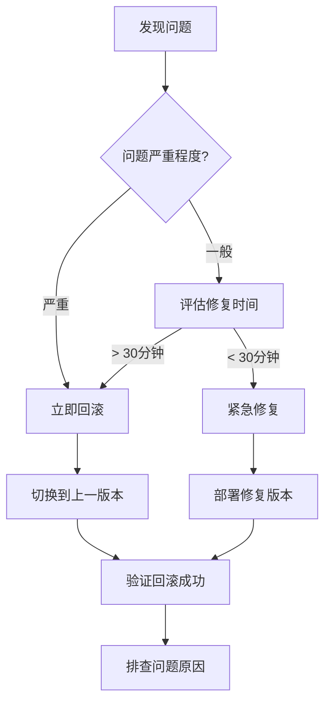

# 8.5.4 上线的标准流程——部署流程

上线不是终点而是起点——规范的部署流程让你上线安心、出问题能快速回滚。

## 部署核心原则

| 原则 | 说明 | 实践 |
|------|------|------|
| 可重复 | 每次部署结果一致 | 使用 Docker |
| 可回滚 | 出问题能快速恢复 | 保留旧版本 |
| 可观测 | 知道系统运行状态 | 日志+监控 |
| 自动化 | 减少人工操作 | CI/CD |

## 部署方式对比

| 方式 | 优点 | 缺点 | 适用场景 |
|------|------|------|----------|
| Vercel | 零配置、自动 CI | 功能限制、价格 | 前端/轻量 API |
| Docker | 环境一致、可移植 | 需要服务器 | 后端服务 |
| 1Panel | 可视化、易管理 | 学习成本 | 自托管项目 |
| K8s | 高可用、自动扩容 | 复杂度高 | 大规模部署 |

## 1Panel 部署 Next.js

### 1. 准备 Dockerfile

```dockerfile
# Dockerfile
FROM node:20-alpine AS base

# 安装依赖
FROM base AS deps
WORKDIR /app
COPY package.json pnpm-lock.yaml ./
RUN corepack enable pnpm && pnpm install --frozen-lockfile

# 构建
FROM base AS builder
WORKDIR /app
COPY --from=deps /app/node_modules ./node_modules
COPY . .
RUN corepack enable pnpm && pnpm build

# 生产镜像
FROM base AS runner
WORKDIR /app
ENV NODE_ENV=production

RUN addgroup --system --gid 1001 nodejs
RUN adduser --system --uid 1001 nextjs

COPY --from=builder /app/public ./public
COPY --from=builder --chown=nextjs:nodejs /app/.next/standalone ./
COPY --from=builder --chown=nextjs:nodejs /app/.next/static ./.next/static

USER nextjs
EXPOSE 3000
ENV PORT=3000
ENV HOSTNAME="0.0.0.0"

CMD ["node", "server.js"]
```

### 2. 配置 next.config.js

```javascript
/** @type {import('next').NextConfig} */
const nextConfig = {
  output: 'standalone',
};

module.exports = nextConfig;
```

### 3. 1Panel 创建应用

1. 进入 1Panel → 应用商店 → 创建自定义应用
2. 填写应用信息
3. 上传 Dockerfile 或配置 Git 仓库
4. 配置环境变量
5. 启动应用

### 4. 配置反向代理

在 1Panel 中配置 Nginx：

```nginx
server {
    listen 80;
    server_name your-domain.com;
    
    location / {
        proxy_pass http://localhost:3000;
        proxy_http_version 1.1;
        proxy_set_header Upgrade $http_upgrade;
        proxy_set_header Connection 'upgrade';
        proxy_set_header Host $host;
        proxy_cache_bypass $http_upgrade;
    }
}
```

## GitHub Actions 自动部署

```yaml
# .github/workflows/deploy.yml
name: Deploy

on:
  push:
    branches: [main]

jobs:
  deploy:
    runs-on: ubuntu-latest
    steps:
      - uses: actions/checkout@v4

      - name: Build Docker image
        run: docker build -t myapp:latest .

      - name: Push to Registry
        run: |
          echo "${{ secrets.DOCKER_PASSWORD }}" | docker login -u "${{ secrets.DOCKER_USERNAME }}" --password-stdin
          docker tag myapp:latest ${{ secrets.DOCKER_REGISTRY }}/myapp:latest
          docker push ${{ secrets.DOCKER_REGISTRY }}/myapp:latest

      - name: Deploy to Server
        uses: appleboy/ssh-action@v1.0.0
        with:
          host: ${{ secrets.SERVER_HOST }}
          username: ${{ secrets.SERVER_USER }}
          key: ${{ secrets.SSH_PRIVATE_KEY }}
          script: |
            docker pull ${{ secrets.DOCKER_REGISTRY }}/myapp:latest
            docker stop myapp || true
            docker rm myapp || true
            docker run -d --name myapp -p 3000:3000 \
              --env-file /root/.env.production \
              ${{ secrets.DOCKER_REGISTRY }}/myapp:latest
```

## 部署检查清单

### 部署前

- [ ] 代码已合并到 main 分支
- [ ] 所有测试通过
- [ ] 环境变量配置正确
- [ ] 数据库迁移准备就绪
- [ ] 通知相关人员

### 部署中

- [ ] 监控部署进度
- [ ] 检查日志输出
- [ ] 验证服务启动

### 部署后

- [ ] 访问关键页面验证
- [ ] 检查监控指标
- [ ] 确认日志正常
- [ ] 保留回滚能力

## 回滚策略



### Docker 回滚

```bash
# 查看历史版本
docker images myapp

# 回滚到指定版本
docker stop myapp
docker rm myapp
docker run -d --name myapp -p 3000:3000 myapp:previous-tag
```

## 监控与告警

### 基础监控

```yaml
# docker-compose.yml 添加健康检查
services:
  app:
    image: myapp:latest
    healthcheck:
      test: ["CMD", "curl", "-f", "http://localhost:3000/api/health"]
      interval: 30s
      timeout: 10s
      retries: 3
```

### 健康检查 API

```typescript
// app/api/health/route.ts
export async function GET() {
  try {
    // 检查数据库连接
    await prisma.$queryRaw`SELECT 1`;
    
    return Response.json({
      status: 'healthy',
      timestamp: new Date().toISOString(),
    });
  } catch (error) {
    return Response.json(
      { status: 'unhealthy', error: error.message },
      { status: 503 }
    );
  }
}
```

## AI 协作指南

**示例 Prompt**：
> "我要将 Next.js 项目部署到我的服务器（Ubuntu 22.04），使用 Docker。请帮我：
> 1. 编写多阶段构建的 Dockerfile
> 2. 配置 GitHub Actions 自动部署
> 3. 设置 Nginx 反向代理和 HTTPS"

## 验收清单

- [ ] 能编写 Next.js 的 Dockerfile
- [ ] 理解 CI/CD 自动部署流程
- [ ] 知道部署前后的检查要点
- [ ] 掌握回滚策略和监控基础
