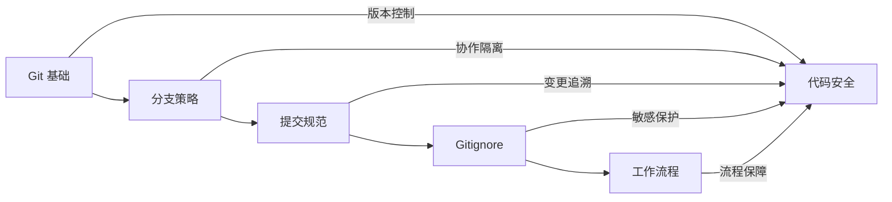

# 8 ｜项目规则与协作

代码写得再好，没有版本管理和协作规范，最终也会变成一团乱麻。

## 为什么需要项目规则？

在个人开发阶段，你可能觉得"我一个人开发，随便写写就行"。但当你遇到以下情况时，就会深刻理解规范的价值：

- 昨天的代码今天跑不了，却不知道改了什么
- 多人协作时互相覆盖对方的代码
- 密钥泄露到 GitHub 公开仓库
- 不知道某个功能是谁开发的、为什么这么写

**项目规则的本质是降低协作成本**——包括与他人协作，也包括与"未来的自己"协作。

## 本章核心内容

```
┌─────────────────────────────────────────────────────────────┐
│                     项目规则与协作                            │
├─────────────────────────────────────────────────────────────┤
│  8.1 Git 基础        │  版本控制的基本操作与回滚机制          │
│  8.2 分支策略        │  多人协作的分支管理与保护规则          │
│  8.3 提交规范        │  Conventional Commits 与自动化       │
│  8.4 Gitignore       │  敏感文件与构建产物的排除策略          │
│  8.5 工作流程        │  对齐→评审→验收→上线的完整闭环        │
└─────────────────────────────────────────────────────────────┘
```

## 章节逻辑关系



## 学习目标

完成本章后，你将能够：

| 能力 | 具体表现 |
|------|----------|
| Git 操作 | 熟练使用 add/commit/push/pull，处理冲突和回滚 |
| 分支管理 | 理解 Git Flow 和 GitHub Flow，配置分支保护 |
| 提交规范 | 使用 Conventional Commits，配置 commitlint |
| 安全意识 | 正确配置 .gitignore，避免敏感信息泄露 |
| 协作流程 | 掌握 PRD 评审、技术评审、验收上线全流程 |

## AI 协作提示

在项目协作中，AI 可以帮助你：

- 生成规范的 commit message
- 编写 PR 描述和 review 意见
- 配置 .gitignore 模板
- 起草 PRD 和技术方案文档

**关键术语**：`git flow`、`conventional commits`、`branch protection`、`code review`、`.gitignore`
