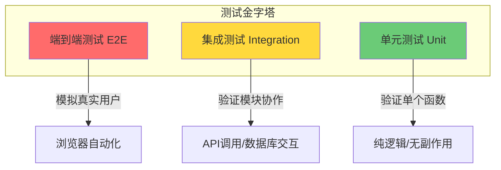

# 9.1.1 测试也分三六九等——测试分层：单元/集成/端到端测试

**不同类型的测试解决不同层面的问题，混淆它们的边界是测试效率低下的根源。**

## 测试金字塔的三个层级



## 三种测试类型详解

### 单元测试：最小粒度的验证

单元测试针对**单个函数或类**进行测试，不涉及外部依赖。

```typescript
// utils/price.ts
export function calculateDiscount(price: number, rate: number): number {
  if (rate < 0 || rate > 1) {
    throw new Error('折扣率必须在 0-1 之间');
  }
  return Math.round(price * (1 - rate) * 100) / 100;
}

// __tests__/utils/price.test.ts
import { calculateDiscount } from '@/utils/price';

describe('calculateDiscount', () => {
  it('应正确计算折扣价格', () => {
    expect(calculateDiscount(100, 0.2)).toBe(80);
    expect(calculateDiscount(99.99, 0.1)).toBe(89.99);
  });

  it('应拒绝无效的折扣率', () => {
    expect(() => calculateDiscount(100, -0.1)).toThrow();
    expect(() => calculateDiscount(100, 1.5)).toThrow();
  });
});
```

**适用场景**：
- 纯函数、工具函数
- 数据转换、格式化逻辑
- 业务规则计算

### 集成测试：验证模块协作

集成测试验证**多个模块之间的协作**，通常涉及数据库、API 调用等。

```typescript
// services/order.service.ts
export class OrderService {
  constructor(private prisma: PrismaClient) {}

  async createOrder(userId: string, items: CartItem[]) {
    return this.prisma.$transaction(async (tx) => {
      const order = await tx.order.create({
        data: {
          userId,
          status: 'PENDING',
          items: { create: items.map(item => ({ ...item })) },
        },
      });
      
      // 扣减库存
      for (const item of items) {
        await tx.product.update({
          where: { id: item.productId },
          data: { stock: { decrement: item.quantity } },
        });
      }
      
      return order;
    });
  }
}

// __tests__/services/order.service.test.ts
describe('OrderService', () => {
  let prisma: PrismaClient;
  let orderService: OrderService;

  beforeAll(async () => {
    prisma = new PrismaClient();
    orderService = new OrderService(prisma);
  });

  beforeEach(async () => {
    // 清理并准备测试数据
    await prisma.order.deleteMany();
    await prisma.product.deleteMany();
    await prisma.product.create({
      data: { id: 'prod-1', name: '测试商品', price: 100, stock: 10 },
    });
  });

  it('应创建订单并扣减库存', async () => {
    const order = await orderService.createOrder('user-1', [
      { productId: 'prod-1', quantity: 2, price: 100 },
    ]);

    expect(order.status).toBe('PENDING');
    
    const product = await prisma.product.findUnique({ where: { id: 'prod-1' } });
    expect(product?.stock).toBe(8); // 10 - 2 = 8
  });
});
```

**适用场景**：
- 服务层业务逻辑
- 数据库操作
- 外部 API 调用（使用 Mock）

### 端到端测试：模拟真实用户

E2E 测试通过浏览器自动化，**模拟真实用户操作**。

```typescript
// e2e/checkout.spec.ts (Playwright)
import { test, expect } from '@playwright/test';

test('用户应能完成结账流程', async ({ page }) => {
  // 登录
  await page.goto('/login');
  await page.fill('[name="email"]', 'test@example.com');
  await page.fill('[name="password"]', 'password123');
  await page.click('button[type="submit"]');
  
  // 添加商品到购物车
  await page.goto('/products/1');
  await page.click('button:has-text("加入购物车")');
  
  // 结账
  await page.goto('/cart');
  await page.click('button:has-text("结账")');
  
  // 验证订单创建成功
  await expect(page).toHaveURL(/\/orders\/\d+/);
  await expect(page.locator('h1')).toContainText('订单已创建');
});
```

**适用场景**：
- 核心用户流程（注册、登录、支付）
- 关键业务路径
- 跨页面交互

## 三种测试的对比

| 特性 | 单元测试 | 集成测试 | E2E 测试 |
|------|---------|---------|---------|
| 执行速度 | 毫秒级 | 秒级 | 分钟级 |
| 维护成本 | 低 | 中 | 高 |
| 发现问题 | 逻辑错误 | 集成错误 | 用户体验问题 |
| 定位问题 | 精确 | 较精确 | 模糊 |
| 覆盖范围 | 小 | 中 | 大 |
| 依赖环境 | 无 | 数据库/Mock | 完整环境 |

## AI 协作指南

当你需要为现有代码添加测试时，可以这样与 AI 沟通：

> **核心意图**：告诉 AI 你要测试的是哪个层级的代码
>
> **需求定义公式**：
> - 单元测试：`为这个纯函数写单元测试，覆盖正常输入和边界条件`
> - 集成测试：`为这个服务层方法写集成测试，需要准备测试数据和清理逻辑`
> - E2E 测试：`为用户登录流程写 Playwright 测试，包含成功和失败场景`

**关键术语**：`describe`、`it`、`expect`、`beforeEach`、`afterEach`、`mock`

## 本节小结

理解测试分层的核心在于：**每种测试类型都有其最佳应用场景**。单元测试快速精确但覆盖面窄，E2E 测试覆盖面广但维护成本高，集成测试则在两者之间取得平衡。对于 Vibe Coding 开发者来说，把精力集中在服务层的集成测试上，是性价比最高的选择。
