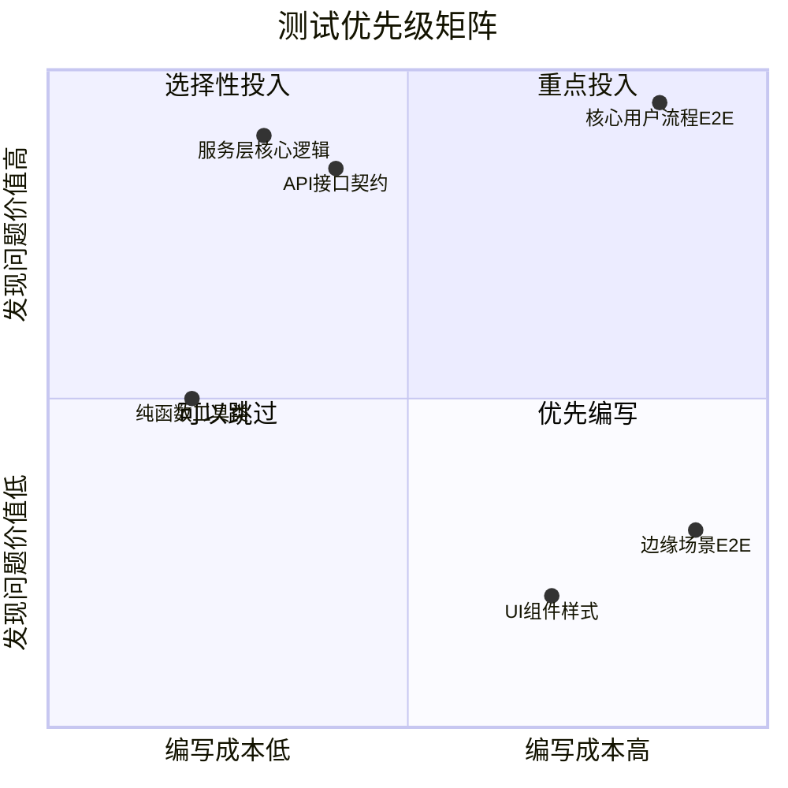
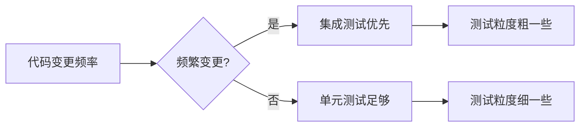

# 9.1.2 时间花在刀刃上——测试优先级：投入产出比分析

**测试的目的不是追求 100% 覆盖率，而是用最少的投入获得最大的质量保障。**

## 测试投入产出比矩阵



## 优先级排序原则

### 第一优先级：服务层业务逻辑

服务层是业务规则的聚集地，bug 在这里造成的损失最大。

```typescript
// 高优先级测试：订单金额计算
describe('OrderService.calculateTotal', () => {
  it('应正确计算订单总额（含折扣）', async () => {
    const total = await orderService.calculateTotal({
      items: [
        { price: 100, quantity: 2 },
        { price: 50, quantity: 1 },
      ],
      discountCode: 'SAVE10',
    });
    
    // 250 * 0.9 = 225
    expect(total).toBe(225);
  });

  it('应处理库存不足的边界情况', async () => {
    await expect(
      orderService.createOrder({ productId: 'prod-1', quantity: 999 })
    ).rejects.toThrow('库存不足');
  });
});
```

### 第二优先级：API 接口契约

API 是对外承诺，一旦变更影响面广。

```typescript
// 高优先级测试：API 响应格式
describe('POST /api/orders', () => {
  it('应返回标准响应格式', async () => {
    const response = await request(app)
      .post('/api/orders')
      .send({ items: [{ productId: 'prod-1', quantity: 1 }] });

    expect(response.status).toBe(201);
    expect(response.body).toMatchObject({
      success: true,
      data: {
        id: expect.any(String),
        status: 'PENDING',
        createdAt: expect.any(String),
      },
    });
  });

  it('应正确处理参数校验失败', async () => {
    const response = await request(app)
      .post('/api/orders')
      .send({ items: [] }); // 空数组

    expect(response.status).toBe(400);
    expect(response.body.error.code).toBe('VALIDATION_ERROR');
  });
});
```

### 第三优先级：纯函数工具类

投入产出比高，编写简单，运行快速。

```typescript
// 中优先级测试：工具函数
describe('formatCurrency', () => {
  it('应正确格式化人民币', () => {
    expect(formatCurrency(1234.5, 'CNY')).toBe('¥1,234.50');
    expect(formatCurrency(0, 'CNY')).toBe('¥0.00');
  });

  it('应处理负数', () => {
    expect(formatCurrency(-100, 'CNY')).toBe('-¥100.00');
  });
});
```

### 低优先级：UI 组件与样式

UI 变化频繁，测试维护成本高，优先考虑视觉回归测试。

## 判断测试价值的快速检查表

| 检查项 | 高价值 | 低价值 |
|-------|-------|-------|
| 涉及金钱计算 | ✅ | |
| 涉及用户权限 | ✅ | |
| 涉及数据持久化 | ✅ | |
| 对外 API 接口 | ✅ | |
| 纯展示性 UI | | ✅ |
| 临时/实验性功能 | | ✅ |
| 频繁变化的代码 | | ✅ |

## 测试覆盖率的正确理解

```
┌─────────────────────────────────────────────────────┐
│                  覆盖率的真相                         │
├─────────────────────────────────────────────────────┤
│                                                     │
│  ❌ 误区：追求 100% 覆盖率                            │
│  ✅ 正解：核心路径 100%，边缘场景 50%                  │
│                                                     │
│  代码覆盖率 80% + 业务场景覆盖率 100%                  │
│  = 实际质量保障 > 95%                                │
│                                                     │
└─────────────────────────────────────────────────────┘
```

## 实战：如何识别高价值测试点

### 场景分析法

1. **问自己**：如果这段代码出错，最坏的结果是什么？
2. **评估影响**：影响用户数量 × 问题严重程度
3. **确定优先级**：影响越大，测试优先级越高

```typescript
// 高影响场景：支付金额计算
// 如果出错 → 多收/少收用户的钱 → 必须测试

// 低影响场景：用户头像圆角
// 如果出错 → 稍微丑一点 → 可以不测
```

### 变更频率法



- **频繁变更的代码**：使用粗粒度的集成测试，减少维护成本
- **稳定的核心逻辑**：使用细粒度的单元测试，精确定位问题

## AI 协作指南

让 AI 帮你识别测试优先级：

> **核心意图**：分析代码并推荐测试优先级
>
> **提示词模板**：
> ```
> 分析以下代码，按照测试价值从高到低排序，并说明理由：
> 1. 哪些函数/方法必须测试
> 2. 哪些可以选择性测试
> 3. 哪些可以暂时跳过
> 
> [粘贴代码]
> ```

**关键术语**：`业务关键路径`、`边界条件`、`错误处理`、`数据完整性`

## 本节小结

测试优先级的核心原则是：**先保障核心业务正确，再逐步扩展覆盖范围**。把 80% 的测试精力投入到 20% 最关键的代码上，这就是懒人测试策略的精髓。记住，没有测试的代码不一定有 bug，但有测试的关键代码一定更可靠。
