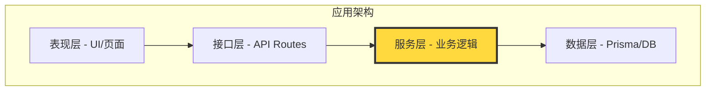

# 9.1.3 业务逻辑是核心——服务层测试：业务逻辑验证重点

**服务层是业务规则的大本营，测好服务层等于守住了应用的核心。**

## 为什么服务层测试最重要



服务层承担着以下核心职责：

| 职责 | 示例 | 测试重要性 |
|------|------|-----------|
| 业务规则验证 | 订单金额 ≥ 最低起送价 | ⭐⭐⭐ |
| 状态流转控制 | 订单：待支付 → 已支付 → 配送中 | ⭐⭐⭐ |
| 跨实体协调 | 下单时同时扣库存、生成支付单 | ⭐⭐⭐ |
| 权限判断 | 用户只能操作自己的订单 | ⭐⭐⭐ |
| 数据聚合 | 计算购物车总价（含优惠券） | ⭐⭐ |

## 服务层测试的核心模式

### 模式一：业务规则验证

```typescript
// services/order.service.ts
export class OrderService {
  private readonly MIN_ORDER_AMOUNT = 20; // 最低起送价

  async createOrder(userId: string, items: CartItem[]): Promise<Order> {
    const totalAmount = this.calculateTotal(items);
    
    if (totalAmount < this.MIN_ORDER_AMOUNT) {
      throw new BusinessError('ORDER_BELOW_MINIMUM', 
        `订单金额不能低于 ${this.MIN_ORDER_AMOUNT} 元`);
    }
    
    return this.prisma.order.create({
      data: { userId, items: { create: items }, totalAmount },
    });
  }
}

// __tests__/services/order.service.test.ts
describe('OrderService.createOrder', () => {
  it('应拒绝低于最低起送价的订单', async () => {
    const items = [{ productId: 'prod-1', price: 10, quantity: 1 }];
    
    await expect(
      orderService.createOrder('user-1', items)
    ).rejects.toThrow('订单金额不能低于 20 元');
  });

  it('应接受达到最低起送价的订单', async () => {
    const items = [{ productId: 'prod-1', price: 25, quantity: 1 }];
    
    const order = await orderService.createOrder('user-1', items);
    
    expect(order.totalAmount).toBe(25);
    expect(order.status).toBe('PENDING');
  });
});
```

### 模式二：状态流转测试

```typescript
// services/order.service.ts
export class OrderService {
  private readonly STATUS_TRANSITIONS: Record<OrderStatus, OrderStatus[]> = {
    PENDING: ['PAID', 'CANCELLED'],
    PAID: ['SHIPPING', 'REFUNDING'],
    SHIPPING: ['DELIVERED'],
    DELIVERED: ['REFUNDING'],
    CANCELLED: [],
    REFUNDING: ['REFUNDED'],
    REFUNDED: [],
  };

  async updateStatus(orderId: string, newStatus: OrderStatus): Promise<Order> {
    const order = await this.prisma.order.findUnique({ where: { id: orderId } });
    
    if (!order) {
      throw new NotFoundError('ORDER_NOT_FOUND');
    }
    
    const allowedStatuses = this.STATUS_TRANSITIONS[order.status];
    if (!allowedStatuses.includes(newStatus)) {
      throw new BusinessError('INVALID_STATUS_TRANSITION',
        `不能从 ${order.status} 变更为 ${newStatus}`);
    }
    
    return this.prisma.order.update({
      where: { id: orderId },
      data: { status: newStatus },
    });
  }
}

// __tests__/services/order.service.test.ts
describe('OrderService.updateStatus', () => {
  it('应允许合法的状态流转', async () => {
    // 准备：创建待支付订单
    const order = await createTestOrder({ status: 'PENDING' });
    
    // 执行：变更为已支付
    const updated = await orderService.updateStatus(order.id, 'PAID');
    
    // 验证
    expect(updated.status).toBe('PAID');
  });

  it('应拒绝非法的状态流转', async () => {
    const order = await createTestOrder({ status: 'DELIVERED' });
    
    // 已送达的订单不能直接变为已支付
    await expect(
      orderService.updateStatus(order.id, 'PAID')
    ).rejects.toThrow('不能从 DELIVERED 变更为 PAID');
  });

  it('应覆盖所有状态流转路径', async () => {
    // 完整的状态流转链测试
    const order = await createTestOrder({ status: 'PENDING' });
    
    await orderService.updateStatus(order.id, 'PAID');
    await orderService.updateStatus(order.id, 'SHIPPING');
    await orderService.updateStatus(order.id, 'DELIVERED');
    
    const finalOrder = await prisma.order.findUnique({ where: { id: order.id } });
    expect(finalOrder?.status).toBe('DELIVERED');
  });
});
```

### 模式三：跨实体协调测试

```typescript
// __tests__/services/order.service.test.ts
describe('OrderService 跨实体操作', () => {
  it('下单应同时扣减库存', async () => {
    // 准备：创建商品
    await prisma.product.create({
      data: { id: 'prod-1', name: '测试商品', stock: 10 },
    });
    
    // 执行：下单
    await orderService.createOrder('user-1', [
      { productId: 'prod-1', quantity: 3 },
    ]);
    
    // 验证：库存应减少
    const product = await prisma.product.findUnique({ where: { id: 'prod-1' } });
    expect(product?.stock).toBe(7);
  });

  it('取消订单应恢复库存', async () => {
    // 准备
    const order = await createTestOrder({
      items: [{ productId: 'prod-1', quantity: 3 }],
    });
    
    // 执行
    await orderService.cancelOrder(order.id);
    
    // 验证
    const product = await prisma.product.findUnique({ where: { id: 'prod-1' } });
    expect(product?.stock).toBe(10); // 恢复原库存
  });

  it('库存不足时下单应失败', async () => {
    await prisma.product.create({
      data: { id: 'prod-1', stock: 2 },
    });
    
    await expect(
      orderService.createOrder('user-1', [
        { productId: 'prod-1', quantity: 5 }, // 超过库存
      ])
    ).rejects.toThrow('库存不足');
  });
});
```

## 服务层测试的最佳实践

### 测试数据准备策略

```typescript
// test/helpers/factory.ts
export async function createTestUser(overrides: Partial<User> = {}) {
  return prisma.user.create({
    data: {
      id: `user-${Date.now()}`,
      email: `test-${Date.now()}@example.com`,
      name: 'Test User',
      ...overrides,
    },
  });
}

export async function createTestOrder(overrides: Partial<CreateOrderInput> = {}) {
  const user = await createTestUser();
  
  return prisma.order.create({
    data: {
      userId: user.id,
      status: 'PENDING',
      totalAmount: 100,
      ...overrides,
    },
  });
}
```

### 测试隔离与清理

```typescript
// __tests__/services/order.service.test.ts
describe('OrderService', () => {
  beforeEach(async () => {
    // 每个测试前清理数据
    await prisma.orderItem.deleteMany();
    await prisma.order.deleteMany();
    await prisma.product.deleteMany();
    await prisma.user.deleteMany();
  });

  afterAll(async () => {
    await prisma.$disconnect();
  });

  // 测试用例...
});
```

## AI 协作指南

为服务层编写测试时，可以这样与 AI 沟通：

> **核心意图**：为服务层方法生成全面的测试用例
>
> **需求定义公式**：
> ```
> 为 [服务名].[方法名] 编写测试用例：
> 1. 正常流程测试（happy path）
> 2. 边界条件测试（如空数组、零值、最大值）
> 3. 错误处理测试（如权限不足、数据不存在）
> 4. 状态流转测试（如适用）
> ```

**关键术语**：`beforeEach`、`afterEach`、`transaction`、`rollback`、`factory`

## 本节小结

服务层测试是投入产出比最高的测试类型。它直接验证业务规则的正确性，覆盖了状态流转、跨实体协调等关键场景。通过良好的测试数据准备和清理策略，可以确保测试的可靠性和可维护性。记住：**测好服务层，就等于给业务逻辑上了保险**。
