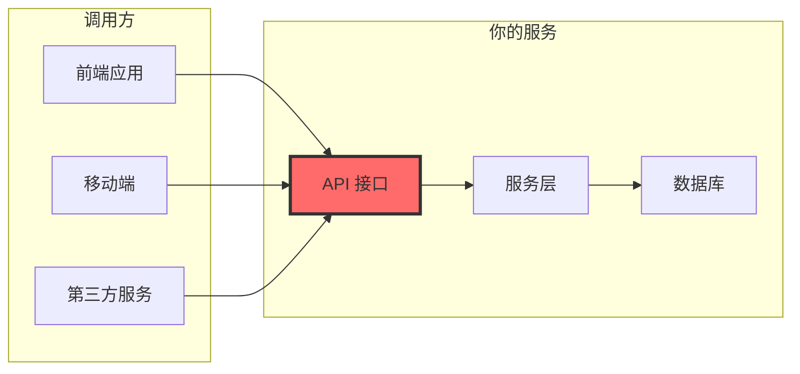

# 9.1.4 接口是门面——API 测试：接口契约与边界条件

**API 是你对外的承诺，测试就是确保这个承诺不会被打破。**

## 为什么 API 测试至关重要



API 测试的价值：

| 测试目标 | 作用 | 示例 |
|---------|------|------|
| 响应格式 | 确保前端能正确解析 | `{ success: true, data: {...} }` |
| 状态码 | 确保错误类型正确 | 400/401/403/404/500 |
| 参数校验 | 阻止非法请求 | 必填项、格式、范围 |
| 边界条件 | 处理极端情况 | 空数组、超长字符串 |

## API 测试的核心模式

### 模式一：响应格式验证

```typescript
// app/api/orders/route.ts
export async function POST(request: Request) {
  try {
    const body = await request.json();
    const order = await orderService.createOrder(body);
    
    return Response.json({
      success: true,
      data: order,
    }, { status: 201 });
  } catch (error) {
    if (error instanceof ValidationError) {
      return Response.json({
        success: false,
        error: { code: 'VALIDATION_ERROR', message: error.message },
      }, { status: 400 });
    }
    throw error;
  }
}

// __tests__/api/orders.test.ts
describe('POST /api/orders', () => {
  it('成功创建订单应返回 201 和标准格式', async () => {
    const response = await request(app)
      .post('/api/orders')
      .send({
        items: [{ productId: 'prod-1', quantity: 2 }],
      });

    expect(response.status).toBe(201);
    expect(response.body).toMatchObject({
      success: true,
      data: {
        id: expect.any(String),
        status: 'PENDING',
        createdAt: expect.any(String),
      },
    });
  });

  it('响应应包含分页信息（列表接口）', async () => {
    const response = await request(app).get('/api/orders?page=1&limit=10');

    expect(response.body).toMatchObject({
      success: true,
      data: expect.any(Array),
      pagination: {
        page: 1,
        limit: 10,
        total: expect.any(Number),
        totalPages: expect.any(Number),
      },
    });
  });
});
```

### 模式二：参数校验测试

```typescript
// __tests__/api/orders.test.ts
describe('POST /api/orders 参数校验', () => {
  it('缺少必填字段应返回 400', async () => {
    const response = await request(app)
      .post('/api/orders')
      .send({}); // 缺少 items

    expect(response.status).toBe(400);
    expect(response.body.error.code).toBe('VALIDATION_ERROR');
    expect(response.body.error.message).toContain('items');
  });

  it('items 为空数组应返回 400', async () => {
    const response = await request(app)
      .post('/api/orders')
      .send({ items: [] });

    expect(response.status).toBe(400);
    expect(response.body.error.message).toContain('至少包含一个商品');
  });

  it('quantity 为负数应返回 400', async () => {
    const response = await request(app)
      .post('/api/orders')
      .send({
        items: [{ productId: 'prod-1', quantity: -1 }],
      });

    expect(response.status).toBe(400);
    expect(response.body.error.message).toContain('数量必须大于 0');
  });

  it('productId 格式错误应返回 400', async () => {
    const response = await request(app)
      .post('/api/orders')
      .send({
        items: [{ productId: '', quantity: 1 }], // 空字符串
      });

    expect(response.status).toBe(400);
  });
});
```

### 模式三：认证与授权测试

```typescript
// __tests__/api/orders.test.ts
describe('订单 API 权限控制', () => {
  it('未登录用户应返回 401', async () => {
    const response = await request(app)
      .get('/api/orders')
      // 不带 Authorization header

    expect(response.status).toBe(401);
    expect(response.body.error.code).toBe('UNAUTHORIZED');
  });

  it('用户只能查看自己的订单', async () => {
    // 创建两个用户的订单
    const user1Order = await createOrderForUser('user-1');
    const user2Order = await createOrderForUser('user-2');

    // user-1 尝试访问 user-2 的订单
    const response = await request(app)
      .get(`/api/orders/${user2Order.id}`)
      .set('Authorization', `Bearer ${user1Token}`);

    expect(response.status).toBe(403);
    expect(response.body.error.code).toBe('FORBIDDEN');
  });

  it('管理员可以查看所有订单', async () => {
    const response = await request(app)
      .get('/api/admin/orders')
      .set('Authorization', `Bearer ${adminToken}`);

    expect(response.status).toBe(200);
  });
});
```

### 模式四：边界条件测试

```typescript
// __tests__/api/orders.test.ts
describe('边界条件测试', () => {
  it('应处理超长字符串', async () => {
    const longString = 'a'.repeat(10000);
    
    const response = await request(app)
      .post('/api/orders')
      .send({
        items: [{ productId: 'prod-1', quantity: 1 }],
        note: longString, // 超长备注
      });

    // 应该截断或拒绝，而不是崩溃
    expect([400, 201]).toContain(response.status);
  });

  it('应处理超大数字', async () => {
    const response = await request(app)
      .post('/api/orders')
      .send({
        items: [{ productId: 'prod-1', quantity: Number.MAX_SAFE_INTEGER }],
      });

    expect(response.status).toBe(400);
  });

  it('应处理特殊字符', async () => {
    const response = await request(app)
      .post('/api/orders')
      .send({
        items: [{ productId: 'prod-1', quantity: 1 }],
        note: '<script>alert("xss")</script>',
      });

    // 应该转义或拒绝
    if (response.status === 201) {
      expect(response.body.data.note).not.toContain('<script>');
    }
  });

  it('应处理并发请求', async () => {
    // 同时发起多个请求
    const requests = Array(10).fill(null).map(() =>
      request(app)
        .post('/api/orders')
        .send({ items: [{ productId: 'prod-1', quantity: 1 }] })
    );

    const responses = await Promise.all(requests);
    
    // 所有请求都应该正常处理
    responses.forEach(res => {
      expect([201, 400]).toContain(res.status); // 成功或库存不足
    });
  });
});
```

## API 测试清单模板

```typescript
// 为每个 API 端点创建测试时，检查以下项目：

describe('[METHOD] /api/[resource]', () => {
  // 1. 正常流程
  it('正常请求应返回正确的状态码和数据格式');
  
  // 2. 参数校验
  it('缺少必填参数应返回 400');
  it('参数格式错误应返回 400');
  it('参数值超出范围应返回 400');
  
  // 3. 认证授权
  it('未认证请求应返回 401');
  it('无权限请求应返回 403');
  
  // 4. 资源不存在
  it('资源不存在应返回 404');
  
  // 5. 业务异常
  it('业务规则违反应返回适当的错误码');
  
  // 6. 边界条件
  it('空数组/空字符串应正确处理');
  it('超大数据应正确处理');
});
```

## 使用 Supertest 进行 API 测试

```typescript
// jest.setup.ts
import { createServer } from 'http';
import { parse } from 'url';
import next from 'next';

const dev = process.env.NODE_ENV !== 'production';
const app = next({ dev });
const handle = app.getRequestHandler();

let server: ReturnType<typeof createServer>;

beforeAll(async () => {
  await app.prepare();
  server = createServer((req, res) => {
    const parsedUrl = parse(req.url!, true);
    handle(req, res, parsedUrl);
  });
  await new Promise<void>((resolve) => server.listen(0, resolve));
});

afterAll(() => {
  server.close();
});

export { server };
```

## AI 协作指南

为 API 编写测试时，可以这样与 AI 沟通：

> **核心意图**：为 API 端点生成全面的测试用例
>
> **需求定义公式**：
> ```
> 为 [METHOD] /api/[path] 编写测试：
> - 请求体示例：[JSON]
> - 预期响应格式：[JSON]
> - 需要覆盖的场景：正常流程、参数校验、权限控制、错误处理
> ```

**关键术语**：`supertest`、`request`、`expect`、`toMatchObject`、`status code`

## 本节小结

API 测试是确保对外接口稳定可靠的关键手段。通过验证响应格式、参数校验、权限控制和边界条件，可以在问题到达用户之前将其拦截。记住：**API 的每一次变更都应该有对应的测试来保护**。使用测试清单模板，确保每个端点都得到全面覆盖。
