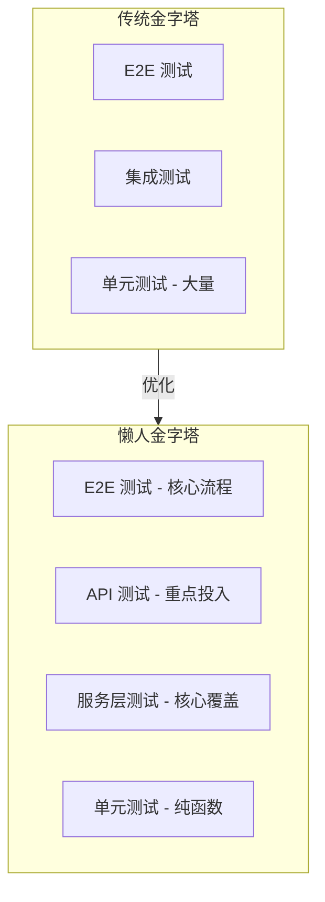

# 9.1 懒人的测试金字塔——优先测服务层与 API

**测试金字塔的精髓不是"写更多测试"，而是"在正确的层级写测试"。**

## 单人开发者的测试困境

作为独立开发者，你面临一个现实问题：时间有限，但质量不能妥协。传统的测试金字塔告诉你要写大量单元测试，但现实是：

- 业务逻辑快速迭代，单元测试维护成本高
- UI 频繁变化，E2E 测试脆弱易碎
- 测试覆盖率数字好看，但 bug 照样上线

## 懒人金字塔：重新分配测试投资

## 核心策略：聚焦服务层与 API

| 测试类型 | 投入比例 | 覆盖目标 | ROI |
|---------|---------|---------|-----|
| 单元测试 | 20% | 纯函数、工具函数 | 中 |
| 服务层测试 | 40% | 业务逻辑、数据处理 | 高 |
| API 测试 | 30% | 接口契约、边界条件 | 高 |
| E2E 测试 | 10% | 核心用户流程 | 中 |

## 为什么这样分配

1. **服务层是业务核心**：所有业务规则都在这里，测好服务层就等于测好了核心逻辑
2. **API 是对外契约**：API 稳定，前端、移动端、第三方都能放心对接
3. **单元测试聚焦纯函数**：有副作用的代码用集成测试覆盖更实际
4. **E2E 只保核心流程**：登录、支付、核心业务流程，其他交给手动测试

## 本节导览

| 小节 | 内容 |
|------|------|
| 9.1.1 | 测试分层：理解单元、集成、E2E 的边界 |
| 9.1.2 | 测试优先级：投入产出比分析 |
| 9.1.3 | 服务层测试：业务逻辑验证重点 |
| 9.1.4 | API 测试：接口契约与边界条件 |

## 本节小结

懒人金字塔的核心不是偷懒，而是**把有限的精力投入到最有价值的地方**。服务层测试保障业务逻辑正确，API 测试保障接口契约稳定，这两者加起来就能覆盖 80% 的常见问题。
