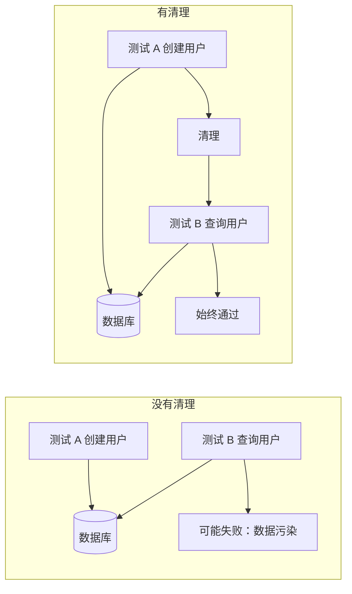
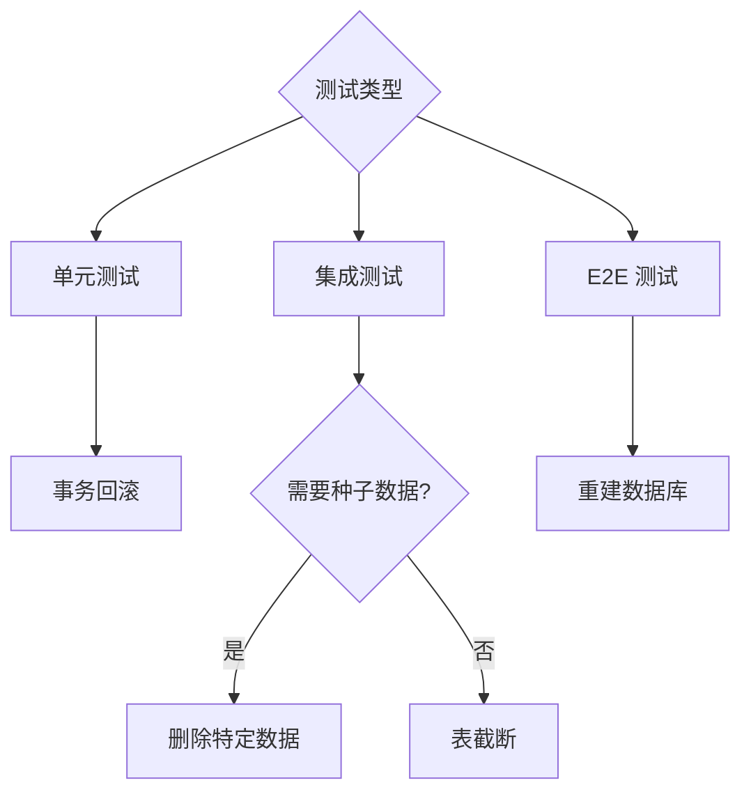

# 9.2.4 每次测试都是全新的——数据清理：测试间的状态隔离

**测试之间相互影响是测试不稳定的首要原因，数据清理是解决这个问题的关键。**

## 为什么需要数据清理



## 数据清理策略

| 策略 | 原理 | 适用场景 | 性能 |
|------|------|---------|------|
| 事务回滚 | 每个测试在事务中运行，结束后回滚 | 单元测试、集成测试 | 快 |
| 表截断 | 清空所有表数据 | 测试套件之间 | 中 |
| 删除特定数据 | 只删除测试创建的数据 | 需要保留种子数据 | 中 |
| 重建数据库 | 每次测试前重建整个数据库 | 完整 E2E 测试 | 慢 |

## 策略一：事务回滚（推荐）

```typescript
// test/helpers/transaction.ts
import { PrismaClient } from '@prisma/client';

const prisma = new PrismaClient();

export async function withTransaction<T>(
  fn: (tx: PrismaClient) => Promise<T>
): Promise<T> {
  return prisma.$transaction(async (tx) => {
    const result = await fn(tx as unknown as PrismaClient);
    // 抛出错误触发回滚
    throw new RollbackError(result);
  }).catch((error) => {
    if (error instanceof RollbackError) {
      return error.result;
    }
    throw error;
  });
}

class RollbackError<T> extends Error {
  constructor(public result: T) {
    super('Transaction rollback');
  }
}
```

```typescript
// __tests__/user.service.test.ts
import { withTransaction } from '@/test/helpers/transaction';

describe('UserService', () => {
  it('应创建用户', async () => {
    await withTransaction(async (tx) => {
      const user = await userService.create(tx, {
        email: 'test@example.com',
        name: 'Test User',
      });
      
      expect(user.email).toBe('test@example.com');
      // 事务结束后自动回滚，数据不会保留
    });
  });
});
```

## 策略二：beforeEach 清理

```typescript
// test/helpers/cleanup.ts
import { PrismaClient } from '@prisma/client';

const prisma = new PrismaClient();

// 按依赖顺序删除（先删除有外键引用的表）
const tablesToClean = [
  'OrderItem',
  'Order',
  'Product',
  'User',
];

export async function cleanDatabase() {
  for (const table of tablesToClean) {
    await prisma.$executeRawUnsafe(`TRUNCATE TABLE "${table}" CASCADE`);
  }
}

// 或者使用 deleteMany（更安全但较慢）
export async function cleanDatabaseSafe() {
  await prisma.orderItem.deleteMany();
  await prisma.order.deleteMany();
  await prisma.product.deleteMany();
  await prisma.user.deleteMany();
}
```

```typescript
// __tests__/order.service.test.ts
import { cleanDatabase } from '@/test/helpers/cleanup';

describe('OrderService', () => {
  beforeEach(async () => {
    await cleanDatabase();
  });

  it('应创建订单', async () => {
    // 每个测试都从干净状态开始
    const user = await createTestUser();
    const order = await orderService.create(user.id, items);
    expect(order.status).toBe('PENDING');
  });
});
```

## 策略三：使用 Prisma 的软重置

```typescript
// test/helpers/reset.ts
import { execSync } from 'child_process';

export function resetDatabase() {
  execSync('dotenv -e .env.test -- npx prisma migrate reset --force --skip-seed', {
    stdio: 'inherit',
  });
}
```

## Jest 配置最佳实践

```typescript
// jest.setup.ts
import { PrismaClient } from '@prisma/client';

const prisma = new PrismaClient();

// 全局清理：每个测试文件开始前
beforeAll(async () => {
  await prisma.$connect();
});

// 全局清理：每个测试文件结束后
afterAll(async () => {
  await prisma.$disconnect();
});

// 可选：每个测试前清理
// beforeEach(async () => {
//   await cleanDatabase();
// });
```

```typescript
// jest.config.ts
export default {
  // 串行运行测试，避免并发冲突
  maxWorkers: 1,
  // 或使用 runInBand
  // runInBand: true,
  
  setupFilesAfterEnv: ['<rootDir>/jest.setup.ts'],
};
```

## 处理外键约束

```typescript
// test/helpers/cleanup.ts

// 方法一：禁用外键检查（PostgreSQL）
export async function cleanWithDisabledFK() {
  await prisma.$executeRaw`SET session_replication_role = 'replica'`;
  
  await prisma.orderItem.deleteMany();
  await prisma.order.deleteMany();
  await prisma.user.deleteMany();
  
  await prisma.$executeRaw`SET session_replication_role = 'origin'`;
}

// 方法二：使用 CASCADE（PostgreSQL）
export async function truncateWithCascade() {
  const tables = ['User', 'Order', 'OrderItem'];
  
  for (const table of tables) {
    await prisma.$executeRawUnsafe(`TRUNCATE TABLE "${table}" CASCADE`);
  }
}

// 方法三：按正确顺序删除
export async function deleteInOrder() {
  // 先删除子表（有外键的表）
  await prisma.orderItem.deleteMany();
  await prisma.order.deleteMany();
  // 再删除父表
  await prisma.user.deleteMany();
}
```

## 保留种子数据的清理

```typescript
// test/helpers/cleanup.ts

// 只清理测试创建的数据（通过 ID 前缀识别）
export async function cleanTestData() {
  await prisma.user.deleteMany({
    where: {
      id: { startsWith: 'test-' },
    },
  });
}

// 或使用创建时间
export async function cleanRecentData() {
  const oneMinuteAgo = new Date(Date.now() - 60 * 1000);
  
  await prisma.user.deleteMany({
    where: {
      createdAt: { gte: oneMinuteAgo },
    },
  });
}
```

## 并行测试的数据隔离

```typescript
// test/helpers/isolated-db.ts
import { v4 as uuid } from 'uuid';

export function createIsolatedContext() {
  const testId = uuid();
  
  return {
    testId,
    createUser: (data: Partial<User>) => ({
      id: `test-${testId}-${uuid()}`,
      ...data,
    }),
    cleanup: async () => {
      await prisma.user.deleteMany({
        where: { id: { contains: testId } },
      });
    },
  };
}

// 使用
describe('UserService', () => {
  const ctx = createIsolatedContext();
  
  afterAll(async () => {
    await ctx.cleanup();
  });
  
  it('应创建用户', async () => {
    const userData = ctx.createUser({ name: 'Test' });
    // ...
  });
});
```

## 清理策略选择



## 本节小结

数据清理的核心目标是**确保每个测试都在可预测的初始状态下运行**。事务回滚是性能最好的方案，适合大多数场景；表截断适合需要完全重置的场景；删除特定数据适合需要保留种子数据的场景。选择合适的策略，让测试既快速又稳定。
