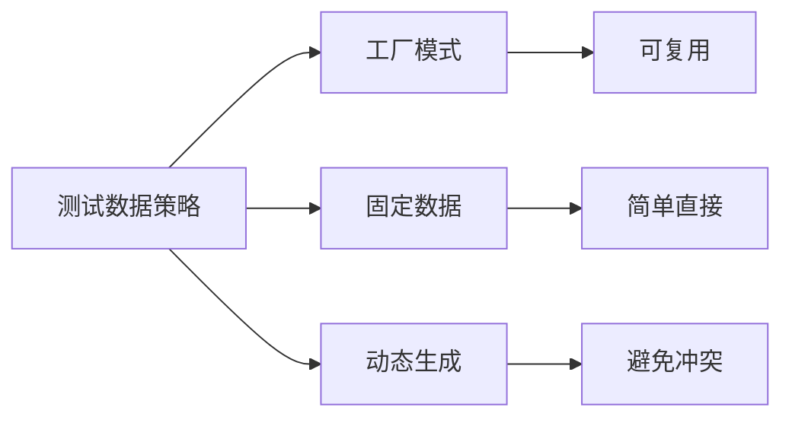

# 9.3.3 测试前准备好数据——Seed 数据：测试用例的数据准备

**好的测试数据准备策略能让测试代码更简洁、更易维护。**

## 测试数据准备模式



## 工厂模式（推荐）

创建可复用的数据工厂，灵活生成测试数据。

```typescript
// test/factories/user.factory.ts
import { prisma } from '@/lib/prisma';
import { faker } from '@faker-js/faker';
import type { User, Prisma } from '@prisma/client';

type UserOverrides = Partial<Prisma.UserCreateInput>;

export async function createUser(overrides: UserOverrides = {}): Promise<User> {
  return prisma.user.create({
    data: {
      email: faker.internet.email(),
      name: faker.person.fullName(),
      password: faker.internet.password(),
      ...overrides,
    },
  });
}

export async function createUsers(
  count: number,
  overrides: UserOverrides = {}
): Promise<User[]> {
  return Promise.all(
    Array.from({ length: count }, () => createUser(overrides))
  );
}
```

```typescript
// test/factories/order.factory.ts
import { prisma } from '@/lib/prisma';
import { faker } from '@faker-js/faker';
import { createUser } from './user.factory';
import { createProduct } from './product.factory';

interface OrderOptions {
  userId?: string;
  itemCount?: number;
  status?: string;
}

export async function createOrder(options: OrderOptions = {}) {
  const user = options.userId
    ? await prisma.user.findUnique({ where: { id: options.userId } })
    : await createUser();

  const products = await Promise.all(
    Array.from({ length: options.itemCount || 2 }, () => createProduct())
  );

  return prisma.order.create({
    data: {
      userId: user!.id,
      status: options.status || 'PENDING',
      items: {
        create: products.map((p) => ({
          productId: p.id,
          quantity: faker.number.int({ min: 1, max: 5 }),
          price: p.price,
        })),
      },
    },
    include: {
      items: true,
      user: true,
    },
  });
}
```

### 使用工厂

```typescript
// __tests__/services/order.service.test.ts
import { createUser } from '@/test/factories/user.factory';
import { createOrder } from '@/test/factories/order.factory';
import { createProduct } from '@/test/factories/product.factory';

describe('OrderService', () => {
  it('应计算订单总额', async () => {
    const order = await createOrder({ itemCount: 3 });
    
    const total = await orderService.calculateTotal(order.id);
    
    const expectedTotal = order.items.reduce(
      (sum, item) => sum + item.price * item.quantity,
      0
    );
    expect(total).toBe(expectedTotal);
  });

  it('VIP 用户应享受折扣', async () => {
    const vipUser = await createUser({ role: 'VIP' });
    const order = await createOrder({ userId: vipUser.id });
    
    const total = await orderService.calculateTotal(order.id);
    
    // VIP 用户享受 10% 折扣
    expect(total).toBeLessThan(order.items.reduce(
      (sum, item) => sum + item.price * item.quantity,
      0
    ));
  });
});
```

## 固定数据 Fixtures

适合需要精确控制数据内容的场景。

```typescript
// test/fixtures/users.ts
export const testUsers = {
  admin: {
    id: 'user-admin-001',
    email: 'admin@test.com',
    name: 'Admin User',
    role: 'ADMIN',
  },
  customer: {
    id: 'user-customer-001',
    email: 'customer@test.com',
    name: 'Test Customer',
    role: 'CUSTOMER',
  },
  vip: {
    id: 'user-vip-001',
    email: 'vip@test.com',
    name: 'VIP User',
    role: 'VIP',
  },
};

// test/fixtures/products.ts
export const testProducts = {
  laptop: {
    id: 'prod-laptop-001',
    name: 'MacBook Pro',
    price: 9999,
    stock: 100,
  },
  phone: {
    id: 'prod-phone-001',
    name: 'iPhone 15',
    price: 6999,
    stock: 50,
  },
};
```

```typescript
// test/helpers/seed-fixtures.ts
import { prisma } from '@/lib/prisma';
import { testUsers } from '../fixtures/users';
import { testProducts } from '../fixtures/products';

export async function seedFixtures() {
  // 创建用户
  for (const user of Object.values(testUsers)) {
    await prisma.user.upsert({
      where: { id: user.id },
      update: user,
      create: user,
    });
  }

  // 创建产品
  for (const product of Object.values(testProducts)) {
    await prisma.product.upsert({
      where: { id: product.id },
      update: product,
      create: product,
    });
  }
}
```

### 使用 Fixtures

```typescript
// __tests__/services/order.service.test.ts
import { testUsers } from '@/test/fixtures/users';
import { testProducts } from '@/test/fixtures/products';
import { seedFixtures } from '@/test/helpers/seed-fixtures';

describe('OrderService with Fixtures', () => {
  beforeAll(async () => {
    await seedFixtures();
  });

  it('管理员可以查看所有订单', async () => {
    const orders = await orderService.getAll(testUsers.admin.id);
    expect(Array.isArray(orders)).toBe(true);
  });

  it('应正确计算商品总价', async () => {
    const order = await orderService.create(testUsers.customer.id, [
      { productId: testProducts.laptop.id, quantity: 1 },
      { productId: testProducts.phone.id, quantity: 2 },
    ]);

    expect(order.total).toBe(9999 + 6999 * 2);
  });
});
```

## Builder 模式

适合复杂对象的构建。

```typescript
// test/builders/order.builder.ts
import { prisma } from '@/lib/prisma';
import { createUser } from '../factories/user.factory';
import { createProduct } from '../factories/product.factory';

export class OrderBuilder {
  private userId?: string;
  private items: { productId: string; quantity: number }[] = [];
  private status = 'PENDING';
  private discountCode?: string;

  withUser(userId: string): this {
    this.userId = userId;
    return this;
  }

  withItem(productId: string, quantity: number): this {
    this.items.push({ productId, quantity });
    return this;
  }

  withStatus(status: string): this {
    this.status = status;
    return this;
  }

  withDiscount(code: string): this {
    this.discountCode = code;
    return this;
  }

  async build() {
    const userId = this.userId || (await createUser()).id;
    
    if (this.items.length === 0) {
      const product = await createProduct();
      this.items.push({ productId: product.id, quantity: 1 });
    }

    return prisma.order.create({
      data: {
        userId,
        status: this.status,
        discountCode: this.discountCode,
        items: {
          create: this.items.map((item) => ({
            productId: item.productId,
            quantity: item.quantity,
          })),
        },
      },
      include: { items: true },
    });
  }
}
```

### 使用 Builder

```typescript
// __tests__/services/order.service.test.ts
import { OrderBuilder } from '@/test/builders/order.builder';

describe('OrderService with Builder', () => {
  it('应用折扣码', async () => {
    const order = await new OrderBuilder()
      .withDiscount('SAVE20')
      .withItem('prod-1', 2)
      .withStatus('PENDING')
      .build();

    const total = await orderService.calculateTotal(order.id);
    
    // 验证折扣已应用
    expect(order.discountCode).toBe('SAVE20');
  });
});
```

## 数据清理策略

```typescript
// test/helpers/cleanup.ts
import { prisma } from '@/lib/prisma';

export async function cleanupTestData() {
  await prisma.orderItem.deleteMany();
  await prisma.order.deleteMany();
  await prisma.product.deleteMany();
  await prisma.user.deleteMany();
}

// jest.setup.ts
import { cleanupTestData } from './test/helpers/cleanup';

beforeEach(async () => {
  await cleanupTestData();
});
```

## 本节小结

测试数据准备的核心是**可复用性和灵活性**。工厂模式适合大多数场景，Fixtures 适合固定场景，Builder 模式适合复杂对象。选择合适的模式，让测试代码更清晰、更易维护。
