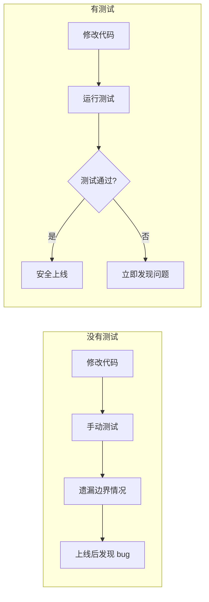

# 9.3 给你的代码上保险——单元测试/集成测试：Jest + Test DB；seed 前置

**自动化测试是你代码的保险单——每次改动都能自动验证是否破坏了已有功能。**

## 为什么需要自动化测试



## 本节技术栈

| 工具 | 用途 | 选择理由 |
|------|------|---------|
| Jest | 测试框架 | 零配置、快照测试、Mock 支持 |
| ts-jest | TypeScript 支持 | 直接运行 TS 测试 |
| @testing-library | React 测试 | 面向用户行为的测试 |
| supertest | API 测试 | 简洁的 HTTP 断言 |

## 快速开始配置

```bash
# 安装依赖
npm install -D jest ts-jest @types/jest

# 初始化配置
npx ts-jest config:init
```

```typescript
// jest.config.ts
import type { Config } from 'jest';

const config: Config = {
  preset: 'ts-jest',
  testEnvironment: 'node',
  roots: ['<rootDir>/src', '<rootDir>/__tests__'],
  testMatch: ['**/*.test.ts', '**/*.spec.ts'],
  setupFilesAfterEnv: ['<rootDir>/jest.setup.ts'],
  moduleNameMapper: {
    '^@/(.*)$': '<rootDir>/src/$1',
  },
};

export default config;
```

## 本节核心内容

| 小节 | 主题 | 解决的问题 |
|------|------|-----------|
| 9.3.1 | Jest 配置 | 如何配置测试框架和断言库 |
| 9.3.2 | 测试数据库 | 内存数据库 vs 真实数据库的选择 |
| 9.3.3 | Seed 数据 | 如何准备测试用例所需的数据 |
| 9.3.4 | Mock 策略 | 如何模拟外部依赖 |

## 测试文件组织

```
project/
├── src/
│   ├── services/
│   │   └── order.service.ts
│   └── utils/
│       └── price.ts
├── __tests__/
│   ├── services/
│   │   └── order.service.test.ts
│   ├── api/
│   │   └── orders.test.ts
│   └── helpers/
│       ├── factory.ts
│       └── cleanup.ts
├── jest.config.ts
└── jest.setup.ts
```

## 本节小结

自动化测试是现代软件开发的基础设施。通过 Jest 和测试数据库的配合，可以实现从单元测试到集成测试的完整覆盖。关键是选择合适的工具、组织好测试代码、准备好测试数据。接下来的小节将详细介绍每个环节的具体实现。
